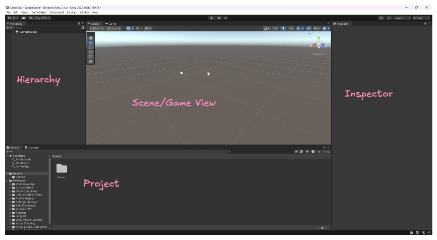

# 260831 Unity(1) 설치와 기본 사항
## 1. 설치
### 1.1. 개요
- 현재 진행할 버전은 22.3.62f3으로 진행
- Windows Build Support 계열을 붙여서 설치.
- 향후 6 버전은 하겠지만 구버전을 선택한 것은 어떤 회사던지 신버전을 사용한다는 보장이 없다.
- LTS가 붙은 버전을 쓰는 것이 안전한 선택이다.
- 라이선스를 갱신할 것.

## 2. 사용
### 2.1. 개요
- 프로젝트로 들어가서 New Project로 진행
- 프로젝트 이름을 설정하는 구간에서 현재 단계에서는 CPU 쪽으로 설정하도록 한다.
- 주로 구성하는 창들이 존재하는데 

- 격자 타일로 배치하는 공간이 존재. 
- 직접적으로 컨트롤하는 공간과 빌드해서 나오는 화면은 Game View를 통해 봐야 한다.
- 목록들을 보는 것이 Hierachy가 존재. 
- 여기 목록에 메인 카메라와 직사광이 존재
- 목록 리소스 안에 있는 정보들은 Inspector에서 보여진다.
- Inspector에서 설정값을 조정 가능한 영역이다. 
- 파일 탐색기처럼 있는 것도 당연히 파일 추가가 가능한데 이것을 Project라고 부른다. 
- 옆에 Console은 출력도 가능하다. text만을 뽑아보기 위한 것.
- 여태껏 Console 부분만 썼다보니 text를 뽑느라 로그를 보지 못했다. 
- 따라서 엔진에서 이에 대한 데이터가 가는지에 대한 로그들을 보기 위한 용도이다. 
- 