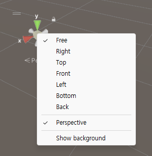
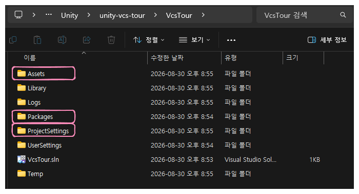
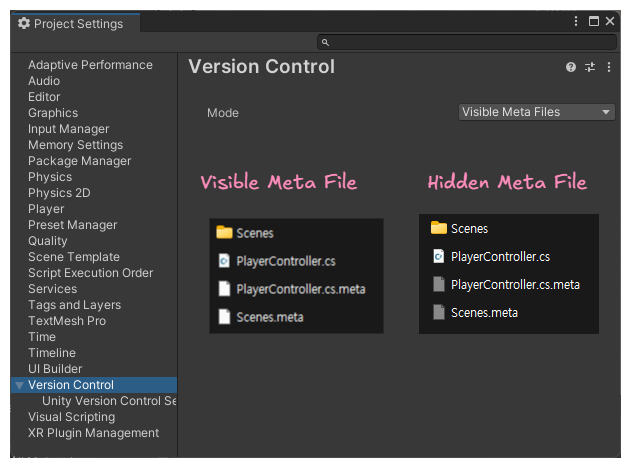
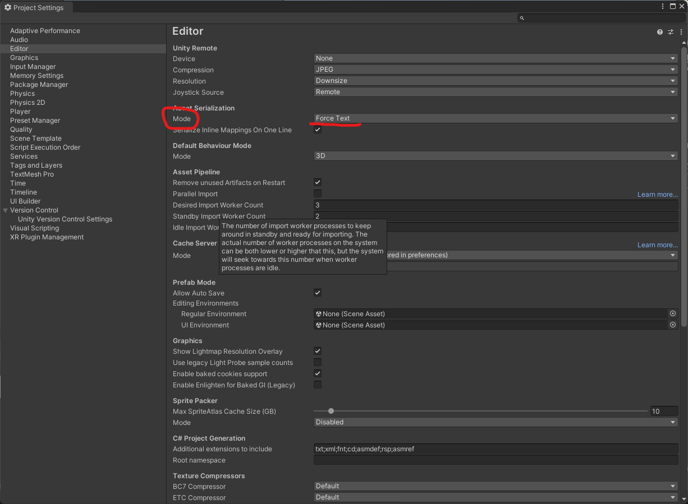
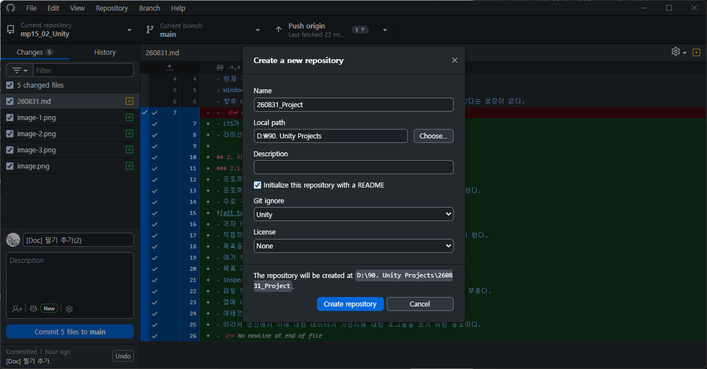
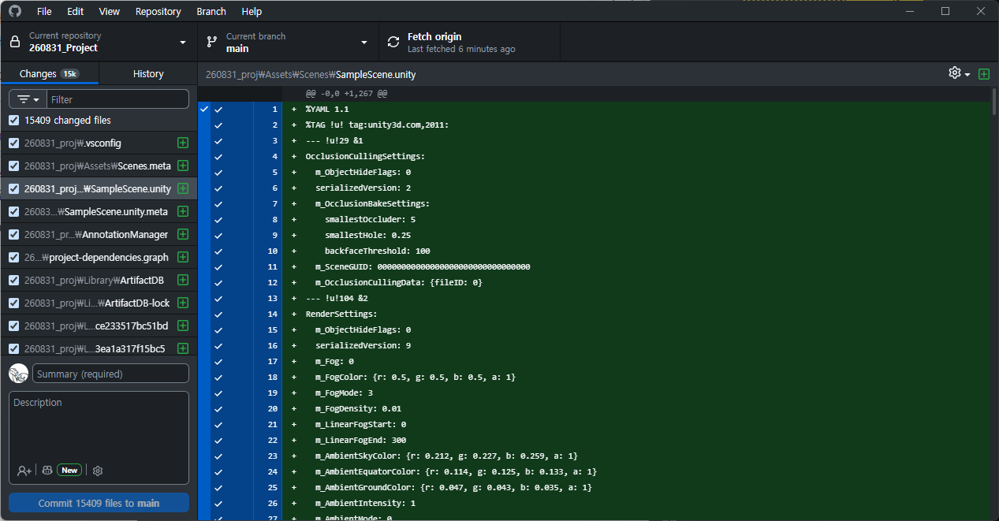
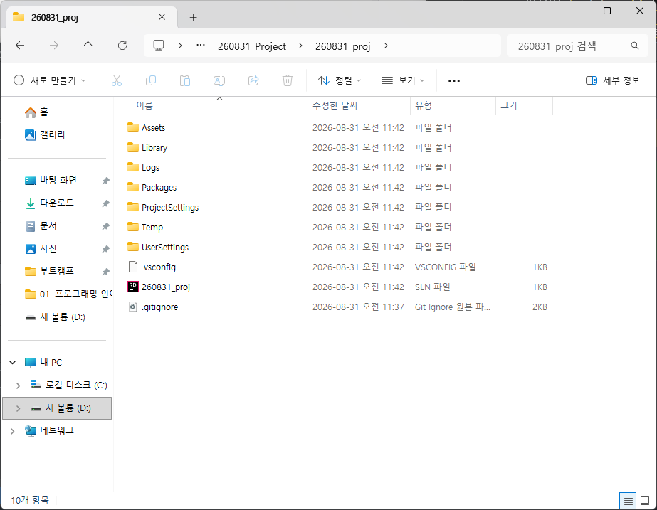
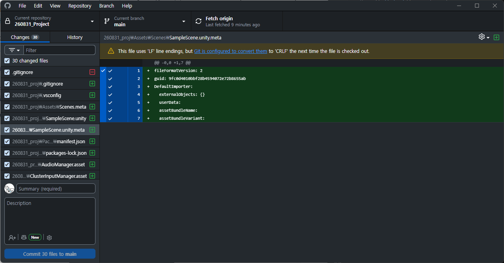
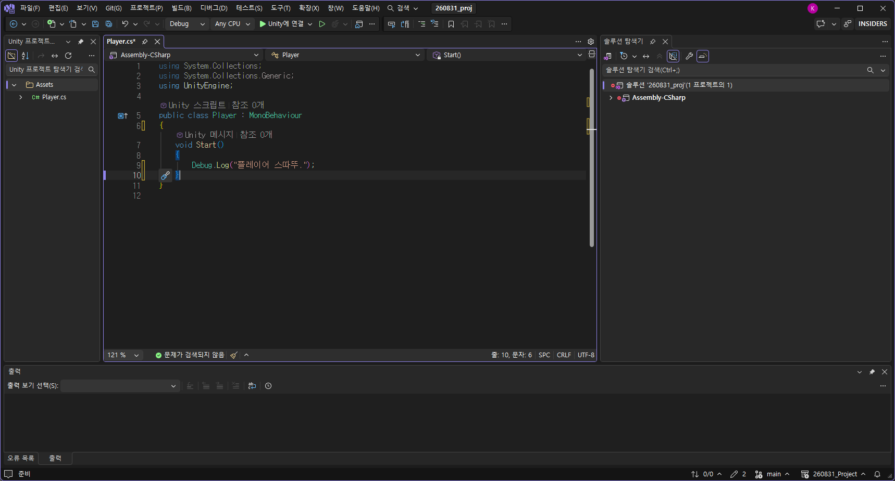

# 260831 Unity(1) 설치와 기본 사항
## 1. 설치
### 1.1. 개요
- 현재 진행할 버전은 22.3.62f3으로 진행
- Windows Build Support 계열을 붙여서 설치.
- 향후 6 버전은 하겠지만 구버전을 선택한 것은 어떤 회사던지 신버전을 사용한다는 보장이 없다.
- LTS가 붙은 버전을 쓰는 것이 안전한 선택이다.
- 라이선스를 갱신할 것.

## 2. 사용
### 2.1. 개요
- 프로젝트로 들어가서 New Project로 진행
- 프로젝트 이름을 설정하는 구간에서 현재 단계에서는 CPU 쪽으로 설정하도록 한다.
- 주로 구성하는 창들이 존재하는데 

- 격자 타일로 배치하는 공간이 존재. 
- 직접적으로 컨트롤하는 공간과 빌드해서 나오는 화면은 Game View를 통해 봐야 한다.
- 목록들을 보는 것이 Hierachy가 존재. 
- 여기 목록에 메인 카메라와 직사광이 존재
- 목록 리소스 안에 있는 정보들은 Inspector에서 보여진다.
- Inspector에서 설정값을 조정 가능한 영역이다. 
- 파일 탐색기처럼 있는 것도 당연히 파일 추가가 가능한데 이것을 Project라고 부른다. 
- 옆에 Console은 출력도 가능하다. text만을 뽑아보기 위한 것.
- 여태껏 Console 부분만 썼다보니 text를 뽑느라 로그를 보지 못했다. 
- 따라서 엔진에서 이에 대한 데이터가 가는지에 대한 로그들을 보기 위한 용도이다. 

### 2.2. 사용
- Hierachy에서 3D Object/Cube를 추가하고 원점에 설정해본다.
- Inspector에서 값이 나오는 곳을 마우스를 갖다대면 조정이 러프하게 가능하다.
- 레이아웃 설정은 자유롭게 설정 가능.
- 마우스 우클릭을 한 상태에서 WASD로 이동과 Q, E로 상하, Shift까지 누르면 빠르게 이동 가능하다.
- 우측 상단에 이러한 것이 있는데 절대 좌표이다.  
- Forward는 z축의 + 이다. 
- 왼쪽 상단에서 tools 모음이 존재한다. 
- WERTY를 통해 툴을 선택 가능. 
- Global, Local을 통해 시점이 달라질 수 있다. 
- 숫자 2키를 누르면 2D로의 전환이 가능. 보통 UI를 만들 때 사용.
- 해당 오브젝트를 놓친 경우 Hierachy에서 더블클릭을 통해 확인 가능하다. 
- 메인 카메라를 이동시켜 회전을 시켜보도록 하자. 
- 메인 카메라의 단축키 중 ctrl shift F를 자주 쓴다. 

## 3. 버전 관리
### 3.1. 개요
- 협업 시 버전에 대한 것들에 대해 주의할 점을 알려줄 것이다.

### 3.2. 3대 리소스

- Assets, Packages, ProjectSetting만을 살리면 얼마든지 살릴 수 있다. 
- Library는 용량도 클 뿐더러 버전 관리에 도움이 되지 않으므로 자주 지워질 수 있는 폴더. 
- 저 셋이 프로젝트의 핵심 폴더이다. 

### 3.3 .meta
- 어지간한 폴더나 파일들에 대응하는 파일. 
- guid가 기억하는 코드이다. 
- 이게 문제가 되면 100% 깨진다. 
- 모든 파일과 폴더에 1대 1로 대응해서 guid가 할당되어서 생기는 것이다. 
- 이것까지 공유하는 것이 중요. 
- package가 잘 관리를 해주는 편.
- 파일과 폴더들을 참조하는 형식.

- 보통 보이는 것이 스탠다드.
- meta를 수동으로 만지는 것은 되도록 하지 말 것.

### 3.4. Force Text
- 터지더라도 가볍게 둔다.
- Git에 올릴 때는 이렇게 둔다.
- Project Setting/Editor/Mode에서 설정 가능.

## 4. Repository 생성하여 진행
### 4.1. 사용

- 이 형태로 진행.
- 리포지토리를 생성한다.
- 기본적으로 .gitignore에 생성된 것은 안 건드는 것이 좋다. 
- 해당 경로에 프로젝트를 만들 것인데 프로젝트를 만들면 Changes에 1.5k 정도로 발생할 것이다.

- 이대로 커밋을 하는 것은 안된다.
- 필요없는 ignore가 있는 셈. 
- .gitignore가 다른 곳에 있어야 한다. 유니티 최상위 경로로 옮겨줘야 한다.

- 이렇게 직접 유니티 프로젝트 최상단 폴더 안에 넣어줘야지 제대로 관리가 된다. 
- 이러한 이유는 직접 붙은 것과 /가 붙은 것과 다른데 프로젝트 내에서 쓰게 될 가능성들이 있는 이름들인데 /가 붙어진게 현 루트 경로이다.
- 만일 /가 안붙으면 하위 라이브러리와 오브젝트가 모두 무시된다. 
- 이러한 이유로 프로젝트 최상단 경로에 두는 것이 맞다. 

### 4.2. scene 파일 충돌
- 이제 커밋을 해보도록 하자. 
- scene 파일 충돌 포인트가 많아지면 사람이 직접 잡는 것이 비효율이다.
- scene에서는 여러 정보가 실시간으로 바뀐다. 
- 직렬화되는 방식에서는 충돌이 안나는 것이 좋다. 
- 백업을 통해 복구를 하는 것으로 하면 되는 부분이다. 
- 기본적인 수칙은 같은 파일을 잘못 건드리지 않게끔 조심하면 된다. 
- 모델링 파일(.fbx)이 50mb, 100mb 단위가 되는데 무과금 선에서는 그 선까지 업로드하는 일은 없다. 
- PortP.용 에셋은 가급적 low-poly가 좋다. 
- 저장한 내용을 커밋한다고 한다면 커밋하면 된다. 

## 5. C# script
### 5.1. 생성
- 바로 생성해보도록 하자. 
- 마우스 우클릭/Create/C# Script로 생성하여 실행.

- 다음과 같이 해볼 것. 
- WriteLine같은 것이 Debug.Log이다.
- C# 스크립트는 클래스로 생성되고 객체로써 동작하며 토막된 기능을 구현해서 플레이어에 조립하면 완성된 것으로 움직인다고 생각하면 된다.
- 자동적으로 monobehavior를 상속받고 이것도 클래스.
- 기본적으로 게임 오브젝트에 스크립트를 갖다가 붙여 동작하려면 필요한 상속이다. 
- 유니티 엔진 내부에서의 오브젝트와 기존 문법에서의 최상단 클래스와는 다르다.

### 5.2. 사용
- cs를 저장려면 플레이를 중단할 것. 
- Edit/Preference/Playmode tint를 무조건 지정해서 사용할 것. 
