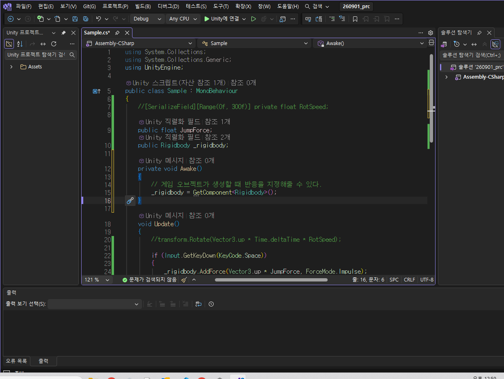
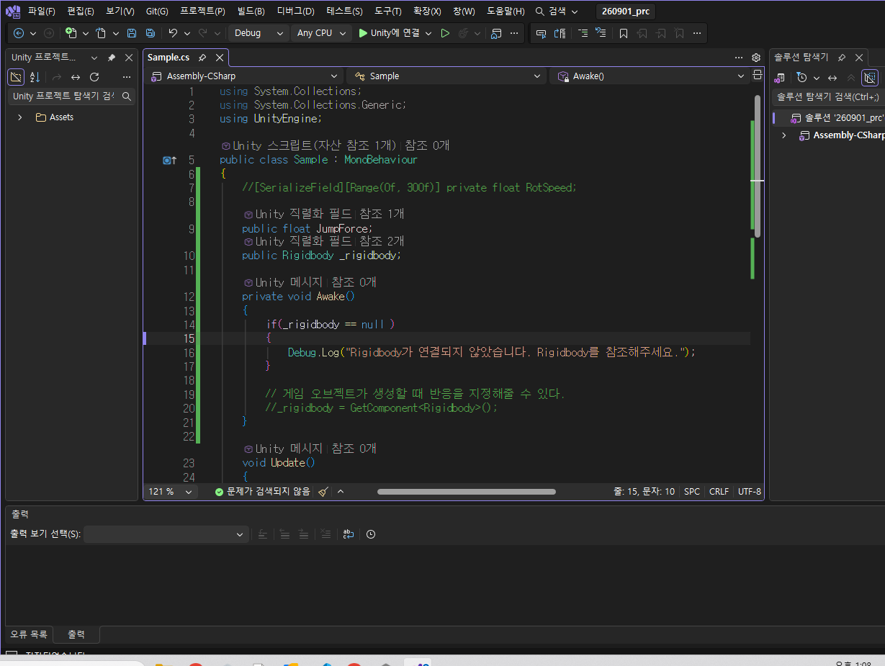
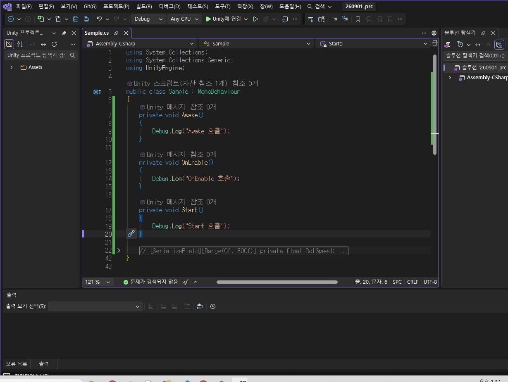
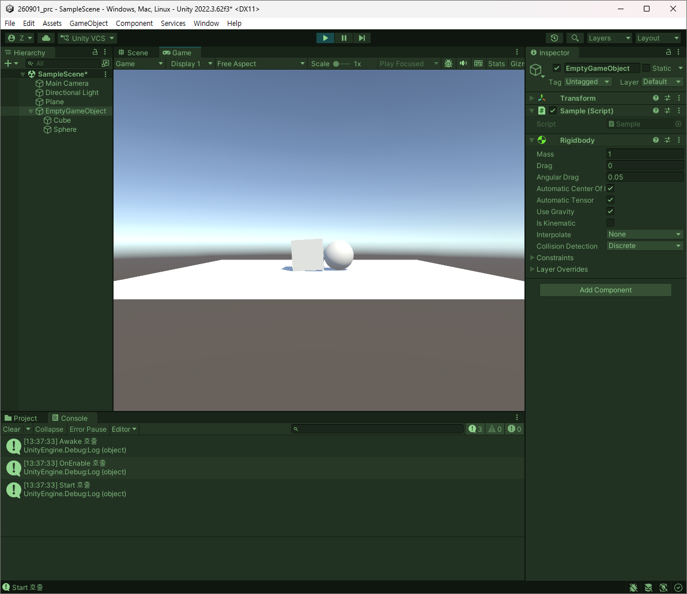
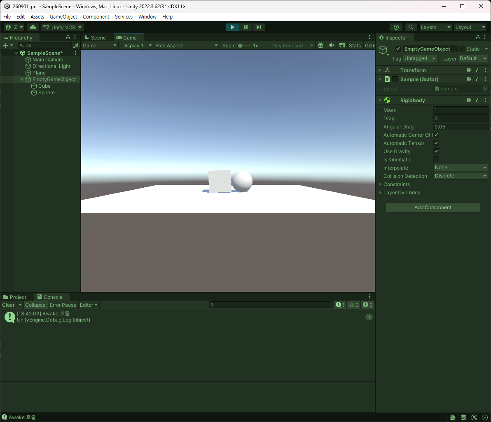
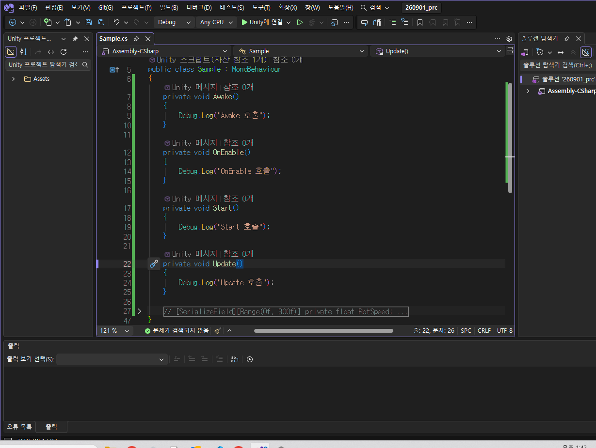
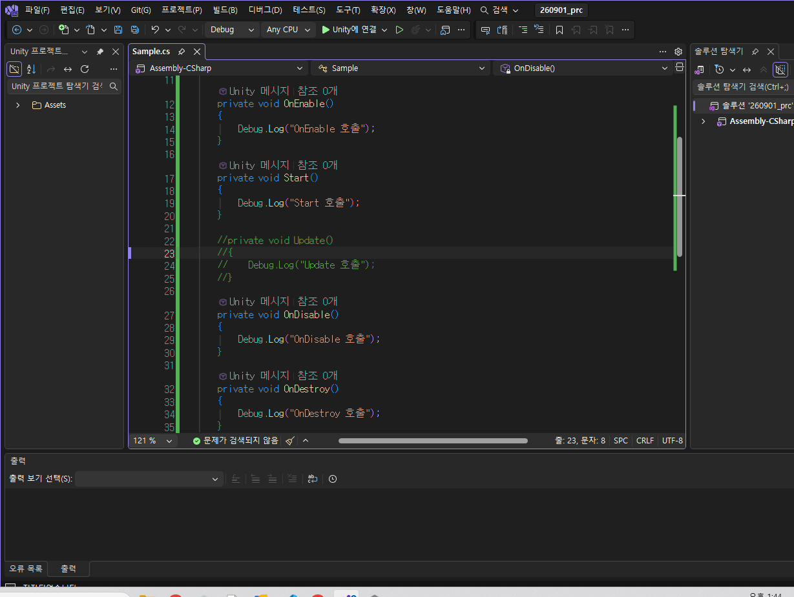
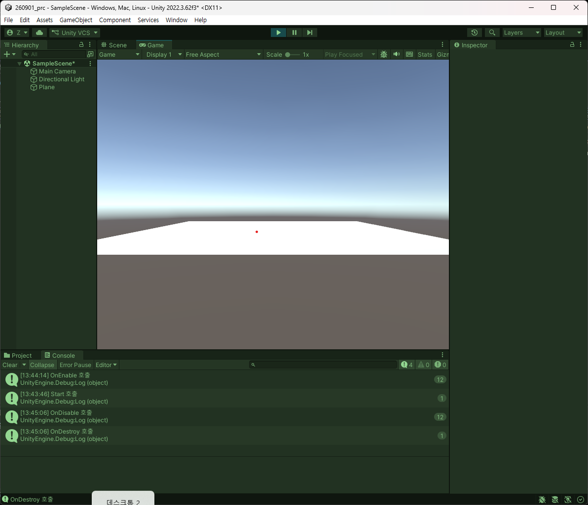

# 260901 Unity(2) 게임 오브젝트와 컴포넌트, 라이프사이클
## 1. 게임 오브젝트와 컴포넌트
### 1.1. 개요
- 게임에서 보여지는 모든 것들이 게임상에서의 오브젝트이다. 
- 심지어 눈에 보이지 않은 시스템적인 요소들도 오브젝트에 해당한다. 
- 단순한 cube에서도 Transform 기능이 있고 Mesh filter나 랜더러에 Collider까지 있다. 
- 원래는 게임 오브젝트는 기능을 가지고 있지 않고 빈 상태이다. Transform만 들어가있는 상태 정도이다. 
- **Transform은 어떤 오브젝트던지 필수적으로 들어가는 정보**이다. 
- 여기에 무언가 정보를 추가함으로써 가시적으로 볼 수 있게 되거나 충돌 체크, 질감 등을 할 수 있게 된다.
- **Inspector에 뜨고 있는 단위들을 컴포넌트**라고 부른다.
- 하나의 오브젝트에 컴포넌트 여럿을 가질 수 있다. 

### 1.2. 실사용
- 지면을 하나 만들어보도록 하자.

- 위와 같이 있을 때, 큐브에 기능이 존재하는데 중력을 넣어보도록 할 것이다. 

- regidbody를 통해서 중력을 부여하여 실질적으로 플레이 때 떨어지는 것을 확인할 수 있었다. 
- regidbody는 클래스고 컴포넌트를 상속받는다. 
- 그래서 C# Script, 즉 클래스로써 별 문제없이 붙일 수 있다는 것. 
- 기본적으로는 C# 클래스로 구현이 모두 되어있다(예외는 존재하나 일부).
- 때로는 Monobehavior를 상속받지 않고 순수 C# 클래스로만 상세적인 상태를 구현한다거나가 가능하다. 
- Add Component를 통해서 여러 기능들을 추가할 수 있다. 
- C# 스크립트도 Monobehavior를 상속받고 있다. 
- 그러면 C# Script를 컴포넌트로써 붙여보도록 하자.
- 유니티에서 프로그래밍을 한다는 것은 C# Script를 구성한다는 것이다.
- 이번엔 스크립트에다가 다음과 같이 설정해준다.

사진으로는 안보이지만 돌아가는 중이다.

- 어떤 상황에서 무엇을 해야 할지에 대해 소스 코드로 관리를 한다. 
- 유니티에서 프로그래밍을 한다는 것은 이러한 느낌이다. 
- 컴포넌트 자체를 켜고 끌 수 있다. 

### 1.3. 인스펙터 노출
- public은 남발하면 안된다.
- 그래서 private으로 둔다면 또 조정하는 값이 사라진다.
- 따라서 [SerializeField]를 쓰면 된다. 

- 이것을 **애트리뷰트**라고 부른다.
- 제한도 가능하다.

또 다른 키워드도 존재.

이런 식으로 좀 더 직관적으로 Header를 통해 표현이 가능하다.

Tooltip을 통해서 더 설명이 가능하다.

이렇게 프로퍼티도 값을 설정할 수 있다. 

이렇게도 가능하고

배열도 뜬다.

List가 뜨는 등 참조로 데이터를 담아서 보관하는 용도로 직관적인 모니터링이 가능하다.
- 이런 사소한 것 하나가 상당히 직관적으로 띄워서 테스트가 가능하다는 이야기이다.

### 1.4. 계층 구조
- 따로 존재하는 것을 어떤 것의 하위로 둘 수 있다. 
- 단순히 Hirarchy에 갖다가 붙여줘도 붙는다.

- 이것 관련해서 일반적으로 Capsule을 통해 예를 들 수 있는데 캐릭터를 설정할 때 게임 오브젝트를 설정해서 그것을 조정하고 Capsule을 하위로 설정하면 Capsule은 로컬 좌표로는 0 이지만 피봇을 찍어져서 실질적으로 상위가 월드 좌표를 가진다. 
- 이런 식의 관리가 좋은 것은 계층 구조일 때 임의로 설정된 도형이 아닌 실질적인 리소스로 갈아끼우기가 좋다. 
- 그래서 핵심 기능들은 상위에 있고 아바타 랜더링과 애니메이션만을 담당하게 된다.

### 1.5. Tag 및 Layer
- 충돌 판정에서 자세히 다룰 예정.
- 간단히만 이야기하면 아이템을 구분하기 위한 체계이다. 
- 오타나 실수할 가능성이 있는 것이 Tag인데 Text 기반이다보니 그럴 수 있음
- Layer는 미리 지정하고 어떤 그룹끼리 충돌이 안 일어나게 조정을 한다거나 충돌한 Layer가 무엇인지를 판별한다거나 이런 것이다.
  
### 1.6. GetComponent
- 인스펙터에서의 한계로 인해 코드 영역에서 해야 하는 것이 있다.

참조를 걸어준 상태까지.

이렇게 직접적으로 코드에서 설정을 하여 인스펙터에서의 값대로 가능하게 된다. 

- 다른 컴포넌트를 참조하여 소스 코드로써 사용하는 것이 중요한 대목이다.
- 현재는 다른 컴포넌트를 참조 연결해서 사용을 했었다. 
- 그런데 유저들이 참조를 걸어서 사용을 할 순 없다. 
- 런타임 중에서도 참조하는 것이 이뤄져야 한다.
- 그것도 소스 코드 딴에서 이뤄져야 한다. 

- 테스트를 위해서 인스펙터의 변수는 참조를 직접 걸지 않고 None으로 설정. 
- 동일 컴포넌트가 여러개를 받아야 하면 배열로 반환받을 수 있다.
- 캐릭터가 상위인데 하위로 바디가 있을 경우, 자식 객체의 참조를 받아와야 하므로 GetComponentInChildren과 부모 쪽은 GetComponentInParent로 할 수 있다.

### 1.7. Find
- 쓰지 말 것을 권장.
- 컴포넌트 내에서만 순회를 돌릴 것인데 Find의 경우 Scene 전체적으로 돌아가기 때문에 오브젝트 수가 많으면 많을수록 비효율적이다. 
- Unity 6에서는 개선되었다지만 조심스럽다.
- 어쩔 수 없이 써야 하는 경우가 아니고서 매 프레임 Find를 돌리면 프레임드랍이 빈번하게 일어나게 될 것이다.
- 필요 이상으로 적극적인 사용을 금할 것. 

### 1.8. Rigidbody
- 소스 코드나 유니티에서 rigidbody가 참조 걸리지 않은채로 실행이 될 경우, 그 행동에 대한 것을 실행할 때 참조가 제대로 걸리지 않았다는 것에 대해 에러가 발생하므로 이에 대해 알 것.

- 그래서 이렇게 초기화 단계에서 체크해주는 방어적 코딩이 필요.
- 자기 자신 오브젝트에 대한 참조는 .name을 호출이다. 

## 2. 라이프사이클
### 2.1. 개요
- 게임이 흘러가는 구조를 생각했을 때, 프레임이라는 단위가 있다.
- 프레임이란 1초에 얼만큼의 이미지가 갱신되느냐이다. 
- 게임 엔진에서는 한 프레임에 일어나는 연산을 한 다음 그림 한 장을 출력하고 그것을 갱신하는 것을 반복하는 것이다.
- Update는 매 프레임마다 한 번 호출되는 함수인데 초당 60프레임이면 이 조건문을 1초에 60번 검사한 셈이다. 
- 기능들이 엄청 많고 오브젝트가 많은데 Update 한 번 돌 때, 연산 돌 것을 다 처리하고 1프레임 출력이 되는 구조이다.
- Update 뿐만이 아니라 [링크](https://docs.unity3d.com/kr/2019.4/uploads/Main/monobehaviour_flowchart.svg)대로의 과정을 거친다.
- 초기화 단계는 매 프레임 호출이 아니다. 최초 1회이다.
- Start의 경우 게임 오브젝트를 시작할 때, 최초 구동할 때 호출되는 함수.
- 그 다음은 물리 처리 단계이다. 무거운 연산이며 이 단계는 동일한 연산양이 보장되어야 한다. 
- 매 프레임 호출이 아니다. FixedUpdate는 정해진 시간마다 한 번 씩 호출되게 되어 있다. 
- OnDisable은 오브젝트 비활성일 때, 1회 호출.
- OnDestroy는 Scene에서 지워질 때 발생. 

### 2.2. Update
- 매 프레임마다 일어나고 게임 로직의 시작 단계이다. 
- 특정 조건 검사해서 몬스터가 죽어야 하는지 볼 때 이 안에서 이뤄진다.
- 그래서 Update는 매 프레임마다 1회씩이다.
- 함정은 매 프레임마다 1회 호출이라는 것인데 사양이 안좋으면 덜 호출된다는 것이다.
- 그러면 Update에서 고정 처리가 안된다면 게임의 판정과 이동이 의도와 다르게 돌아간다. 
- 사양이 좋으면 캐릭터가 빠르게 이동하고 판단이 가능하지만 사양이 안좋으면 문제가 된다. 

### 2.3. DeltaTime
- FPS : Frames Per Second
- 이동 로직을 Update에서 하면 좋으면 좋은 사양이면 빠르게 이동 가능할 것이다. 
- 이럴 때, 이동속도에 걸린 시간을 곱해지도록 하는 것을 하면 동일하게 한다. 
- 그러니까 프레임간에 걸린 시간을 곱해지면 차이가 고정이 된다.
- 이것을 deltaTime이라고 부른다.
- 프레임 단위에서 1회 갱신걸리기까지의 시간의 deltaTime인데 변수 하나를 선언해서 누적을 시키면 시간을 잴 수 있을 것이다. 
- Time이란 클래스에서 deltaTime을 제공해준다. 

### 2.4. 이벤트 함수
- 매 프레임마다 업데이트가 호출되고 이것은 함수이다. 
- 업데이트는 직접 호출이 아닌 유니티 엔진 자체에서 호출해주는 것이다. 
- 자주 쓰는 것은 다음과 같다.
- Awake, OnEnable, Start가 초기화 단계에서 사용하는 함수이다.
- 자기 내부적으로 초기화가 필요한 로직들에서 수행된다. 
- **awake와 start의 차이와 쓰는 상황** 
- awake는 자기 자신에게 초기화가 필요한 것들. 엔진은 준비가 되어 있으니 참조를 얻어오거나 데이터 수치들을 초기화하여 맞춰준다는 것이고 
- OnEnable은 활성화 될 때마다 호출인데 GameObject를 재활용하게 될 때, 여러번 불린다.
- Start는 생성되는 시점과 활성화가 되었을 때 첫 프레임이 시작하기 전에 딱 한 번 호출되는 함수이다. 외부 값을 받아오거나 할 때 사용된다. 
- 그 다음, 고정적으로 돌아가는 것들은 Update, FixedUpdate(고정된 업데이트. 정해진 시간마다 돈다), LateUpdate.
- Update는 게임 내 로직이 수행되는 것들을 여기다가 준다.
- LateUpdate는 Update에서 캐릭터 이동이 먼저 수행될 때, 카메라가 같이 오는 이동을 하는 것이 이에 해당한다.
- OnDisable은 비활성화, OnDestory는 오브젝트가 파괴되어 제외될 때 사용. 

### 2.5. 실사용

유니티에서 확인.

이번엔 비활성화 된채로 실행.

- Collapse는 공통 단위를 합쳐서 보여준다.
- 아무튼 Update는 엄청나게 출력된다. 

다음은 비활성화와 파괴

컴포넌트 단위에서 활성화 비활성화를 했을 때 OnDisable이 보여진다. 

이제 임의로 삭제하면 OnDestroy가 삭제된다. 

- 손에 익을 때, 흘러갈지를 알려면 봐버릇을 해야 한다. 
- Update, 게임에서의 로직을 먼저 처리한다. 애니메이션 같은 것.
- OnDrawGizmos 정도만 아마 차후에 자주 쓸 수 있다. 
- Collision 등에서 보여주는 선들을 Gizmo라고 하는데 프로그래머가 확인용으로 보는 것이지 실질적으로 보이게끔 하면 안된다.  
- 라이프사이클은 유니티의 기본기이며 어떤 상황에서 호출되어야 하며 비활성화 삭제했을 때 어떤 상황에서 호출되고 엔진을 다루는 것에 익숙해질 것.

### 2.6. Playmode Tint
- 색이 비슷하면 플레이 모드라는 것을 까먹고 기능 추가하고 작업을 했을 경우 플레이 모드를 끄면 다 사라지게 된다. 
- 그래서 작업한 것을 분명히 할 필요가 있다는 것. 