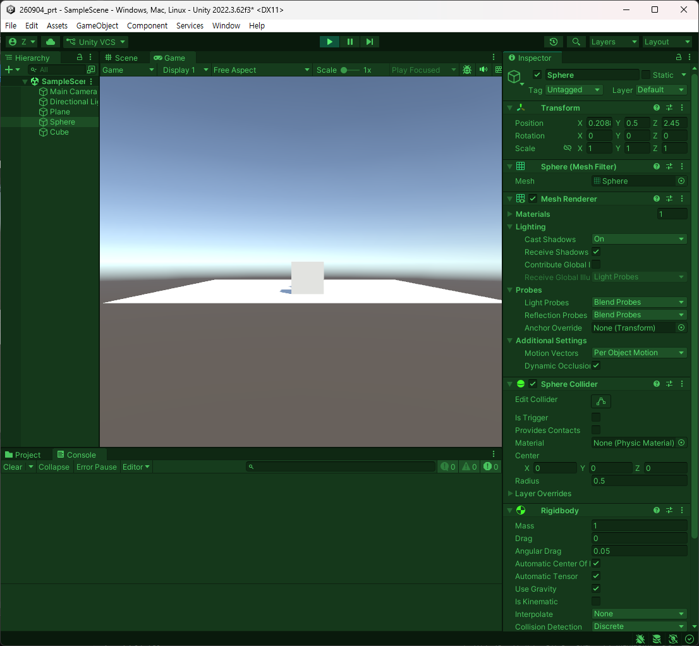
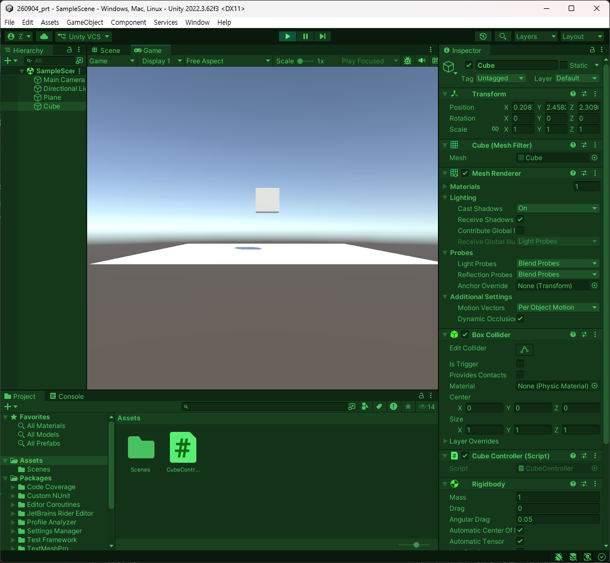
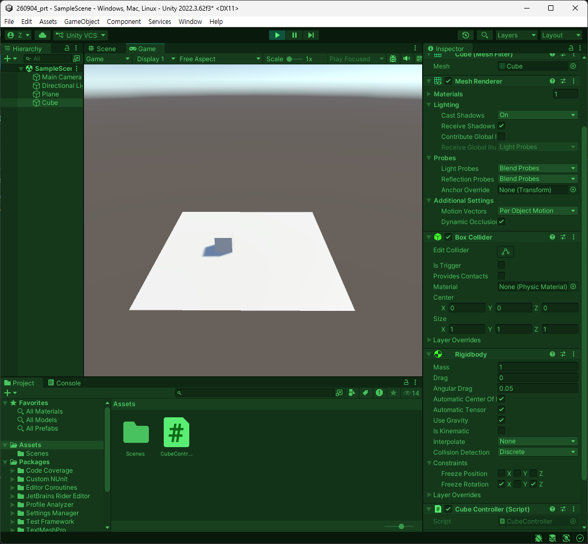
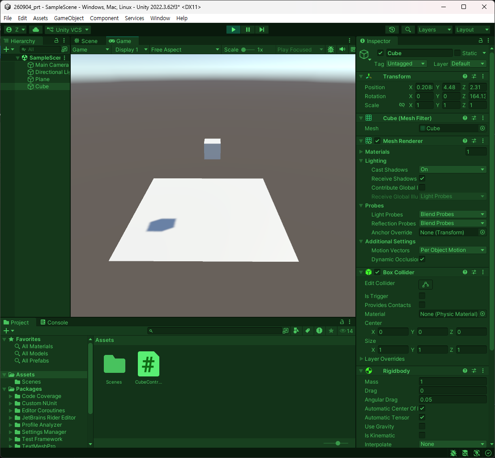
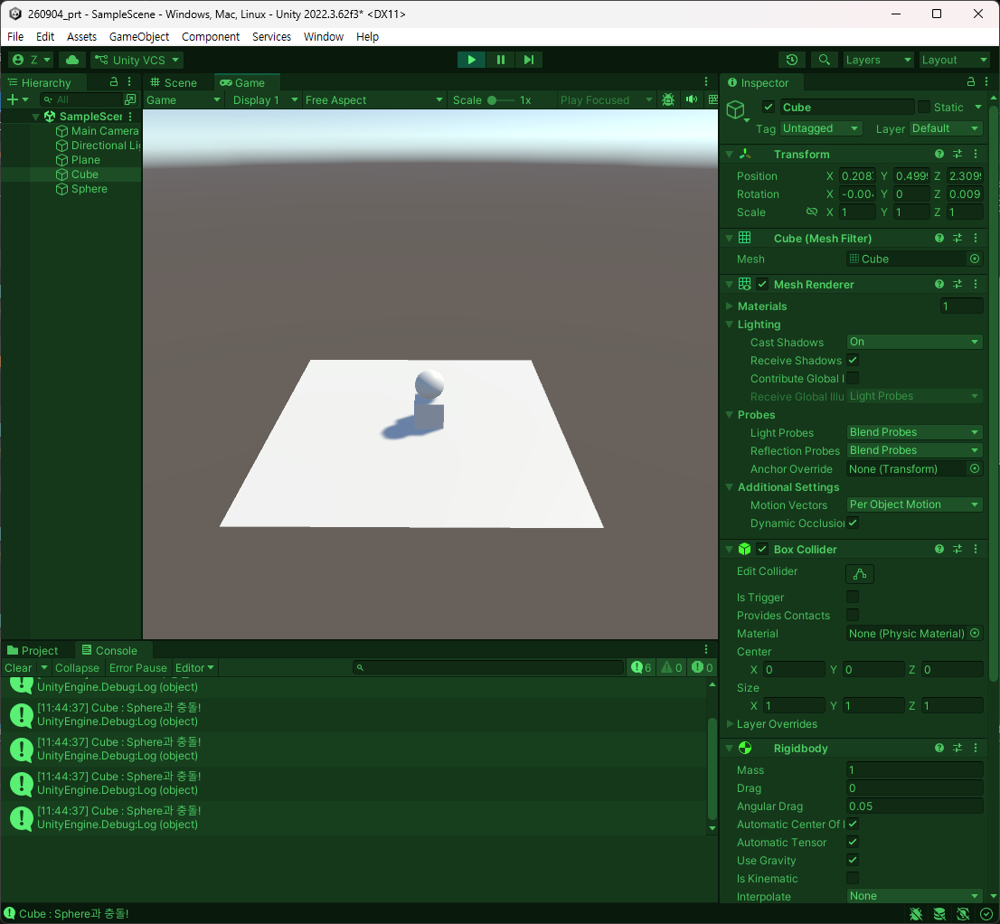
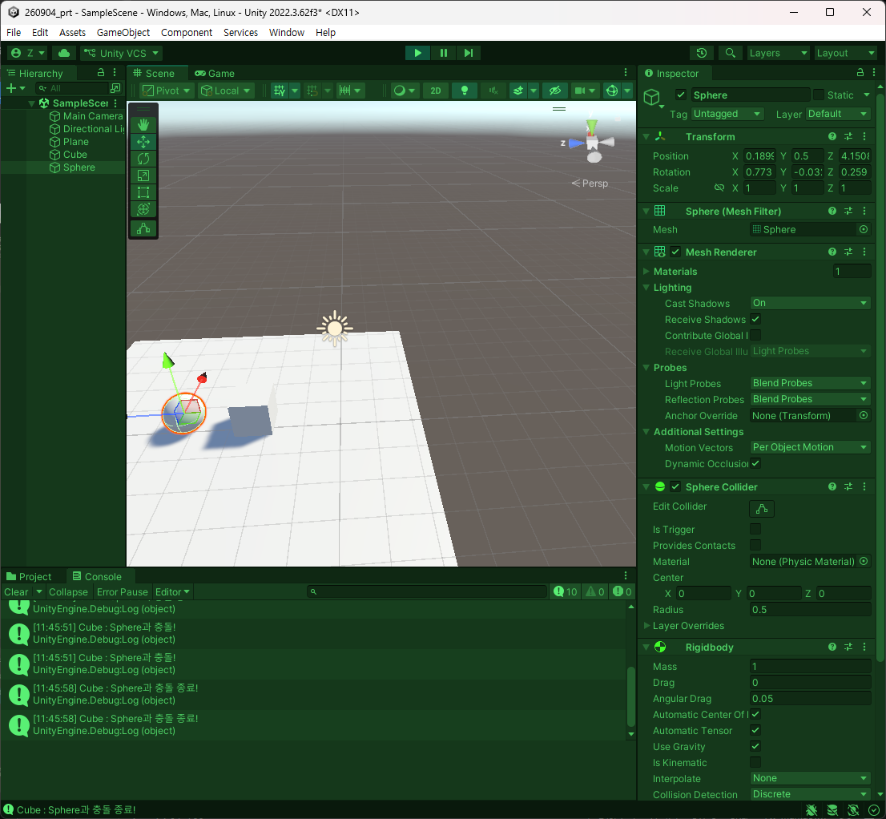

# 260904 Unity(5) 물리 및 충돌, Raycast 
## 1. 물리 및 충돌
### 1.1. 개요
- 가령 도형 2개가 있다고 가정을 했을 때 Collider가 있으면 충돌체로의 역할이 가능하다.
- 이동하는 로직은 Transform으로 짰고 이동도 가능했다. 
- 그런데 플레이를 시키고나서 실질적으로는 겹치게 된다.
- 충돌체는 있지만 물리엔진이 적용이 안된 상태라는 것.
- 만일 rigidbody가 있으면 충돌되어 튕겨져나간다.
- 위치를 전환시키고 회전을 가하는 것이지 물리적으로 힘을 가하진 않는다.
- 이젠 오브젝트에 힘을 가하거나 회전력을 더하거나 속도를 더한다는 것으로 접근이 된다.
- 게임에서는 물리 엔진 충돌을 자주 쓸 수 밖에 없다. 
- 아이템을 습득하는 것조차 역시 물리 충돌 판정이다. 
- 게임에서의 판정이 정확할수록 유저는 생각보다 더 불쾌하게 생각한다. 
- 하지만 여담으론 네트워크가 적용된다면 정말 정확해야만 한다. 

### 1.2. rigidbody
먼저 Plane 추가 및 Cube, Sphere 등을 추가한 다음 플레이를 했을 때는 아무일도 없지만 rigidbody를 적용하면 중력이 적용됨을 볼 수 있다. 



생각보다 유니티 엔진에는 내장된 물리 기능들이 많이 존재한다. (Physics).

그래서 가장 대표적이고 많이 쓰일 것이 rigidbody라는 컴포넌트이다. 
질량, 중력 사용 여부, 판정을 위해 물리엔진을 쓸 경우의 kinematic, 물리 엔진을 통해 이동이 생기는 것을 막거나 회전하는 것을 막거나 하는 Constraints가 있다.

그런데 rigidbody를 줬을 때, 매우 높은 거리에서 떨어뜨렸을 경우, 물체가 통과되는 현상이 존재한다. 

일단 그래서 중력을 rigidbody를 통해 줄 수 있다. 물리엔진이 적용되다 보니까 물체끼리 부딪혀 굴러가기도 한다. 

그런데 Constraints에서 보면 회전과 움직임을 lock을 걸 수 있다. 물리연산 때문에 막아준다는 개념이라고 생각할 것. 

그래서 캐릭터 이동을 구현할 때 물리적 구현에서 rigidbody에서 Constraints에서 x, z의 회전을 잠구기도 한다. 

최종적으로는 물체 부딪히는 것을 구현하도록 가져다 쓸 수 있다. 

Collider가 없이 할려고 할 때, 충돌의 기능이 없어 통과되는 것이 있기 때문에 Collider는 필요하다. 

### 1.3. rigidbody에서 쓸만한 것
C# script를 하나 만든다. 그리고 코드 상에서 진행.
```csharp
using System.Collections;
using System.Collections.Generic;
using UnityEngine;

public class CubeController : MonoBehaviour
{
    private Rigidbody _rigidbody;

    private void Awake()
    {
        // 1. 컴포넌트를 가져와서 붙여준다.
        _rigidbody = GetComponent<Rigidbody>();
    }

    private void Update()
    {
        Foo();
    }

    private void Foo()
    {
        // 4. Update에서 너무 사용하지 않도록 설정.
        if(!Input.GetKeyDown(KeyCode.Space)) 
            return;

        // 2. 대표적으로 쓰는 것은 AddForce(), velocity를 많이 쓴다.
        // 3. AddForce()는 힘을 가하는 것이다.
        _rigidbody.AddForce(new Vector3(0,5,0), ForceMode.Impulse);

        // 5. velocity는 속도를 직접 바꾸는 것이다.
    }
}
```


위와 같이 적용이 된다.

이번에는 velocity를 해볼 것이다.
```csharp
using System.Collections;
using System.Collections.Generic;
using UnityEngine;

public class CubeController : MonoBehaviour
{
    private Rigidbody _rigidbody;

    private void Awake()
    {
        // 1. 컴포넌트를 가져와서 붙여준다.
        _rigidbody = GetComponent<Rigidbody>();
    }

    private void Update()
    {
        Foo();
    }

    private void Foo()
    {
        // 4. Update에서 너무 사용하지 않도록 설정.
        if(!Input.GetKeyDown(KeyCode.Space)) 
            return;

        // 2. 대표적으로 쓰는 것은 AddForce(), velocity를 많이 쓴다.
        // 3. AddForce()는 힘을 가하는 것이다.
        //_rigidbody.AddForce(new Vector3(0,5,0), ForceMode.Impulse);

        // 5. velocity는 속도를 직접 바꾸는 것이다.
        _rigidbody.velocity = new Vector3(0, 0, 5);
    }
}
```


Constraint에서 회전 x, z를 잠궜을 때 가해지고 있던 속도가 점점 줄어들고 관성이 비스무리하게 구현된다.

키입력과 단위 벡터를 반환받아 속도 변수를 단위 벡터에 곱해서 이동이 되는 것을 구현이 가능할 것이다. 

Transform의 경우 업데이트에서 연산을 주다 보니까 PC마다 프레임 갱신율이 다르다. 이동 속도의 보정을 위해 deltaTime을 썼다.

그런데 Transform으로 이동시킬 때와 다르게 하지만 **물리엔진의 경우는 똑같은 물리 엔진의 갱신이 보장되다 보니까 여기서는 deltaTime을 곱할 필요**가 없다. 오히려 곱하면 많이 느려진다.

활발하지 않지만 결과적으로는 물리의 회전력이 더해진 케이스인데 AngularVelocity로 회전시키는 것이 가능하다. 

```csharp
using System.Collections;
using System.Collections.Generic;
using UnityEngine;

public class CubeController : MonoBehaviour
{
    private Rigidbody _rigidbody;

    private void Awake()
    {
        // 1. 컴포넌트를 가져와서 붙여준다.
        _rigidbody = GetComponent<Rigidbody>();
    }

    private void Update()
    {
        Foo();
    }

    private void Foo()
    {
        // 4. Update에서 너무 사용하지 않도록 설정.
        if(!Input.GetKey(KeyCode.Space)) 
            return;

        // 2. 대표적으로 쓰는 것은 AddForce(), velocity를 많이 쓴다.
        // 3. AddForce()는 힘을 가하는 것이다.
        //_rigidbody.AddForce(new Vector3(0,5,0), ForceMode.Impulse);

        // 5. velocity는 속도를 직접 바꾸는 것이다.
        //_rigidbody.velocity = new Vector3(0, 0, 5);

        // 6. Angular Velocity를 적용
        _rigidbody.angularVelocity = new Vector3(0, 0, 5);
    }
}
```


회전하다가 서서히 느려진다.

단, 캐릭터 회전은 Rotation으로 하는 것을 추천하고 이동은 키입력을 받아 단위 벡터를 반환받아 velocity로 넣어주는 방식을 취하도록 한다. 

### 1.4. Collision
- **물리엔진을 쓰는 경우는 충돌 체크를 위함이다**
- 대표적으로 Collider와 Trigger라는 키워드가 존재한다. 
- Enter, Stay, Exit 이 3가지를 지원한다.
  - Enter : 충돌이 시작되었을 때
  - Stay : 충돌이 유지되고 있을 때
  - Exit : 충돌이 종료되었을 때.
```csharp
private void OnCollisionEnter(Collision collision)
{
}

private void OnTriggerEnter(Collider other)
{
}

private void OnCollisionExit(Collision collision)
{
}
```
기본적으로 제공하는 유니티 함수이다. 심지어 라이프사이클에서도 포함이 되며 Physics 영역에서 처리된다. 

- 업데이트보다 한 프레임 내에서 빨리 호출된다. 
- 무슨일이 있을 때는 이벤트 함수와 실행 순서를 매번 보도록 한다.

이제 충돌이 시작되었을 때를 보도록 하자. Enter부터.
```csharp
private void OnCollisionEnter(Collision collision)
{
    Debug.Log($"{gameObject.name} : ");
}
```
충돌 정보가 매개변수로써 담겨있을 것이며 충돌체의 rigidbody, transform, collider, gameobject도 담고 있다. 

기본적으로 이런식으로 쓴다. 
```csharp
private void OnCollisionEnter(Collision collision)
{
    Debug.Log($"{gameObject.name} : {collision.gameObject.name}과 충돌!");
}
```

그래서 몬스터 GetComponent 등을 통해 데미지를 받는다거나 하는 많은 것들에 사용된다. 

사용해보도록 하자. 


Exit을 추가.
```csharp
using System.Collections;
using System.Collections.Generic;
using UnityEngine;

public class CubeController : MonoBehaviour
{
    private Rigidbody _rigidbody;

    private void Awake()
    {
        // 1. 컴포넌트를 가져와서 붙여준다.
        _rigidbody = GetComponent<Rigidbody>();
    }

    // Collision(충돌)과 Trigger(특정 이벤트 스위치)가 존재한다.
    private void OnCollisionEnter(Collision collision)
    {
        Debug.Log($"{gameObject.name} : {collision.gameObject.name}과 충돌!");
    }

    private void OnTriggerEnter(Collider other)
    {
    }

    private void OnCollisionExit(Collision collision)
    {
        Debug.Log($"{gameObject.name} : {collision.gameObject.name}과 충돌 종료!");
    }
}
```


이렇게 충돌 정보를 담아준다. 

Stay를 마지막에 둔 것은 잘 안쓰기 때문이다.

### 1.5. Trigger
- 말그대로의 방아쇠이다. 

일단 Sphere를 지우고 