# 260907 Unity(6) 물리 및 충돌, Raycast 추가 
## 1. 발표 : rigidbody로 물리엔진을 적용했음에도 바닥을 뚫고 지나가는 원인
- rigidbody로 물리엔진을 적용했음에도 바닥을 뚫고 지나가는 원인에 대해서가 주제였음.
- 프레임 단위로 재생하는 것을 확인했을 때, 평면에 부딪혀 0이 되는 것이 아니라 좌표상 -값이 나오는 상황이 발생.
- 즉, 프레임 삭제가 발생하는 현상이 존재. 
- 터널링 키워드 주목.
- 너무 빠르면 충돌 감지가 불가하고 통과하는 현상
- 유니티 라이프사이클 상에서 FixedUpdate, Update간의 관계에서 발생. 
- FixedUpdate의 경우는 물리 엔진 계산을 담당한다. 
- FixedUpdate의 경우에는 0.02초마다 발생하고 Update는 매 프레임이다. 
- 이동의 경우는 값을 받아서 Update에서 이동시키는 작업을 한다. 
- 0.02초 동안에도 이동은 해야 한다. 
- 그래서 FixedUpdate, Update의 경우에는 FixedUpdate에서 계산한 것을 실시간으로 받아와서 Update가 다음 위치로 보내주는데 충돌을 발생하지 않았다고 판단하여 0.02초 안의 업데이트를 못해서 통과를 해버린다.
- 그래서 Unity의 경우에는 제공해주는 기능들이 존재한다.
- Rigidbody 컴포넌트에서는 충돌감지모드 4종이 있다. 
- 알고리즘 차이로 종류가 나뉘는데 rigidbody가 없으면 정적 오브젝트, Rigidbody가 있으면 동적 오브젝트.
- Discrete : 기본값. 연산 속도가 빠르고 범용성이 좋지만 빠른 속도의 충돌을 감지 못한다는 점이 존재. 
- 툭툭 끊어서 계산하는 이산적 탐지. 
- 이 때문에 빠른 속도에 대한 충돌이 발생하지 않는 터널링이 존재한다는 것이다. 
- Continuous : 연속 충돌 탐지. Sweep Base 알고리즘 적용. 선형으로 범위를 탐지했을 때 충돌 여부를 감지한다. 
- 직선 운동 충돌은 잘 감지하지만 회전 운동에 대한 것은 잘 감지하지 못함. 
- 또한 선형 운동을 하는 오브젝트가 많이 존재하면 부담이 많이 걸린다.
- Continuous Dynamic : 동적 오브젝트도 감지가 가능하다. 
- Continuous는 동적 오브젝트에 대한 충돌을 감지하므로 Continuous에 대해서 터널링이 발생하면 여긴 발생하지 않는다. 
- Continuous Speculative : Speculative 알고리즘 사용. 속도에 기반해서 계산을 하는데 사각형으로 묶어 감지 영역에서 충돌이 예상되는 부분을 지정해 연산 처리를 진행한다. 
- 그러나 문제는 Ghost Collision이라고 해서 의도하지 않는 충돌이 발생한다. 이게 추측성 알고리즘을 사용했기 때문에 발생한다.
- 즉, 정확도가 낮아진다. 
- 순차적으로 문제에 따라 적용해봄직 하다. 복잡한 물리 연산이 없으면 Speculative, 인스턴스가 동적인지 정적인지에 따라 Continuous를 적용한다. 
- FixedUpdate 주기를 조정하는 것은 어지간하면 하지 않을 것. 
- 물리 엔진 쪽에서 속도가 빠르면 소위 거부존이라는 현상도 있음. 

## 2. 물리 처리에 대한 보충
### 2.1. 추가적 충돌 처리에 관한 강의
- 충돌 처리에 관련해서 Collision과 Trigger가 있었음. 
- 이 두가지는 Collider 자체를 기준으로 충돌이 발생하는지 Trigger를 통해서 원하는 물체가 영역에 들어왔는지를 썼었음. 
- 기본적으로 이 2가지는 유니티 이벤트 함수에서 지원했음. 
- 충돌 처리 자체를 유저가 하고 싶은 타이밍에 검사를 돌리는 방법이 있음. 

그래서 이번엔 Player가 Monster를 감지하는 것을 구현해보려고 함. 

코드는 다음과 같이 설정. 세부 설명은 주석 참조.
```csharp
public class CubeController : MonoBehaviour
{
    private Camera _cam;
    [SerializeField] private UnitMovement _target;

    private void Start()
    {
        _cam = Camera.main;
    }

    private void Update()
    {
        RayShot();
        MoveTarget();
        DetectMonster();
    }

    [SerializeField] private float _detectRange; // 3. 감지 거리 변수

    private void DetectMonster()
    {
        // 1. 감지 시, 로그를 뽑아볼 것임.
        if (!Input.GetKeyDown(KeyCode.Alpha1))
            return;

        // 2. 구체 범위로 선정. 자신의 위치를 기준으로 감지 범위 설정.
        // 4. Physics 클래스에서 보면 OverlapSphere은 Collider 배열을 반환함.
        // 5. 반경 이내의 Collider를 담아 배열로 반환.
        Collider[] cols = Physics.OverlapSphere(transform.position, _detectRange);

        // 6. 반복문으로 이름들을 순회
        foreach (Collider col in cols)
        {
            Debug.Log(col.gameObject.name);
        }
    }
    ... 생략
}
```


감지 범위를 설정하고 1을 눌렀을 때 감지가 되는 것을 확인할 수 있었다. 

특정 크기만큼 Overlap을 하고 있고 자신까지 감지를 한다. Layermask나 Tag 등으로 걸러낼 수 있음.

현재 환경에서는 Tag : Monster를 foreach에서 처리.

```csharp
// 반복문으로 이름들을 순회
foreach (Collider col in cols)
{
    if(col.gameObject.CompareTag("Monster"))
    { 
        Debug.Log(col.gameObject.name); 
    }
}
```


이것까지는 배운 내용대로. 나중에는 Layermask를 통해 해야 할 것이다. 

- 인터페이스에 익숙해질 필요가 있는 것이 특정 지점을 기준으로 범위를 돌리는데 FPS에서 수류탄을 예시로 들면 몬스터나 플레이어나 상호작용 오브젝트도 적용받는다. 
- 지금으로써는 Tag를 모두 추가해야 한다. 
- 그래서 특정 인터페이스를 기준으로 동작하게끔 할 수 있다. 
- 그래서 OverlapSphere는 주의를 해야 하는 것이 배열이 생성되서 들어가있는 것이 확인.
- 문제는 배열을 반환하는 이것을 Update에 계속 돌리면 안된다. 
- 수류탄 정도야 괜찮지만.
- **빈번한 사용에서는 조금 더 효과적인 사용을 위한 키워드는 NonAllock**이다. 

### 2.2. 발표에서의 추가 설명
- 구체가 앞으로 전진했을 때는 틀림없이 벽에 부딪히는데 구의 중앙에서 Raycast를 쐈을 때 벽이 감지되지 않는다.
- 그 때 쓸 수 있는 것은 Physics.SphereCast() 라는 것이 존재한다. 
- 특히나 범위 기준을 나열할 때, 충돌이 일어나는지 아닌지를 판단할 때 써봄직하다. 
- 잘 안쓰이긴 하지만 예시로는 전진할 때 부딪히는지 미리 판단할 때 정도?
- 물리 엔진을 굳이 사용하지 않아도 되는 게임들이 다수 존재한다. 
- 혹시나 rigidbody를 무의식적으로 추가하여 성능 낭비를 하진 말 것. 
- 진정으로 필요한 기능인지를 생각해보고 사용하는 것이 맞을 것.

## 3. 유니티 패키지
### 3.1. 설명
- 원본을 전달하는 것은 guid가 꼬일 가능성이 다분하다. 
 
순서는 다음과 같다.


프로젝트 때 실질적으로 선택해서 전달할 수 있음. 

## 4. FPS 구현
### 4.1. url
https://github.com/KimJaeSeongJade/mp15-FpsSample
- 놓쳤을 경우 특정 파일을 기준으로 찾아서 사용하도록 할 것. 

### 4.2. 구현
일단 Import, Script, Prefab 폴더를 추가.


이미 레트로 유니티에서도 나와있기는 하다. 범위 내 플레이어가 들어왔을 때 벽에 가면 감지 불능이어야 한다. 

첫번째는 범위 내인가 두번째는 벽에 가려졌는지 Raycast로 쏴야 한다. 

일단 에셋을 받아서 살펴본다. 
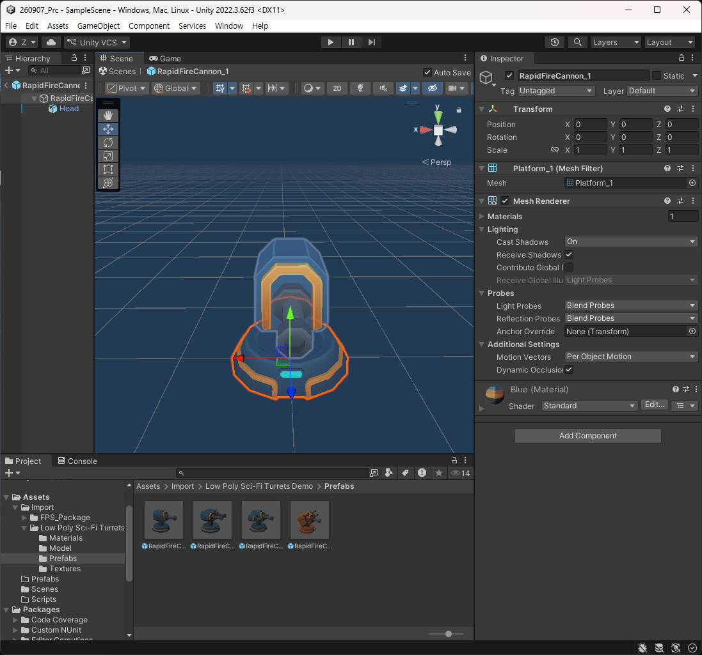

샘플 씬에다가 Turret 오브젝트 생성.
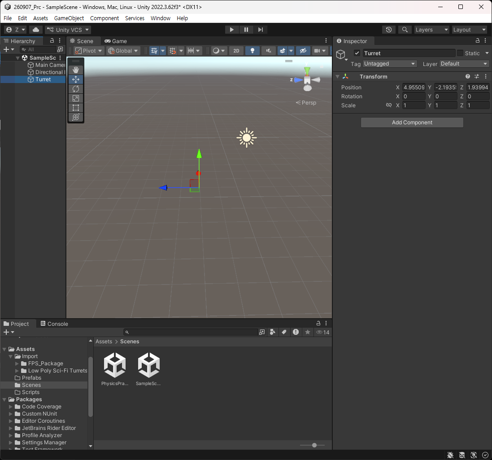

선정한 프리팹을 하위에 달아줄 것.
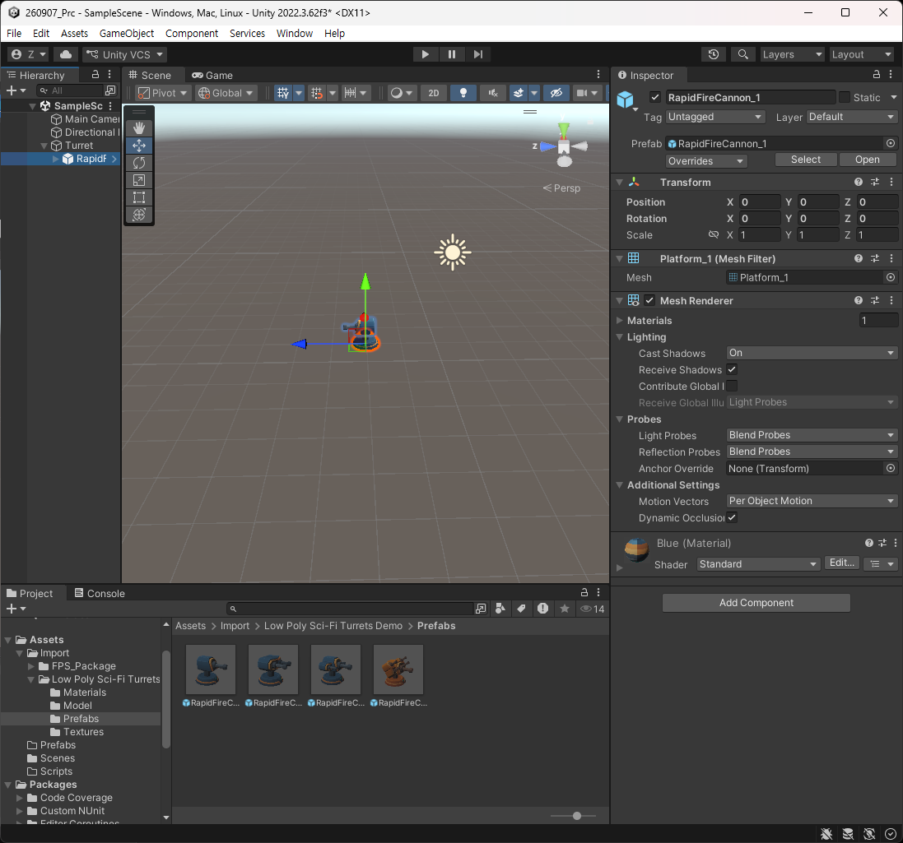

Collider를 넣고 값 설정.
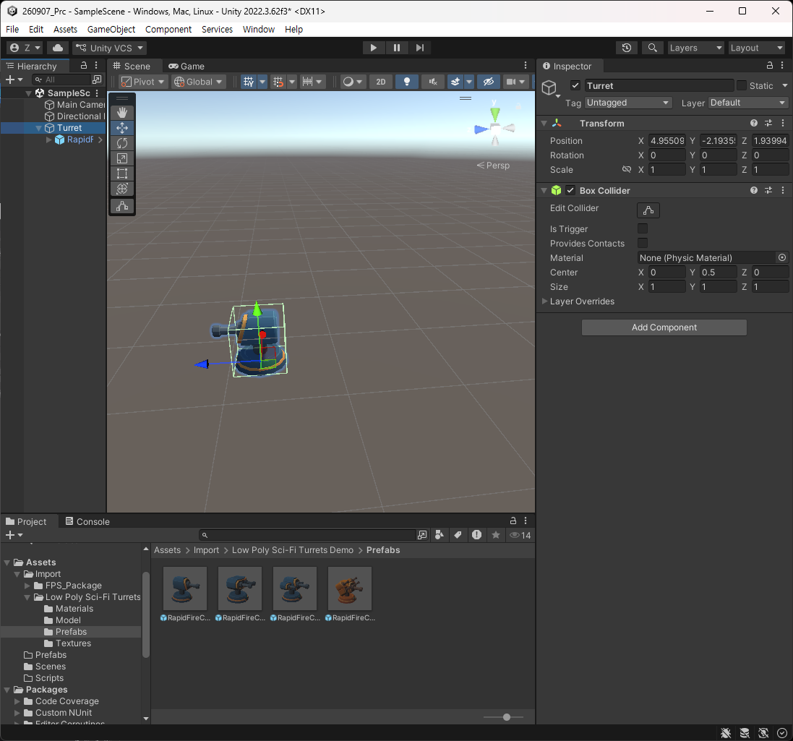

만든 것을 프리팹 화.
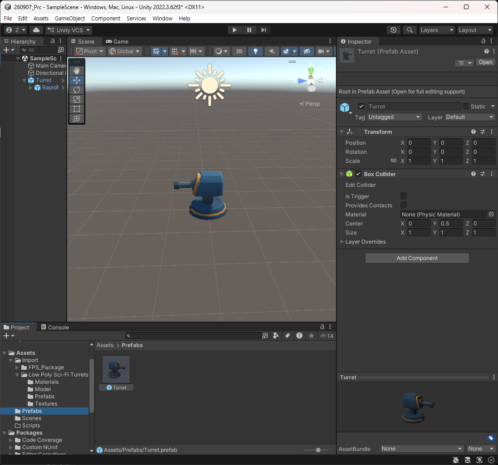

스크립트를 만들기 전에 기준을 정하는 것이 좋을 것으로 판단됨. 
- 플레이어라는 것을 어떻게 감지를 할 것인지?
  - **태그로 감지**. 물론 플레이어를 인터페이스화 할 수 있다. 캐릭터가 다양할 때 걸어주면 그만. 지금 상황에서는 플레이어는 Tag를 달아둘 것이라 이 부분은 Tag로 감지해보도록 하자.
- '감지'는 어떤 조건이 필요한지?
  - **Trigger 내에 들어와서 Raycast로 플레이어가 감지된다.** 만일 터렛의 범위가 존재할 때 Collider 크기라던지 있다면 사실상 벽이 없을 때는 플레이어가 감지되지만 벽이 있으면 일반적 상황에서는 감지가 되었다고 보기 힘들다. <br>
  그래서 첫번째는 Trigger에 감지가 되었는지, Trigger에 감지가 되었다면 Raycast를 쏜 다음에 플레이어를 제대로 받아오면 중간에 벽이 없었다는 것이고 있으면 막힌다. 즉, 두번째는 Raycast를 통해 Player를 찾았을 때 감지 완료가 발생해야 한다(백터 내적으로 시야각을 판정한 다음 감지는 되었는데 어디에 있는지 판단할 수 있으나 지금은 아니다).
- 감지했을 때는 무엇을 해야 할지?
  - **Head를 플레이어에게 돌려 일정 주기마다 bullet 발사.**
- 감지를 하지 못했을 때는 무엇을 해야 할지?
  - **Head를 돌린다.**

이런 전제조건이 필요할 것으로 보여짐. 

일단 Trigger가 필요할 것인데 접근은 다음과 같이 가자. 
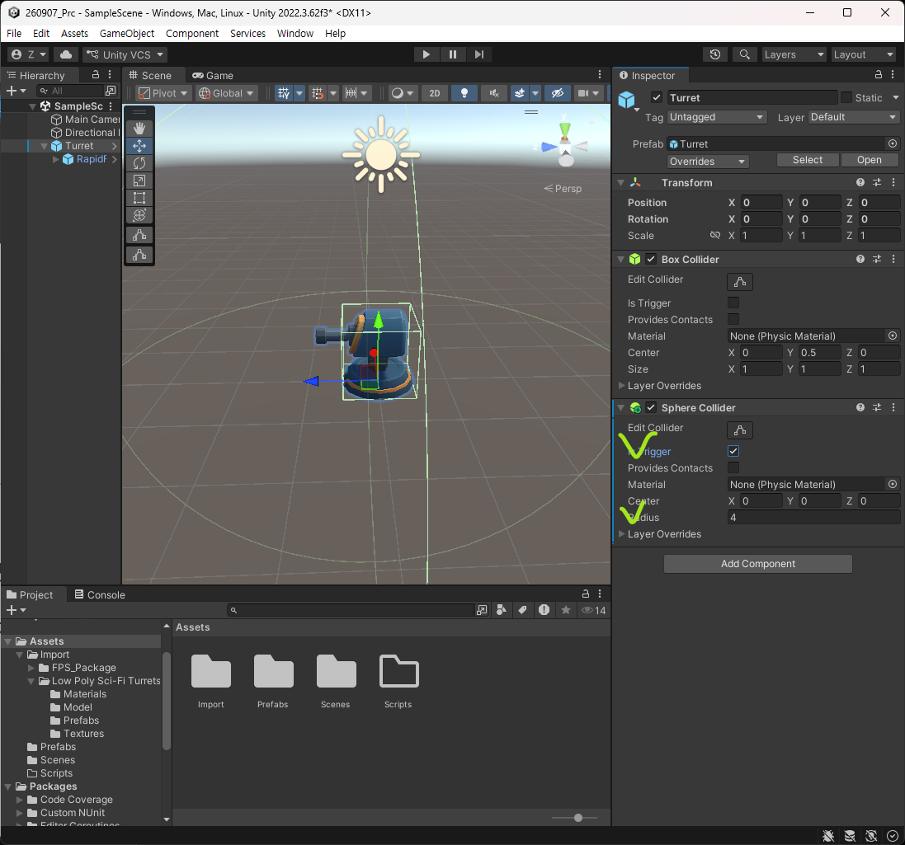
스크립트 추가.
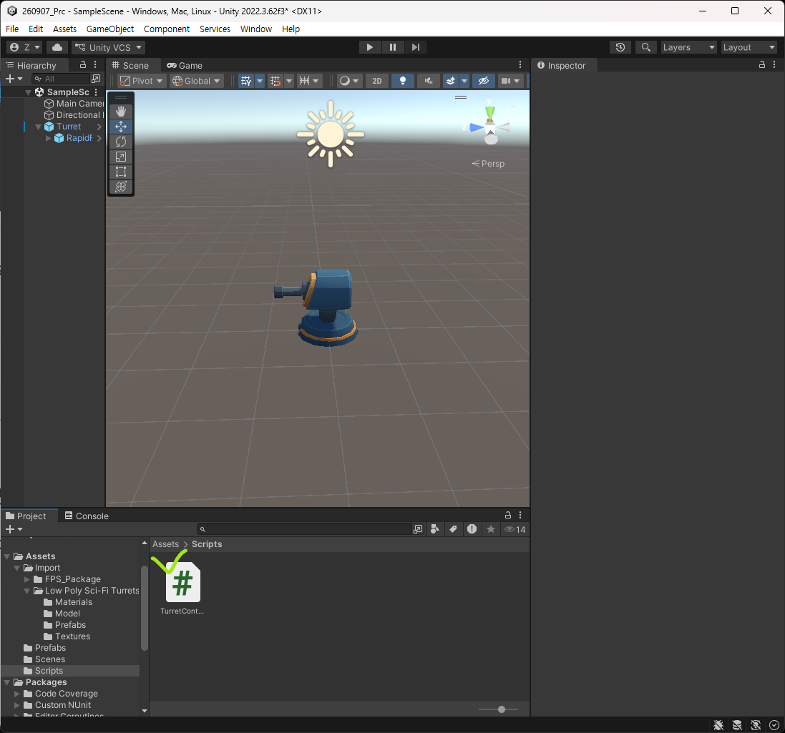

Trigger 내에 플레이어가 들어왔다는 것을 태그를 통해 확인되도록 진행. 
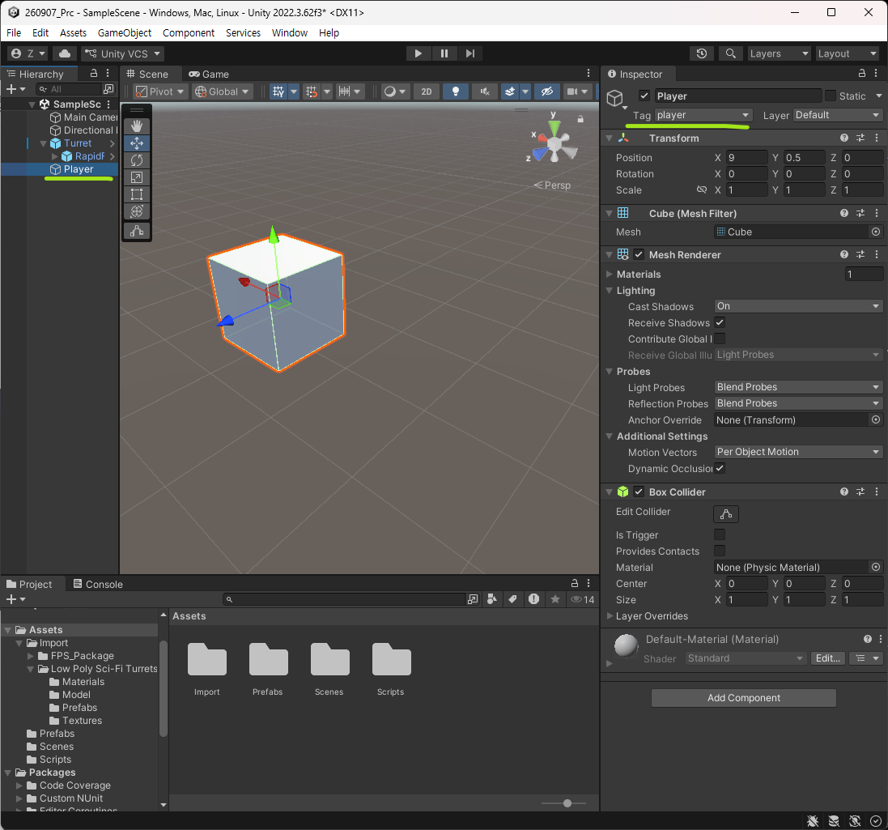
```csharp
using System.Collections;
using System.Collections.Generic;
using UnityEngine;

public class TurretController : MonoBehaviour
{
    private void OnTriggerEnter(Collider other)
    {
        if(other.gameObject.CompareTag("player"))
        {
            Debug.Log("Player 범위 내 들어옴");
        }
    }
    private void OnTriggerExit(Collider other)
    {
        if (other.gameObject.CompareTag("player"))
        {
            Debug.Log("플레이어 나감");
        }
    }
}
```

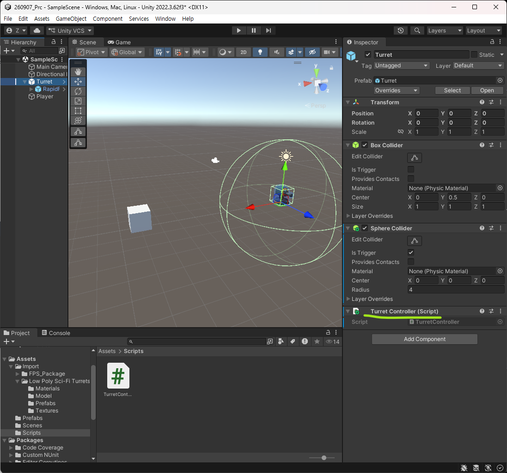

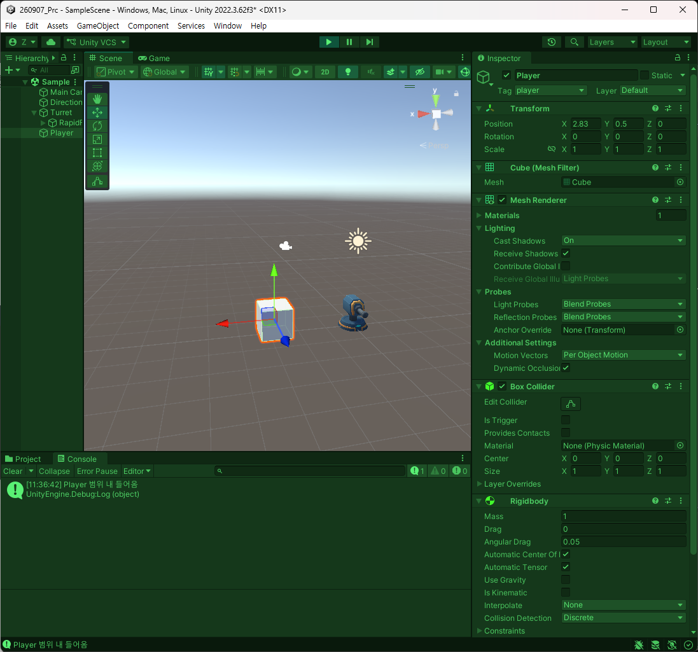

이런 식이다. 

어디에 rigidbody를 적용할지를 보려면 [링크](https://docs.unity3d.com/kr/2018.4/Manual/CollidersOverview.html)로.

플레이어에서 rigidbody를 가지고 있으므로 상대가 어떤 상태라도 한 쪽에서 rigidbody를 가지고 있다면 OnTrigger가 발생할 수 있다. 

일단 로그로만 해둔 상태. 감지를 했다는 것이 조건 2개가 True여야 하는데 bool 타입 변수를 쓰도록 한다. 

```csharp
using System.Collections;
using System.Collections.Generic;
using UnityEngine;

public class TurretController : MonoBehaviour
{
    private bool isPlayerInTrigger = false;

    private void OnTriggerEnter(Collider other)
    {
        if(other.gameObject.CompareTag("player"))
        {
            Debug.Log("Player 범위 내 들어옴");

            isPlayerInTrigger = true;
        }
    }
    private void OnTriggerExit(Collider other)
    {
        if (other.gameObject.CompareTag("player"))
        {
            Debug.Log("나감");

            isPlayerInTrigger = false;
        }
    }
}

```

두번째 조건은 Raycast를 쏴야 하는데 무지성으로 쏠 수 없다. 그래서 Trigger 내에 들어왔을 때는 플레이어의 transform을 보관해야 할 것인데 position에 ray를 쏠 수 있도록 해야 한다.

```csharp
using System.Collections;
using System.Collections.Generic;
using UnityEngine;

public class TurretController : MonoBehaviour
{
    private Transform _playerTransform;
    private bool isPlayerInTrigger = false;

    private void OnTriggerEnter(Collider other)
    {
        if(other.gameObject.CompareTag("player"))
        {
            Debug.Log("Player 범위 내 들어옴");

            _playerTransform = other.transform;
            isPlayerInTrigger = true;
        }
    }
    private void OnTriggerExit(Collider other)
    {
        if (other.gameObject.CompareTag("player"))
        {
            Debug.Log("Player 범위 밖으로 나감");

            _playerTransform = null;
            isPlayerInTrigger = false;
        }
    }
}
```

이러면 bool 타입 변수가 쓸모 없어진다. 그렇다면 다음과 같이 진행. 

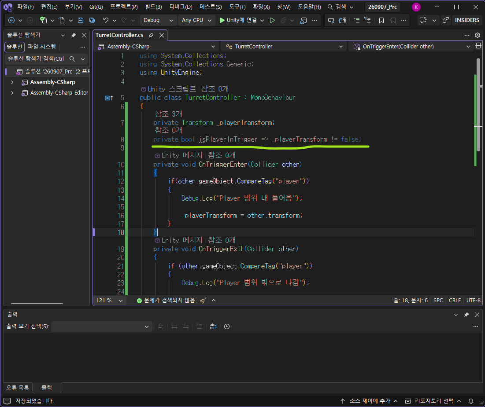
```csharp
using System.Collections;
using System.Collections.Generic;
using UnityEngine;

public class TurretController : MonoBehaviour
{
    private Transform _playerTransform;
    private bool isPlayerInTrigger => _playerTransform != null;

    private void OnTriggerEnter(Collider other)
    {
        if(other.gameObject.CompareTag("player"))
        {
            Debug.Log("Player 범위 내 들어옴");

            _playerTransform = other.transform;
        }
    }
    private void OnTriggerExit(Collider other)
    {
        if (other.gameObject.CompareTag("player"))
        {
            Debug.Log("Player 범위 밖으로 나감");

            _playerTransform = null;
        }
    }
}
```

저것은 동작상으로 완전히 같지는 않지만 프로퍼티를 통해 get을 해오는 경우라고 생각하면 쉽다. 

```csharp
using System.Collections;
using System.Collections.Generic;
using UnityEngine;

public class TurretController : MonoBehaviour
{
    private Transform _playerTransform;
    private bool _isPlayerInTrigger => _playerTransform != null;

    private void OnTriggerEnter(Collider other)
    {
        if(other.gameObject.CompareTag("player"))
        {
            Debug.Log("Player 범위 내 들어옴");

            _playerTransform = other.transform;
        }
    }
    private void OnTriggerExit(Collider other)
    {
        if (other.gameObject.CompareTag("player"))
        {
            Debug.Log("Player 범위 밖으로 나감");

            _playerTransform = null;
        }
    }

    private void RayShotToPlayer()
    {
        if (!_isPlayerInTrigger)
        {
            return;
        }

        Ray ray;
        RaycastHit hit;

        if(Physics.Raycast())
        {
            // 플레이어를 찾았으면 감지 완료.
        }
    }
}

```
이어서 진행을 했을 때 다음과 같이 Raycast에 대한 함수를 만들 수 있을 것. 

그렇다면 시야 내에 있다고 판단을 했을 수 있으므로 bool에 상태를 담아두도록 하자. 
```csharp
using System.Collections;
using System.Collections.Generic;
using UnityEngine;

public class TurretController : MonoBehaviour
{
    private Transform _playerTransform;
    private bool _isPlayerInTrigger => _playerTransform != null;
    private bool _isPlayerInsight = false;

    // --- 생략 ---

    private void RayShotToPlayer()
    {
        if (!_isPlayerInTrigger)
        {
            return;
        }

        Ray ray;
        RaycastHit hit;

        if(Physics.Raycast())
        {
            // 플레이어를 찾았으면 감지 완료.
            if(hit.transform.CompareTag("player"))
            {
                _isPlayerInsight = true;
            }
            else
            {
                _isPlayerInsight = false;
            }
        }
        else // 벽일 경우
        {
            _isPlayerInsight = false;
        }
    }
}

```

Ray를 발사해야 하니 시작위치와 방향을 설정해야 한다. 함정이 존재한다. 그저 터렛으로부터 플레이어에게 Ray를 쏘면 된다고 생각하지만 그게 아니라는 것.

지면 상에 놓여 있을 때, 터렛은 가운데가 아니라 땅에 pivot을 해놨기 때문에 Turret의 기준으로 Ray를 쏘게 되면 Pivot으로부터 쏘게 된다는 것. 

그렇게 된다면 땅 자체가 평지였을 경우에는 괜찮겠지만 문제는 지형지물에 의해 pivot이 막혔을 때는 Ray가 플레이어를 감지하지 못한다. 

이전 Turret을 진행할 때는 muzzlePoint로 발사 위치를 잡아놨었다. 애초에 발사 위치가 변하진 않지만 MuzzlePoint와 높이를 맞춰서 쏠 것이다. 플레이어도 muzzlePoint만큼 띄운 다음에 가게 만들 것이다(크기 변환과 상관 X).

```csharp
public class TurretController : MonoBehaviour
{
    private Transform _playerTransform;
    private bool _isPlayerInTrigger => _playerTransform != null;
    private bool _isPlayerInsight = false;

    private Transform _muzzlePoint;

    // --- 생략 ---

    private void RayShotToPlayer()
    {
        if (!_isPlayerInTrigger)
        {
            return;
        }

        // 각각의 피봇. 발사 위치만큼 띄워야 한다.
        Vector3 from = //transform.position;
                        new Vector3(transform.position.x, 
                        transform.position.y + _muzzlePoint.position.y, 
                        transform.position.z);
        Vector3 to = //_playerTransform.position;
                        new Vector3(_playerTransform.position.x, 
                        _playerTransform.position.y + _muzzlePoint.position.y, 
                        _playerTransform.position.z);
        Ray ray;
        RaycastHit hit;

 // ---- 생략 -----
```
다음과 같이 muzzlePoint를 통한 좌표 설정을 한다는 것. 

```csharp
public class TurretController : MonoBehaviour
{
    private Transform _playerTransform;
    private bool _isPlayerInTrigger => _playerTransform != null;
    private bool _isPlayerInsight = false;

    private Transform _muzzlePoint;
    private SphereCollider _sphereCollider;

    // 유니티 이벤트 
    private void Awake()
    {
        CacheComponents();
    }

    private void Update()
    {
        RayShotToPlayer();
    }

    private void CacheComponents()
    {
        _sphereCollider = GetComponent<SphereCollider>();
    }

    private void OnTriggerEnter(Collider other)
    {
        if(other.gameObject.CompareTag("player"))
        {
            Debug.Log("Player 범위 내 들어옴");

            _playerTransform = other.transform;
        }
    }
    private void OnTriggerExit(Collider other)
    {
        if (other.gameObject.CompareTag("player"))
        {
            Debug.Log("Player 범위 밖으로 나감");

            _playerTransform = null;
        }
    }

    private void RayShotToPlayer()
    {
        if (!_isPlayerInTrigger)
        {
            return;
        }

        // 각각의 피봇. 발사 위치만큼 띄워야 한다.
        Vector3 from = //transform.position;
                       new Vector3(transform.position.x, 
                       transform.position.y + _muzzlePoint.position.y, 
                       transform.position.z
                        );
        Vector3 to = //_playerTransform.position;
                     new Vector3(_playerTransform.position.x, 
                     _playerTransform.position.y + _muzzlePoint.position.y, 
                     _playerTransform.position.z
                        );
        //Ray ray;
        // 방향과 크기가 나오는 벡터로 변환 필요.
        // 목적지로 삼는 벡터에서 자신의 벡터를 빼면 다음과 같이 된다.
        Ray ray = new Ray(from, (to - from).normalized);
        RaycastHit hit;

        // 반지름만큼 발사해줘야 한다. 
        if(Physics.Raycast(ray, out hit, _sphereCollider.radius))
        {
            // 플레이어를 찾았으면 감지 완료.
            if(hit.transform.CompareTag("player"))
            {
                _isPlayerInsight = true;
            }
            else
            {
                _isPlayerInsight = false;
            }
        }
        else // 벽일 경우
        {
            _isPlayerInsight = false;
        }
    }
}
```

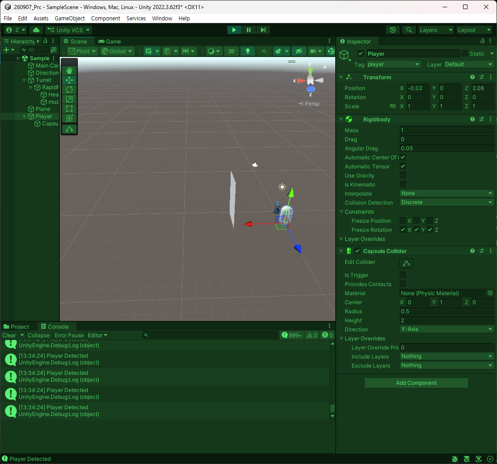

이제 플레이어가 밖으로 되면 회전해야 한다.

```csharp
using System.Collections;
using System.Collections.Generic;
using UnityEngine;

public class TurretController : MonoBehaviour
{
    private Transform _playerTransform;
    private bool _isPlayerInTrigger => _playerTransform != null;
    private bool _isPlayerInsight = false;

    [SerializeField] private Transform _muzzlePoint;
    private SphereCollider _sphereCollider;

    [SerializeField] private float _rotateSpeed;
    [SerializeField] private Transform _headTransform;

    // 유니티 이벤트 
    private void Awake()
    {
        CacheComponents();
    }

    private void Update()
    {
        RayShotToPlayer();
        Rotate();
    }

    private void CacheComponents()
    {
        _sphereCollider = GetComponent<SphereCollider>();
    }
    // ---- 끝 ----

    private void Rotate()
    {
        if (_isPlayerInsight)
        {
            return;
        }
        _headTransform.Rotate(Vector3.up, _rotateSpeed * Time.deltaTime);
    }

    private void Fire()
    {
        if(_isPlayerInsight)
        {
            return;
        }

        _headTransform.LookAt(_playerTransform.position);
    }

    private void OnTriggerEnter(Collider other)
    {
        if(other.gameObject.CompareTag("player"))
        {
            Debug.Log("Player 범위 내 들어옴");

            _playerTransform = other.transform;
        }
    }
    private void OnTriggerExit(Collider other)
    {
        if (other.gameObject.CompareTag("player"))
        {
            Debug.Log("Player 범위 밖으로 나감");

            _playerTransform = null;
        }
    }

    private void RayShotToPlayer()
    {
        if (!_isPlayerInTrigger)
        {
            return;
        }

        // 각각의 피봇. 발사 위치만큼 띄워야 한다.
        Vector3 from = new Vector3(transform.position.x, 
                       transform.position.y + _muzzlePoint.position.y, 
                       transform.position.z
                        );


        Vector3 to = new Vector3(_playerTransform.position.x, 
                     _playerTransform.position.y + _muzzlePoint.position.y, 
                     _playerTransform.position.z
                      );
        //Ray ray;
        // 방향과 크기가 나오는 벡터로 변환 필요.
        // 목적지로 삼는 벡터에서 자신의 벡터를 빼면 다음과 같이 된다.
        Ray ray = new Ray(from, (to - from).normalized);
        RaycastHit hit;

        // 반지름만큼 발사해줘야 한다. 
        if(Physics.Raycast(ray, out hit, _sphereCollider.radius))
        {
            // 플레이어를 찾았으면 감지 완료.
            if(hit.transform.CompareTag("player"))
            {
                _isPlayerInsight = true;
                Debug.Log("Player Detected");
            }
            else
            {
                _isPlayerInsight = false;
            }
        }
        else // 벽일 경우
        {
            _isPlayerInsight = false;
        }
    }
}

```
이렇게 되었을 경우 상황이 애매해진다. 
```csharp
private void Fire()
    {
        if(_isPlayerInsight)
        {
            return;
        }

        _headTransform.LookAt(_playerTransform.position);
    }
```

Turret이 기울여져야 한다. 높이만 위치에 맞춰야 한다. 

```csharp
public class TurretController : MonoBehaviour
{
    private Transform _playerTransform;
    //private bool _isPlayerInTrigger => _playerTransform != null;
    private bool _isPlayerInTrigger { get { return _playerTransform != null; } }
    private bool _isPlayerInsight = false;

    [SerializeField] private Transform _muzzlePoint;
    private SphereCollider _sphereCollider;

    [SerializeField] private float _rotateSpeed;
    [SerializeField] private Transform _headTransform;

    // 유니티 이벤트 
    private void Awake()
    {
        CacheComponents();
    }

    private void Update()
    {
        RayShotToPlayer();
        Rotate();
        Fire();
    }

    private void CacheComponents()
    {
        _sphereCollider = GetComponent<SphereCollider>();
    }
    // ---- 끝 ----

    private void Rotate()
    {
        if (_isPlayerInsight)
        {
            return;
        }
        _headTransform.Rotate(Vector3.up, _rotateSpeed * Time.deltaTime);
    }

    private void Fire()
    {
        if(!_isPlayerInsight || !_isPlayerInTrigger)
        {
            return;
        }
        Vector3 look = new Vector3(_playerTransform.position.x, 
            _headTransform.position.y,
            _playerTransform.position.z);


        //_headTransform.LookAt(_playerTransform.position);
        _headTransform.LookAt(look);
    }
}
```
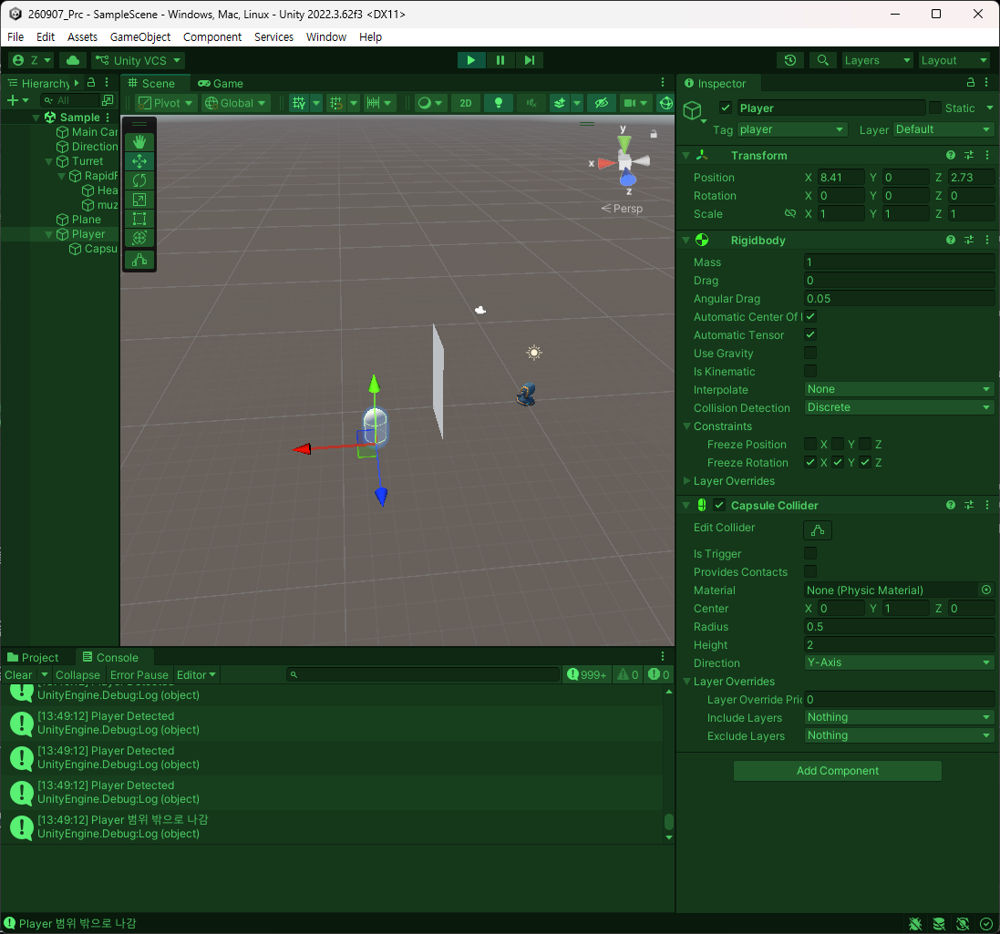

이렇게 되었을 때 일단 감지되면 플레이어 방향으로 포구를 돌리지만 문제는 범위 밖으로 가면 다시 돌아가야 하는데 그러질 않는다. 

현재까지의 코드 상황은 다음과 같다. 
```csharp
using System.Collections;
using System.Collections.Generic;
using UnityEditor.PackageManager;
using UnityEngine;

public class TurretController : MonoBehaviour
{
    [SerializeField] private float _rotateSpeed;
    [SerializeField] private Transform _headTransform;
    [SerializeField] private Transform _muzzlePoint;
    private Transform _playerTransform;
    private bool _isPlayerInTrigger { get { return _playerTransform != null; } }
    private bool _isPlayerInSight = false;
    private SphereCollider _sphereCollider;
    
    // Unity Event Method -----------------------
    private void Awake() => CacheComponents();
    
    private void OnTriggerEnter(Collider other)
    {
        if (other.CompareTag("Player"))
        {
            _playerTransform = other.transform;
        }
    }

    private void OnTriggerExit(Collider other)
    {
        if (other.CompareTag("Player"))
        {
            _playerTransform = null;
        }
    }

    private void Update()
    {
        RayShotToPlayer();
        Rotate();
        Fire();
    }
    // --------------------------------------------
    
    
    private void CacheComponents()
    {
        _sphereCollider = GetComponent<SphereCollider>();
    }

    private void Fire()
    {
        if (!_isPlayerInSight || !_isPlayerInTrigger) return;

        Vector3 look = new Vector3(
            _playerTransform.position.x,
            _headTransform.position.y,
            _playerTransform.position.z
            );
        
        _headTransform.LookAt(look);
    }

    private void Rotate()
    {
        if (_isPlayerInSight) return;
        
        _headTransform.Rotate(Vector3.up, _rotateSpeed * Time.deltaTime);
    }

    private void RayShotToPlayer()
    {
        if (!_isPlayerInTrigger) return;

        Vector3 from = new Vector3(
            transform.position.x,
            transform.position.y + _muzzlePoint.position.y,
            transform.position.z
            );
        
        Vector3 to = new Vector3(
            _playerTransform.position.x,
            _playerTransform.position.y + _muzzlePoint.position.y,
            _playerTransform.position.z
            );
        
        Ray ray = new Ray(from, (to - from).normalized);
        RaycastHit hit;

        if (Physics.Raycast(ray, out hit, _sphereCollider.radius))
        {
            if (hit.transform.CompareTag("Player"))
            {
                _isPlayerInSight = true;
                Debug.Log("플레이어 감지");
            }
            else
            {
                _isPlayerInSight = false;
            }
        }
        else
        {
            _isPlayerInSight = false;
        }
    }
}
```

벽 뒤로 들어가는 것은 괜찮은데 범위 밖에서 포구 회전이 안된다. 

그래서 RayShotToPlayer를 수정.
```csharp
private void RayShotToPlayer()
{
    _isPlayerInsight = false;

    if (!_isPlayerInTrigger)
    {
        return;
    }

    // 각각의 피봇. 발사 위치만큼 띄워야 한다.
    Vector3 from = new Vector3(transform.position.x, 
                   transform.position.y + _muzzlePoint.position.y, 
                   transform.position.z
                    );


    Vector3 to = new Vector3(_playerTransform.position.x, 
                 _playerTransform.position.y + _muzzlePoint.position.y, 
                 _playerTransform.position.z
                  );
    //Ray ray;
    // 방향과 크기가 나오는 벡터로 변환 필요.
    // 목적지로 삼는 벡터에서 자신의 벡터를 빼면 다음과 같이 된다.
    Ray ray = new Ray(from, (to - from).normalized);
    RaycastHit hit;

    // 반지름만큼 발사해줘야 한다. 
    if(Physics.Raycast(ray, out hit, _sphereCollider.radius))
    {
        // 플레이어를 찾았으면 감지 완료.
        if(hit.transform.CompareTag("player"))
        {
            _isPlayerInsight = true;
            Debug.Log("Player Detected");
        }
    }
}
```
이젠 범위 밖에서 돌아간다.

총알 발사할 때 update에 하면 난리나기 때문에 변수 추가할 것.
```csharp
[SerializeField] private float _cooldown;
private float _currentCooldown;
private bool _isReadyToFire { get { return _currentCooldown >= _cooldown; } }
```
_current 쪽에 함수로 빼서 dT를 누적

```csharp
    private void Update()
    {
    UpdateCurrentCooldown();
    RayShotToPlayer();
    Rotate();
    Fire();
    }

    // ---- 중략 ----

    private void UpdateCurrentCooldown()
    {
        if (_isReadyToFire)
        {
            return;
        }
        _currentCooldown += Time.deltaTime;
    }
```
이 상황에서 coolDown은 _currentCooldown에 누적이 될 것이고 발사 로직을 관리해줘야 한다. 

```csharp
private void Fire()
{
    if(!_isPlayerInsight || !_isPlayerInTrigger)
    {
        return;
    }
    Vector3 look = new Vector3(
        _playerTransform.position.x, 
        _headTransform.position.y,
        _playerTransform.position.z
        );


    //_headTransform.LookAt(_playerTransform.position);
    _headTransform.LookAt(look);

    // 발사.
    if (!_isReadyToFire)
        return;

    Debug.Log("탄환 발사");

    _currentCooldown = 0f;
}
```
이렇게 누적이 되다가 멈추고 되면 발사하고나서 다시 발사할 것이라 예상한다. 

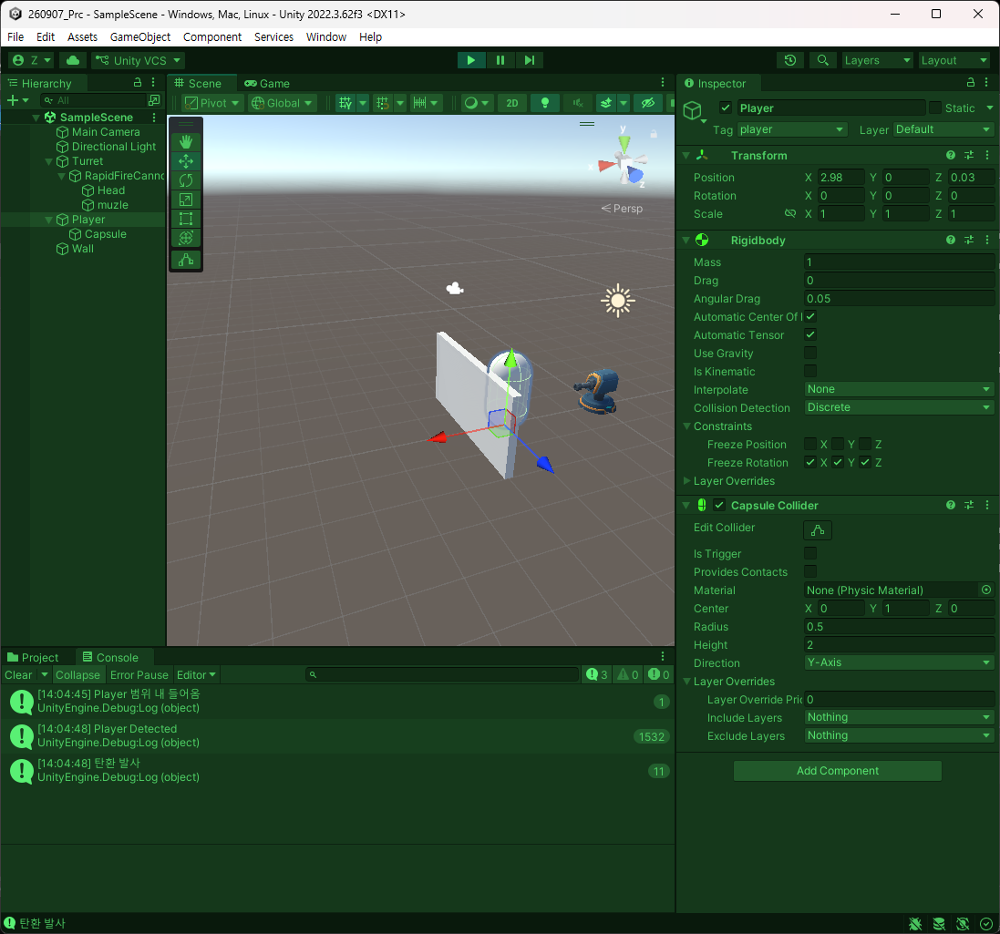

잘 작동함을 확인.

이제 총알 프리팹을 만들어서 발사해주면 된다. 

데미지에 대한 것은 추후 문제이고 일단은 총알을 만들어서 발사를 시켜주면 좋을 듯함. 

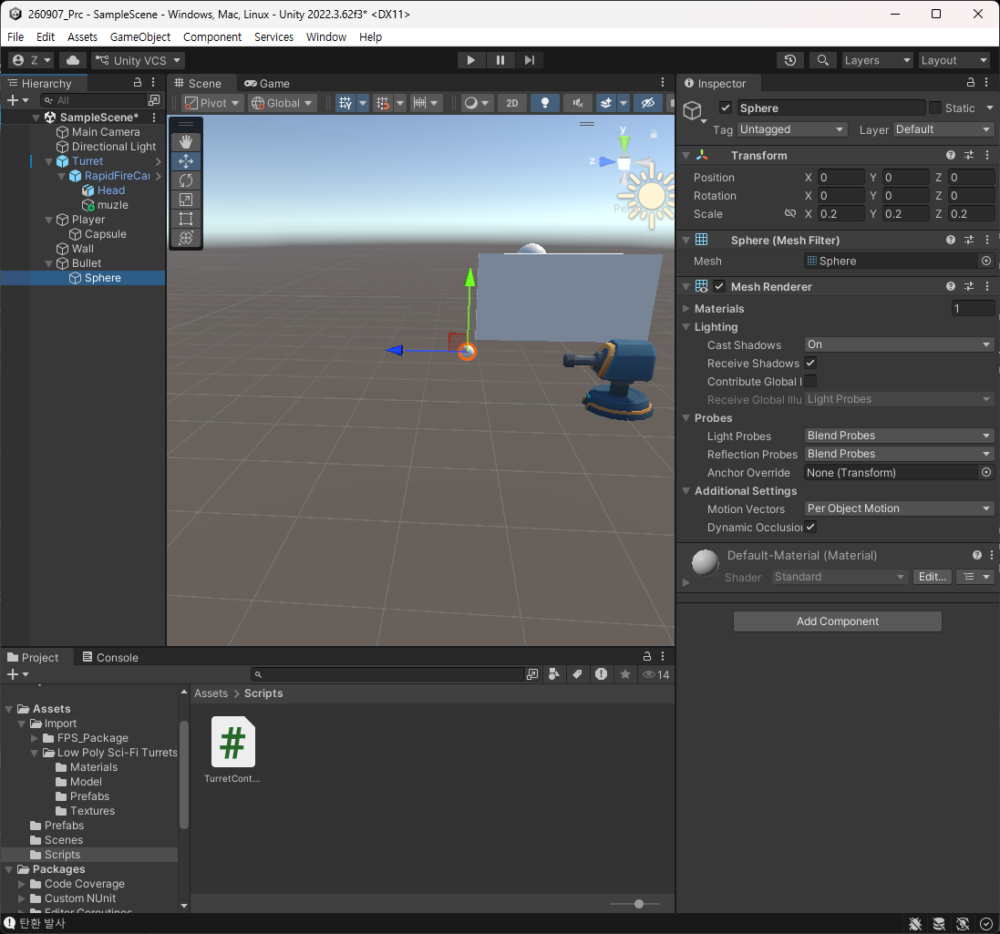
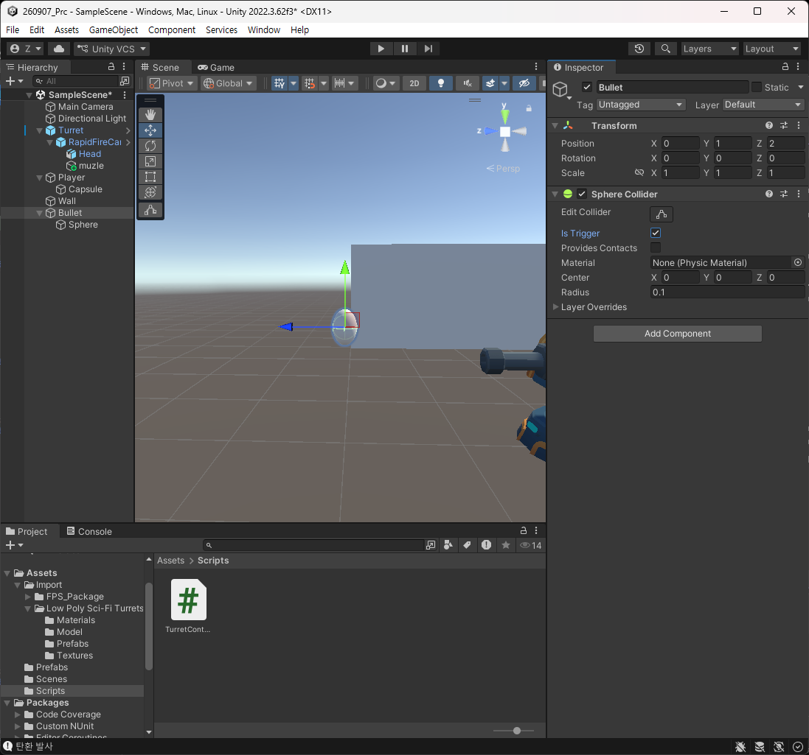

총알은 Trigger로 체크하도록 하자. 그리고 프리팹으로 지정해주고 C# Script 생성.

```csharp
using System.Collections;
using System.Collections.Generic;
using UnityEngine;

public class BulletControll : MonoBehaviour
{
    // Spawn 기준 제한시간 이후 파괴 예약.
    
    // if 어딘가에 부딪혔을 때
        // 플레이어인 경우 데미지 발생.
        // 벽인 경우에는 파괴

    // 터렛으로부터 데이터를 전달받아 총알의 속도, 파괴 시간을 입력받도록 만들자. 
    public void SetData(int damage, float speed, float destroyDelay)
    {

    }
}

```

```csharp
public class BulletControll : MonoBehaviour
{
    private int _damage;
    private float _speed;
    private float _destroyDelay;

    public void SetData(int damage, float speed, float destroyDelay)
    {
        _damage = damage;
        _speed = speed;
        _destroyDelay = destroyDelay;
    }
}
```

앞으로의 운동과 파괴 사항.
```csharp
public class BulletControll : MonoBehaviour
{
    private int _damage;
    private float _speed;

    private void Update()
    {
        MoveForward();
    }

    // 앞으로의 운동
    private void MoveForward()
    {
        transform.Translate(Vector3.forward * _speed * Time.deltaTime);
    }

    public void SetData(int damage, float speed, float destroyDelay)
    {
        _damage = damage;
        _speed = speed;

        Destroy(gameObject, destroyDelay);
    }
}
```

일단 벽이든 뭐든 플레이어 이외엔 파괴가 되도록.
```csharp
private void OnTriggerEnter(Collider other)
{
    // 플레이어인 경우 데미지 추가 
    if(other.CompareTag("player"))
    {
        // TODO : 데미지 추가
    }

    // 벽인 경우엔 파괴
    Destroy(gameObject);
}
```

TurretController에 돌아와서 
```csharp

    [Header("Bullet")]
    [SerializeField] private BulletControll _bulletControll; // Ins 하면서 동시에 가능
    [SerializeField] private int _bulletDamage;
    [SerializeField] private float _bulletSpeed;
    [SerializeField] private float _bulletDestroyDelay;

    // -- 생략 --
    
    private void SpawnBullet()
    {
        //prefab > 필드 변수
        //Instantiate, pos, rot 설정
            // GetComponent<BulletControl>();
        //SetData
    }
```

```csharp
private void Fire()
{
    if(!_isPlayerInsight || !_isPlayerInTrigger)
    {
        return;
    }
    Vector3 look = new Vector3(
        _playerTransform.position.x, 
        _headTransform.position.y,
        _playerTransform.position.z
        );


    //_headTransform.LookAt(_playerTransform.position);
    _headTransform.LookAt(look);

    // 발사.
    if (!_isReadyToFire)
        return;

    SpawnBullet();

    _currentCooldown = 0f;
}

private void UpdateCurrentCooldown()
{
    if (_isReadyToFire)
    {
        return;
    }
    _currentCooldown += Time.deltaTime;
}

private void SpawnBullet()
{
    //prefab > 필드 변수
    //Instantiate, pos, rot 설정
    // GetComponent<BulletControl>();
    BulletControll bullet = Instantiate(
        _bulletPrefab,
        _muzzlePoint.position,
        _muzzlePoint.rotation
        );

    //SetData
    bullet.SetData(_bulletDamage, _bulletSpeed, _bulletDestroyDelay);
}
```
엔진 내에서 필드에 설정한 것들을 모두 설정하면 

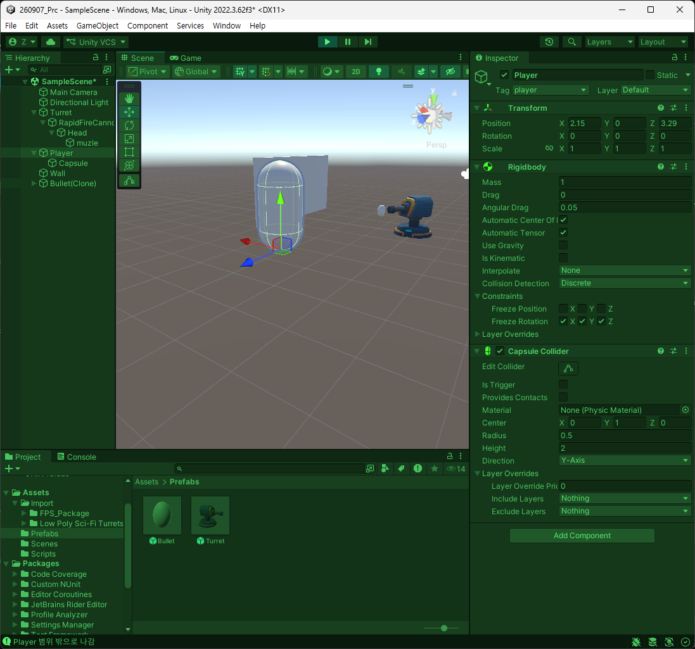

다음과 같이 발사되는 것을 확인할 수 있다. 

만일 총알이 이상한 방향으로 갈 경우 Muzzle을 하위로 두지 않아 발생하는 것이라 muzzle을 기준으로 생성된다. 따라서 Head의 하위에 둘 것.

현재까지의 코드는 다음과 같다.
```csharp
<BulletControll.cs>
using System.Collections;
using System.Collections.Generic;
using UnityEngine;

public class BulletControll : MonoBehaviour
{
    private int _damage;
    private float _speed;

    private void OnTriggerEnter(Collider other)
    {
        // 플레이어인 경우 데미지 추가 
        if(other.CompareTag("player"))
        {
            // TODO : 데미지 추가
            Debug.Log("player shots.");
        }

        // 벽인 경우엔 파괴
        Destroy(gameObject);
    }

    // Spawn 기준 제한시간 이후 파괴 예약.

    // if 어딘가에 부딪혔을 때
    // 플레이어인 경우 데미지 발생.
    // 벽인 경우에는 파괴

    private void Update()
    {
        MoveForward();
    }

    // 앞으로의 운동
    private void MoveForward()
    {
        transform.Translate(Vector3.forward * _speed * Time.deltaTime);
    }

    // 터렛으로부터 데이터를 전달받아 총알의 속도, 파괴 시간을 입력받도록 만들자. 
    public void SetData(int damage, float speed, float destroyDelay)
    {
        _damage = damage;
        _speed = speed;

        Destroy(gameObject, destroyDelay);
    }
}

```

```csharp
<TurretController.cs>
using System.Collections;
using System.Collections.Generic;
using UnityEngine;

public class TurretController : MonoBehaviour
{
    private Transform _playerTransform;
    //private bool _isPlayerInTrigger => _playerTransform != null;
    private bool _isPlayerInTrigger { get { return _playerTransform != null; } }
    private bool _isPlayerInsight = false;

    [SerializeField] private Transform _muzzlePoint;
    private SphereCollider _sphereCollider;

    [SerializeField] private float _rotateSpeed;
    [SerializeField] private Transform _headTransform;

    [SerializeField] private float _cooldown;
    private float _currentCooldown;
    private bool _isReadyToFire { get { return _currentCooldown >= _cooldown; } }

    [Header("Bullet")]
    [SerializeField] private BulletControll _bulletPrefab; // Ins 하면서 동시에 가능
    [SerializeField] private int _bulletDamage;
    [SerializeField] private float _bulletSpeed;
    [SerializeField] private float _bulletDestroyDelay;

    // 유니티 이벤트 
    private void Awake()
    {
        CacheComponents();
    }

    private void Update()
    {
        RayShotToPlayer();
        Rotate();
        Fire();
        UpdateCurrentCooldown();
    }

    private void CacheComponents()
    {
        _sphereCollider = GetComponent<SphereCollider>();
    }
    // ---- 끝 ----

    private void Rotate()
    {
        if (_isPlayerInsight)
        {
            return;
        }
        _headTransform.Rotate(Vector3.up, _rotateSpeed * Time.deltaTime);
    }

    private void Fire()
    {
        if(!_isPlayerInsight || !_isPlayerInTrigger)
        {
            return;
        }
        Vector3 look = new Vector3(
            _playerTransform.position.x, 
            _headTransform.position.y,
            _playerTransform.position.z
            );


        //_headTransform.LookAt(_playerTransform.position);
        _headTransform.LookAt(look);

        // 발사.
        if (!_isReadyToFire)
            return;

        SpawnBullet();

        _currentCooldown = 0f;
    }

    private void UpdateCurrentCooldown()
    {
        if (_isReadyToFire)
        {
            return;
        }
        _currentCooldown += Time.deltaTime;
    }
    
    private void SpawnBullet()
    {
        //prefab > 필드 변수
        //Instantiate, pos, rot 설정
        // GetComponent<BulletControl>();
        BulletControll bullet = Instantiate(
            _bulletPrefab,
            _muzzlePoint.position,
            _muzzlePoint.rotation
            );

        //SetData
        bullet.SetData(_bulletDamage, _bulletSpeed, _bulletDestroyDelay);
    }
    private void OnTriggerEnter(Collider other)
    {
        if(other.gameObject.CompareTag("player"))
        {
            Debug.Log("Player 범위 내 들어옴");

            _playerTransform = other.transform;
        }
    }
    private void OnTriggerExit(Collider other)
    {
        if (other.gameObject.CompareTag("player"))
        {
            Debug.Log("Player 범위 밖으로 나감");

            _playerTransform = null;
        }
    }

    private void RayShotToPlayer()
    {
        _isPlayerInsight = false;

        if (!_isPlayerInTrigger)
        {
            return;
        }

        // 각각의 피봇. 발사 위치만큼 띄워야 한다.
        Vector3 from = new Vector3(transform.position.x, 
                       transform.position.y + _muzzlePoint.position.y, 
                       transform.position.z
                        );


        Vector3 to = new Vector3(_playerTransform.position.x, 
                     _playerTransform.position.y + _muzzlePoint.position.y, 
                     _playerTransform.position.z
                      );
        //Ray ray;
        // 방향과 크기가 나오는 벡터로 변환 필요.
        // 목적지로 삼는 벡터에서 자신의 벡터를 빼면 다음과 같이 된다.
        Ray ray = new Ray(from, (to - from).normalized);
        RaycastHit hit;

        // 반지름만큼 발사해줘야 한다. 
        if(Physics.Raycast(ray, out hit, _sphereCollider.radius))
        {
            // 플레이어를 찾았으면 감지 완료.
            if(hit.transform.CompareTag("player"))
            {
                _isPlayerInsight = true;
                Debug.Log("Player Detected");
            }
        }
    }
}

```
- 현재의 단계에서 선택할 수 있는 3가지.
  - 정석은 Layermask,
  - 발사 높이와 감지 높이를 다르게 해서 우회,
  - RaycastAll로 배열에 모두 담아서 처리

지금 플레이를 했을 때 총알을 발사하고 잠시 돈다. 

일단 발사 높이와 감지 높이를 다르게 가져가는 것으로 해보면
```csharp
Vector3 from = new Vector3(transform.position.x, 
               transform.position.y + _muzzlePoint.position.y / 2, 
               transform.position.z
                );


Vector3 to = new Vector3(_playerTransform.position.x, 
             _playerTransform.position.y + _muzzlePoint.position.y / 2, 
             _playerTransform.position.z
              );
```
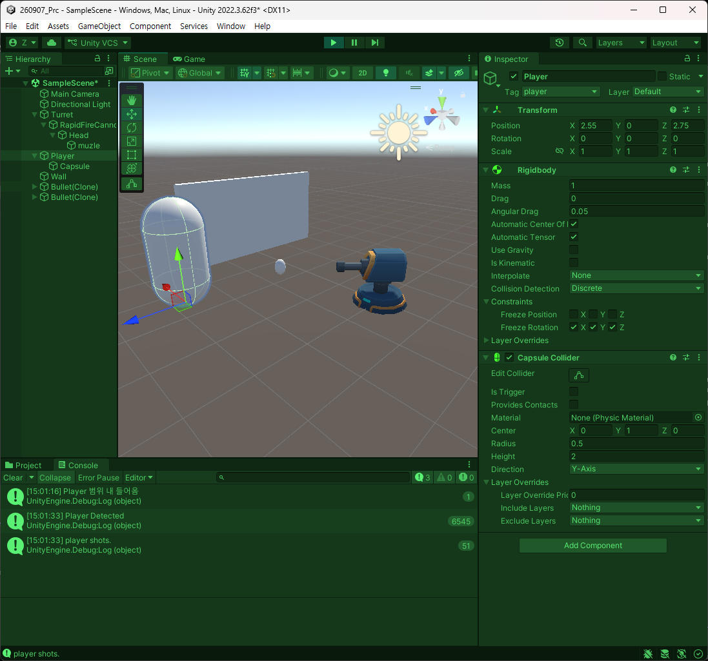

플레이를 하면 일단 해결은 된다. 

플레이어를 구현하기 전에 Yurret에 담긴 데이터 저장을 잘 해두도록 한다. override를 사용하여.

이제 FPS 플레이어를 진정으로 구현 해볼 것인데 손만 구현하는 경우가 종종 있다. 여기선 총만.

플레이어 캡슐
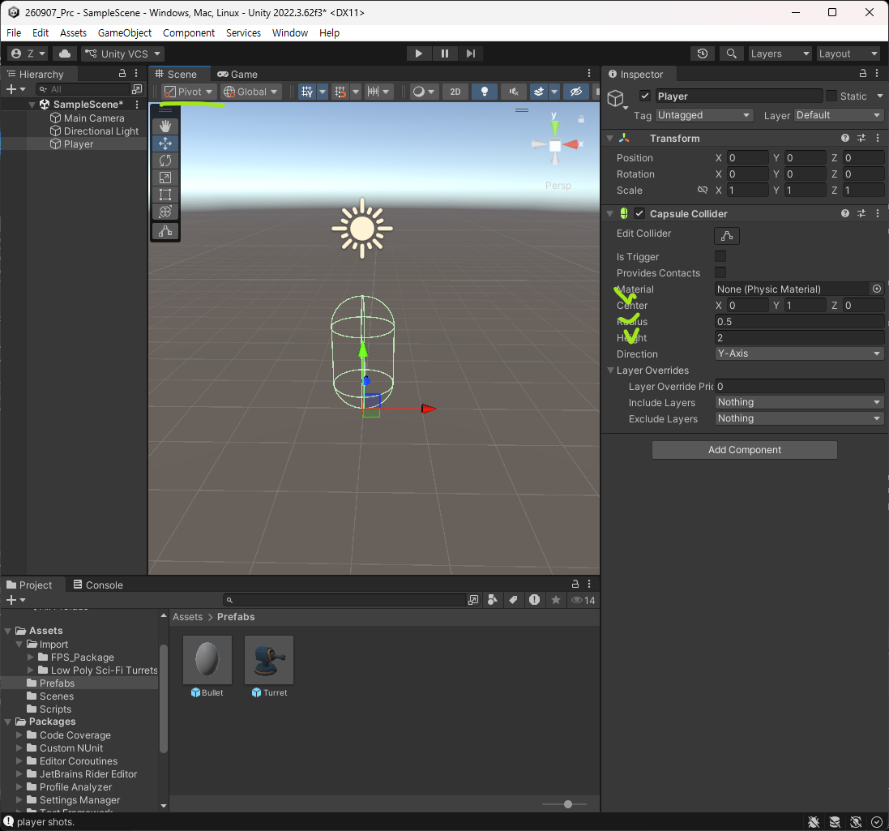

카메라 위치 
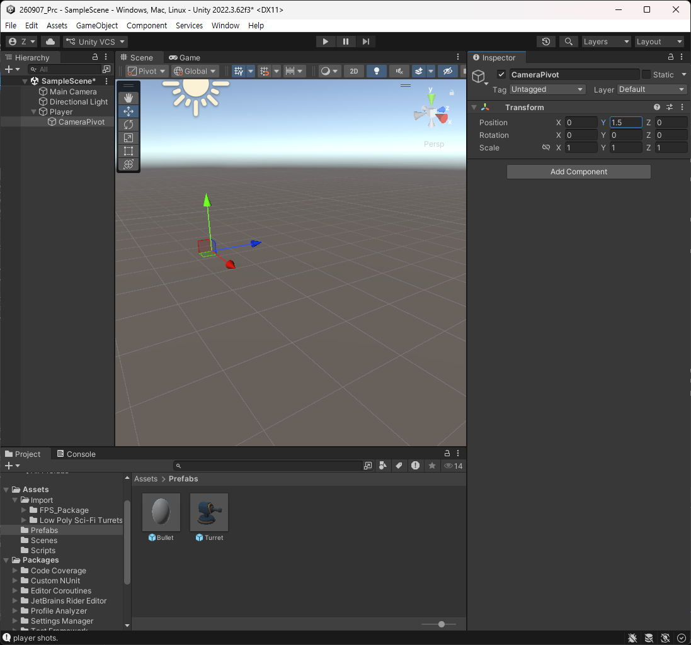

스크립트 생성
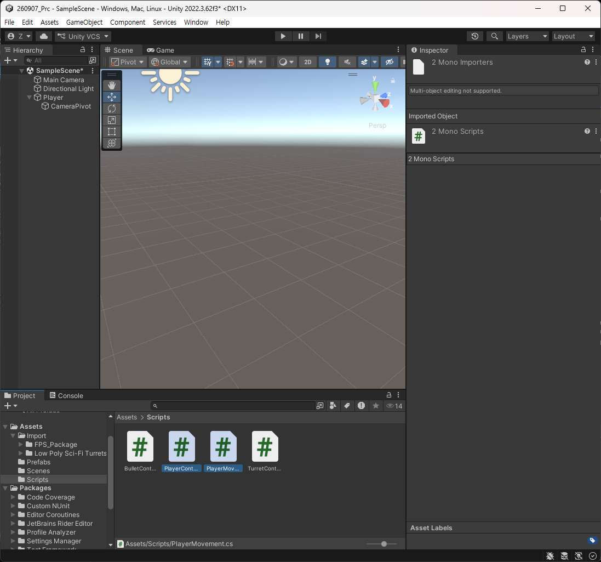

움직임부터 시작. 벽에 막히고 해야 하는데 그러려면 rigidbody를 알아야 한다.
```csharp
using System.Collections;
using System.Collections.Generic;
using UnityEngine;

public class PlayerMovement : MonoBehaviour
{
    [SerializeField] private float _moveSpeed;
    private Rigidbody _rigidbody;

    private void Awake()
    {
        CacheComponents();
    }

    public void Move()
    {
        // 입력을 통한 방향 구하기
        // 새로운 속도값 설정
        // _rigidbody.velocity에 적용.
    }

    private void CacheComponents()
    {
        _rigidbody = GetComponent<Rigidbody>();
    }
}
```
이렇게 골조는 가져갈 것이다. 

그런데 입력받아 방향을 구하는 것은 함수로.

```csharp
private Vector3 ReadMoveInput()
{
    float x = Input.GetAxisRaw("Horizontal");
    float z = Input.GetAxisRaw("Vertical");

    return new Vector3(x, 0, z).normalized;
}
```
새로운 방향을 받아 방향을 구하는 함수가 완료되었고 

Move에 대한 세팅을 진행하면
```csharp
public void Move()
{
    // 입력을 통한 방향 구하기
    Vector3 input = ReadMoveInput();

    // 새로운 속도값 설정
    Vector3 newVelocity = new Vector3(
        input.x * _moveSpeed,
        _rigidbody.velocity.y,
        input.z * _moveSpeed
        );
    // _rigidbody.velocity에 적용.
    _rigidbody.velocity = newVelocity;
}
```
전우좌우는 여기까지만 하도록 하자.

PlayerController로 넘어가서 
```csharp
using System.Collections;
using System.Collections.Generic;
using UnityEngine;

public class PlayerController : MonoBehaviour
{
    private PlayerMovement _movement;

    private void Awake()
    {
        CacheComponents();
    }

    private void CacheComponents()
    {
        _movement = GetComponent<PlayerMovement>();
    }
}

```
기본 사항.

FixedUpdate에
```csharp
using System.Collections;
using System.Collections.Generic;
using UnityEngine;

public class PlayerController : MonoBehaviour
{
    private PlayerMovement _movement;

    private void Awake()
    {
        CacheComponents();
    }

    private void FixedUpdate()
    {
        _movement.Move();
    }

    private void CacheComponents()
    {
        _movement = GetComponent<PlayerMovement>();
    }
}
```

이제 카메라도 pivot에 맞춰서 움직여야 하므로 같이 처리해야 한다.
```csharp
public class PlayerController : MonoBehaviour
{
    [SerializeField] private Transform _cameraPivot;
    private PlayerMovement _movement;
    private Transform _cameraTransform;

    // -- 생략 --
}
```

```csharp
using System.Collections;
using System.Collections.Generic;
using UnityEngine;

public class PlayerController : MonoBehaviour
{
    [SerializeField] private Transform _cameraPivot;
    private PlayerMovement _movement;
    private Transform _cameraTransform;

    private void Awake()
    {
        CacheComponents();
    }

    private void FixedUpdate()
    {
        _movement.Move();
    }

    private void LateUpdate()
    {
        SetCameraTransform();
    }

    private void CacheComponents()
    {
        _movement = GetComponent<PlayerMovement>();
        _cameraTransform = Camera.main.transform;
    }

    private void SetCameraTransform()
    {
        //_cameraTransform.position = _cameraPivot.position;
        //_cameraTransform.rotation = _cameraPivot.rotation;

        _cameraTransform.SetPositionAndRotation(
            _cameraPivot.position,
            _cameraPivot.rotation
            );
    }
}

```

일단 rigidbody 있어야 하고
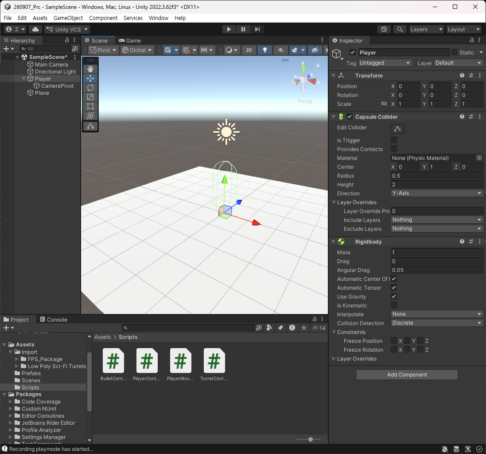

지금 상태에선 Rotation이 돌아갈 것이므로 다 잠굴 것. 
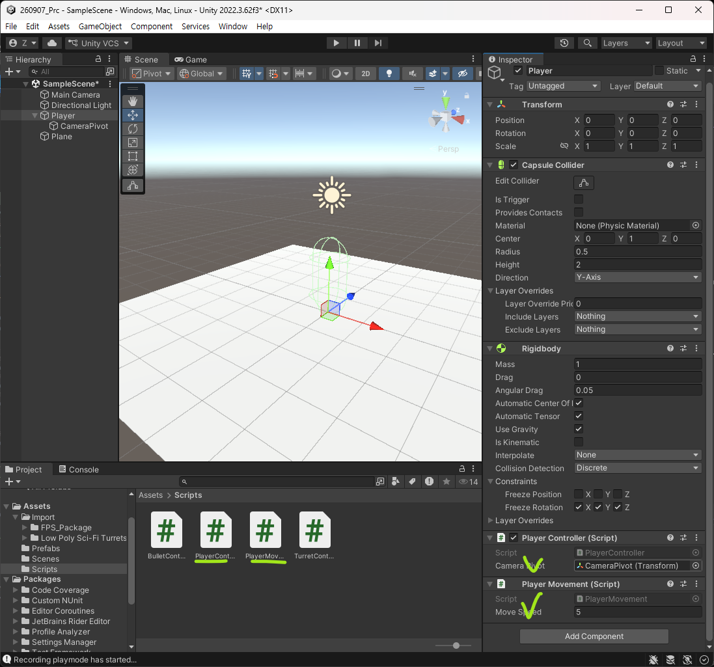

플레이어가 제대로 입력받아 움직임을 알 수 있음. 
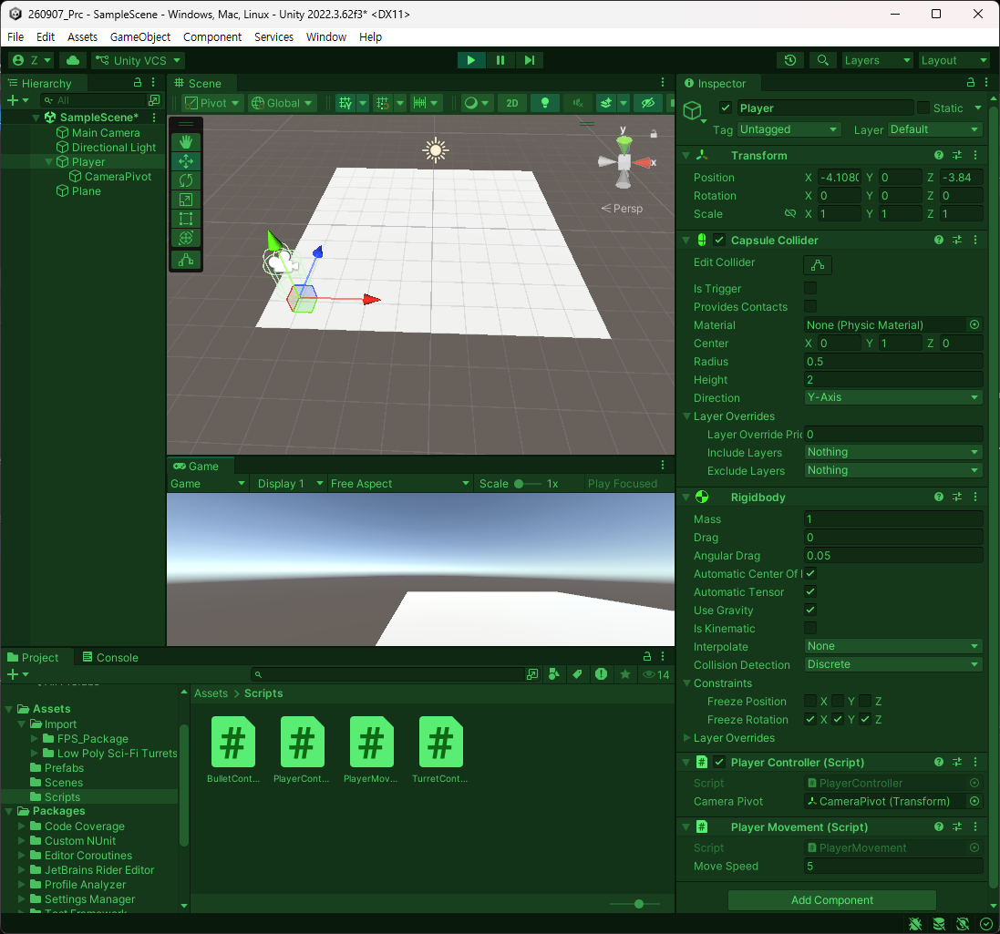

이번에는 마우스 움직임을 받아 화면 회전을 해야 한다. 

Controller에서
```csharp
private void Rotate()
{
    // 마우스 입력 받기

    // 회전
        // 좌우 -> 회전
        // 상하 -> 범위 내로 들어오게 해야 함.
}
```

프로젝트 세팅에서 마우스 값도 설정되어 있다.
```csharp
private Vector3 ReadRotateInput()
{
    float x = Input.GetAxis("Mouse X");
    float y = Input.GetAxis("Mouse Y");

    return new Vector3(x, y, 0);
}
```
하지만 'return new Vector3(x, y, 0);'으로 인해 문제가 일어날 것임. 이는 확인해보며 볼 것.

```csharp
public class PlayerMovement : MonoBehaviour
{
    [SerializeField] private float _moveSpeed;
    [SerializeField] private float _mouseSensitivity;
    private Rigidbody _rigidbody;

    private void Awake()
    {
        CacheComponents();
    }

    public void Move()
    {
        // 입력을 통한 방향 구하기
        Vector3 input = ReadMoveInput();

        // 새로운 속도값 설정
        Vector3 newVelocity = new Vector3(
            input.x * _moveSpeed,
            _rigidbody.velocity.y,
            input.z * _moveSpeed
            );
        // _rigidbody.velocity에 적용.
        _rigidbody.velocity = newVelocity;
    }

    private Vector3 ReadMoveInput()
    {
        float x = Input.GetAxisRaw("Horizontal");
        float z = Input.GetAxisRaw("Vertical");

        return new Vector3(x, 0, z).normalized;
    }

    private void CacheComponents()
    {
        _rigidbody = GetComponent<Rigidbody>();
    }

    public void Rotate()
    {
        // 마우스 입력 받기
        // Vector3 input = ReadRotateInput();만 하면 정해진 것이 없음.
        // 감도를 추가해볼 것임. 
        Vector3 input = ReadRotateInput() * _mouseSensitivity;

        // 회전
        // 좌우 -> 회전 (로컬 좌표에서 돌아가야 하므로 Self).
        transform.Rotate(0, input.x, 0, Space.Self);
        // 상하 -> 범위 내로 들어오게 해야 함.
    }

    private Vector3 ReadRotateInput()
    {
        float x = Input.GetAxis("Mouse X");
        float y = Input.GetAxis("Mouse Y");

        return new Vector3(x, y, 0);
    }
}
```
이대로 적용을 하면 문제는 상하로 움직여도 좌우로 움직인다. 

그래서 실제로는 축을 바꿔줘야 한다.
```csharp
public void Rotate()
{
    // 마우스 입력 받기
    // Vector3 input = ReadRotateInput();만 하면 정해진 것이 없음.
    // 감도를 추가해볼 것임. 
    Vector3 input = ReadRotateInput() * _mouseSensitivity;

    // 회전
    // 좌우 -> 회전 (로컬 좌표에서 돌아가야 하므로 Self).
    transform.Rotate(0, input.y, 0, Space.Self);
    // 상하 -> 범위 내로 들어오게 해야 함.
}

private Vector3 ReadRotateInput()
{
    float x = Input.GetAxis("Mouse X");
    float y = Input.GetAxis("Mouse Y");

    return new Vector3(y, x, 0);
}
```
일단 카메라 피봇에 상하 회전으로써 쓰려고 함. 카메라 피벗을 회전시키면 된다. 

변수
```csharp
[SerializeField] private Transform _cameraPivot;
[SerializeField] private float _minPitch;
[SerializeField] private float _maxPitch;
private float _pitch;
```

함수 설정
```csharp
public void Rotate()
{
    // 마우스 입력 받기
    // Vector3 input = ReadRotateInput();만 하면 정해진 것이 없음.
    // 감도를 추가해볼 것임. 
    Vector3 input = ReadRotateInput() * _mouseSensitivity;

    // 회전
    // 좌우 -> 회전 (로컬 좌표에서 돌아가야 하므로 Self).
    transform.Rotate(0, input.y, 0, Space.Self);
    // 상하 -> 범위 내로 들어오게 해야 함. Clamp 함수로 가능.
    // 입력받은 x값을 더했을 때, 범위 밖으로 벗어나지는 않는지?
    _pitch = Mathf.Clamp(_pitch + input.x, _minPitch, _maxPitch);
    // 회전. 부모에 속한 것을 돌려야 하므로 로컬.
    _cameraPivot.localRotation = Quaternion.Euler(_pitch, 0, 0);
}
```
지금은 적용시켰을 때 상하 반전이다. 
```csharp
private Vector3 ReadRotateInput()
{
    float x = Input.GetAxis("Mouse X");
    float y = Input.GetAxis("Mouse Y");

    return new Vector3(-y, x, 0);
}
```
이렇게 바꾸고

Move쪽에서도 바꿀 것이 존재.
```csharp
public void Move()
{
    // 입력을 통한 방향 구하기
    Vector3 input = ReadMoveInput();

    // 새로운 속도값 설정
    Vector3 direction = transform.right * input.x + transform.forward * input.z;
    Vector3 newVelocity = new Vector3(
       direction.x * _moveSpeed,
       _rigidbody.velocity.y,
        direction.z * _moveSpeed
        );
    // _rigidbody.velocity에 적용.
    _rigidbody.velocity = newVelocity;
}
```
현재는 마우스가 그대로 보인다. 그 처리를 해볼 것이다.
```csharp
public class PlayerController : MonoBehaviour
{
    [SerializeField] private Transform _cameraPivot;
    private PlayerMovement _movement;
    private Transform _cameraTransform;

    private void Awake()
    {
        CacheComponents();
    }

    private void Start()
    {
        LockCursor();
    }

    // ---- 중략 ---

    private void LockCursor()
    {
        Cursor.lockState = CursorLockMode.Locked;
        Cursor.visible = false;
    }
}
```

이제 플레이어를 프리팹으로 만든다.
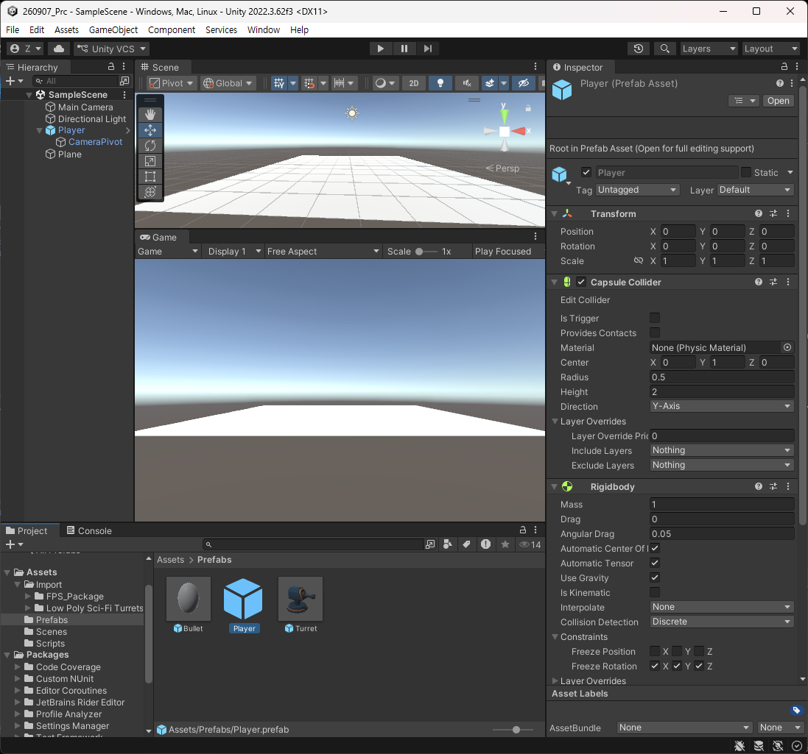

하위 오브젝트들을 할당하고 조절한다.
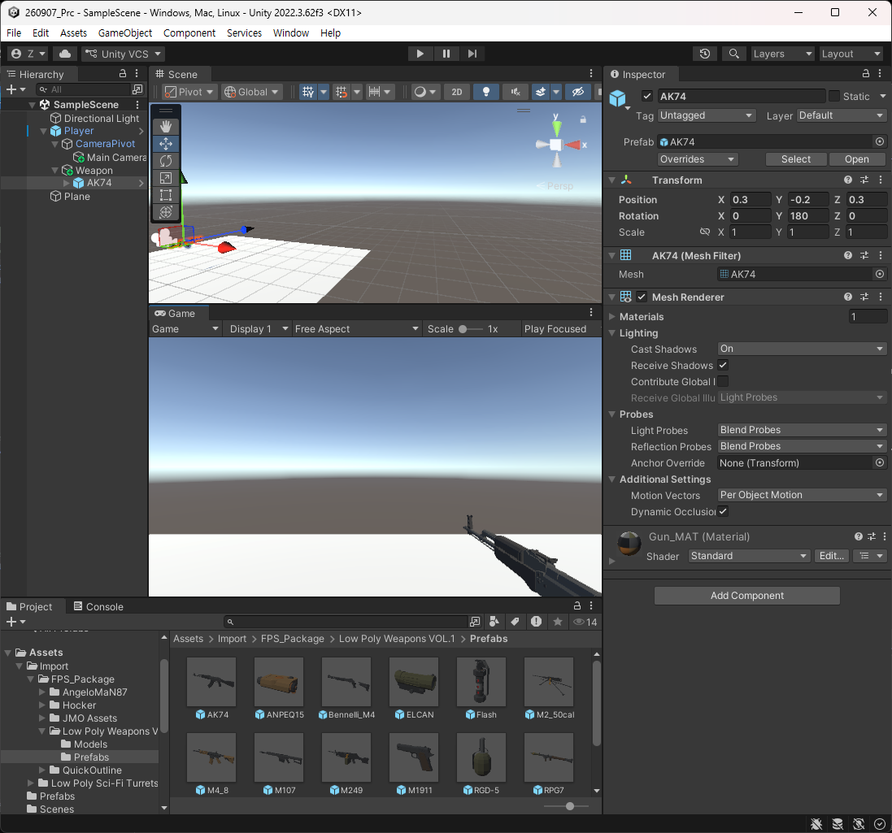

이 기준의 화면 비율로 맞춘다고 가정. 
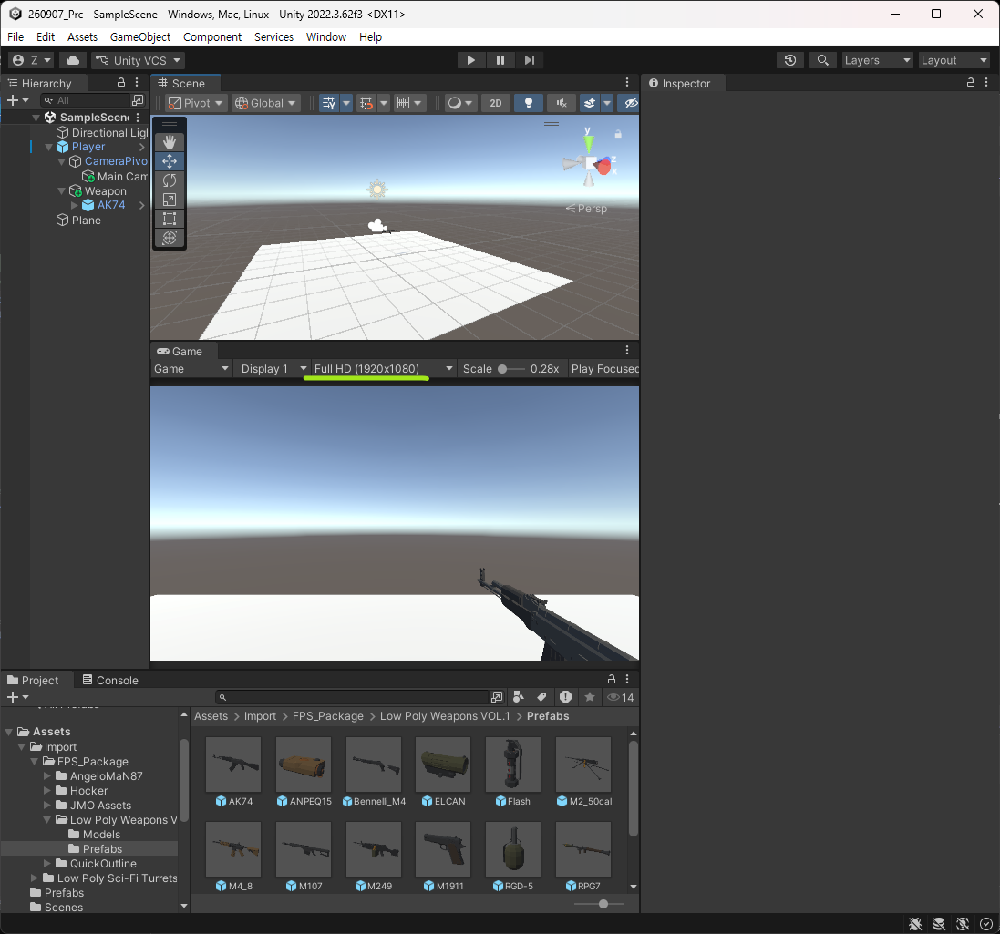

지금은 무기가 같이 움직이지 않으므로 이를 설정해줘야 한다. 

```csharp
public class PlayerController : MonoBehaviour
{
    [SerializeField] private Transform _cameraPivot;
    private PlayerMovement _movement;
    private Transform _cameraTransform;

    [SerializeField] private Transform _weaponTransform;

    // --- 중략 ---

    private void LateUpdate()
    {
        SetWeaponTransform();
        SetCameraTransform();
    }

    // --- 중략 ---

    private void SetWeaponTransform()
    {
        _weaponTransform.SetPositionAndRotation(_cameraPivot.position,
            _cameraPivot.rotation);
    }
}

```

```csharp

```

```csharp

```