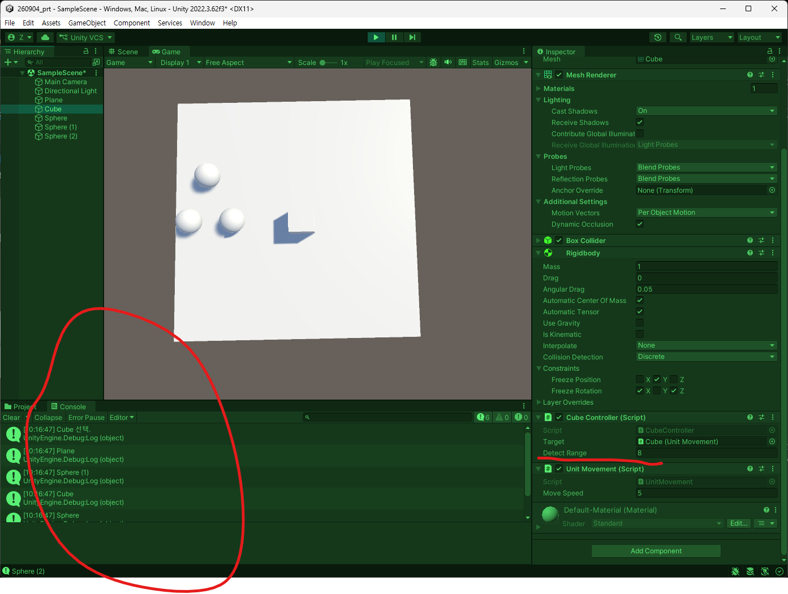
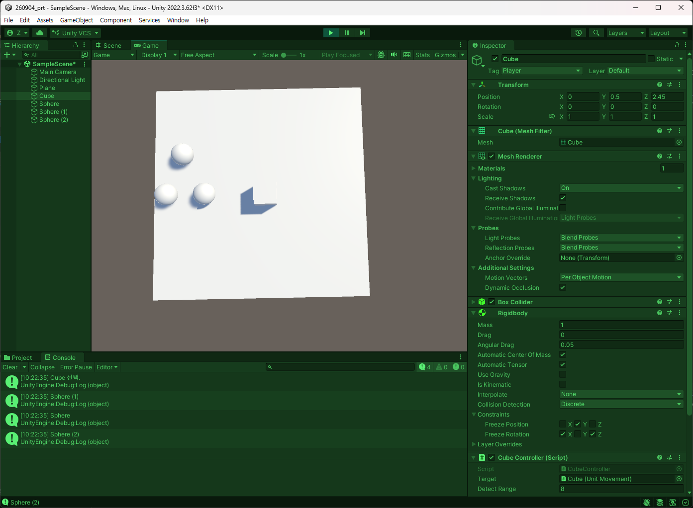
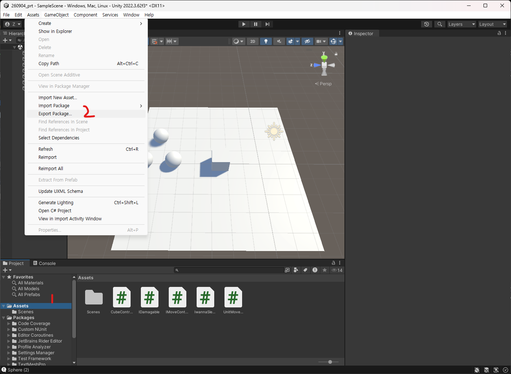
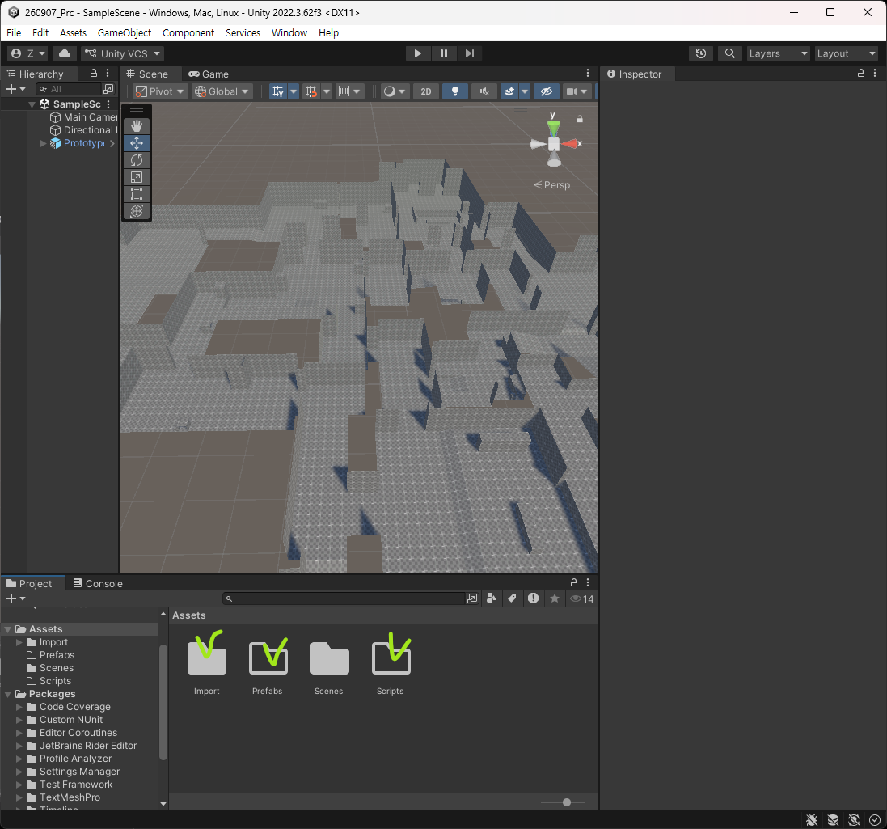

# 260907 Unity(6) 물리 및 충돌, Raycast 추가 
## 1. 발표 : rigidbody로 물리엔진을 적용했음에도 바닥을 뚫고 지나가는 원인
- rigidbody로 물리엔진을 적용했음에도 바닥을 뚫고 지나가는 원인에 대해서가 주제였음.
- 프레임 단위로 재생하는 것을 확인했을 때, 평면에 부딪혀 0이 되는 것이 아니라 좌표상 -값이 나오는 상황이 발생.
- 즉, 프레임 삭제가 발생하는 현상이 존재. 
- 터널링 키워드 주목.
- 너무 빠르면 충돌 감지가 불가하고 통과하는 현상
- 유니티 라이프사이클 상에서 FixedUpdate, Update간의 관계에서 발생. 
- FixedUpdate의 경우는 물리 엔진 계산을 담당한다. 
- FixedUpdate의 경우에는 0.02초마다 발생하고 Update는 매 프레임이다. 
- 이동의 경우는 값을 받아서 Update에서 이동시키는 작업을 한다. 
- 0.02초 동안에도 이동은 해야 한다. 
- 그래서 FixedUpdate, Update의 경우에는 FixedUpdate에서 계산한 것을 실시간으로 받아와서 Update가 다음 위치로 보내주는데 충돌을 발생하지 않았다고 판단하여 0.02초 안의 업데이트를 못해서 통과를 해버린다.
- 그래서 Unity의 경우에는 제공해주는 기능들이 존재한다.
- Rigidbody 컴포넌트에서는 충돌감지모드 4종이 있다. 
- 알고리즘 차이로 종류가 나뉘는데 rigidbody가 없으면 정적 오브젝트, Rigidbody가 있으면 동적 오브젝트.
- Discrete : 기본값. 연산 속도가 빠르고 범용성이 좋지만 빠른 속도의 충돌을 감지 못한다는 점이 존재. 
- 툭툭 끊어서 계산하는 이산적 탐지. 
- 이 때문에 빠른 속도에 대한 충돌이 발생하지 않는 터널링이 존재한다는 것이다. 
- Continuous : 연속 충돌 탐지. Sweep Base 알고리즘 적용. 선형으로 범위를 탐지했을 때 충돌 여부를 감지한다. 
- 직선 운동 충돌은 잘 감지하지만 회전 운동에 대한 것은 잘 감지하지 못함. 
- 또한 선형 운동을 하는 오브젝트가 많이 존재하면 부담이 많이 걸린다.
- Continuous Dynamic : 동적 오브젝트도 감지가 가능하다. 
- Continuous는 동적 오브젝트에 대한 충돌을 감지하므로 Continuous에 대해서 터널링이 발생하면 여긴 발생하지 않는다. 
- Continuous Speculative : Speculative 알고리즘 사용. 속도에 기반해서 계산을 하는데 사각형으로 묶어 감지 영역에서 충돌이 예상되는 부분을 지정해 연산 처리를 진행한다. 
- 그러나 문제는 Ghost Collision이라고 해서 의도하지 않는 충돌이 발생한다. 이게 추측성 알고리즘을 사용했기 때문에 발생한다.
- 즉, 정확도가 낮아진다. 
- 순차적으로 문제에 따라 적용해봄직 하다. 복잡한 물리 연산이 없으면 Speculative, 인스턴스가 동적인지 정적인지에 따라 Continuous를 적용한다. 
- FixedUpdate 주기를 조정하는 것은 어지간하면 하지 않을 것. 
- 물리 엔진 쪽에서 속도가 빠르면 소위 거부존이라는 현상도 있음. 

## 2. 물리 처리에 대한 보충
### 2.1. 추가적 충돌 처리에 관한 강의
- 충돌 처리에 관련해서 Collision과 Trigger가 있었음. 
- 이 두가지는 Collider 자체를 기준으로 충돌이 발생하는지 Trigger를 통해서 원하는 물체가 영역에 들어왔는지를 썼었음. 
- 기본적으로 이 2가지는 유니티 이벤트 함수에서 지원했음. 
- 충돌 처리 자체를 유저가 하고 싶은 타이밍에 검사를 돌리는 방법이 있음. 

그래서 이번엔 Player가 Monster를 감지하는 것을 구현해보려고 함. 

코드는 다음과 같이 설정. 세부 설명은 주석 참조.
```csharp
public class CubeController : MonoBehaviour
{
    private Camera _cam;
    [SerializeField] private UnitMovement _target;

    private void Start()
    {
        _cam = Camera.main;
    }

    private void Update()
    {
        RayShot();
        MoveTarget();
        DetectMonster();
    }

    [SerializeField] private float _detectRange; // 3. 감지 거리 변수

    private void DetectMonster()
    {
        // 1. 감지 시, 로그를 뽑아볼 것임.
        if (!Input.GetKeyDown(KeyCode.Alpha1))
            return;

        // 2. 구체 범위로 선정. 자신의 위치를 기준으로 감지 범위 설정.
        // 4. Physics 클래스에서 보면 OverlapSphere은 Collider 배열을 반환함.
        // 5. 반경 이내의 Collider를 담아 배열로 반환.
        Collider[] cols = Physics.OverlapSphere(transform.position, _detectRange);

        // 6. 반복문으로 이름들을 순회
        foreach (Collider col in cols)
        {
            Debug.Log(col.gameObject.name);
        }
    }
    ... 생략
}
```


감지 범위를 설정하고 1을 눌렀을 때 감지가 되는 것을 확인할 수 있었다. 

특정 크기만큼 Overlap을 하고 있고 자신까지 감지를 한다. Layermask나 Tag 등으로 걸러낼 수 있음.

현재 환경에서는 Tag : Monster를 foreach에서 처리.

```csharp
// 반복문으로 이름들을 순회
foreach (Collider col in cols)
{
    if(col.gameObject.CompareTag("Monster"))
    { 
        Debug.Log(col.gameObject.name); 
    }
}
```



이것까지는 배운 내용대로. 나중에는 Layermask를 통해 해야 할 것이다. 

- 인터페이스에 익숙해질 필요가 있는 것이 특정 지점을 기준으로 범위를 돌리는데 FPS에서 수류탄을 예시로 들면 몬스터나 플레이어나 상호작용 오브젝트도 적용받는다. 
- 지금으로써는 Tag를 모두 추가해야 한다. 
- 그래서 특정 인터페이스를 기준으로 동작하게끔 할 수 있다. 
- 그래서 OverlapSphere는 주의를 해야 하는 것이 배열이 생성되서 들어가있는 것이 확인.
- 문제는 배열을 반환하는 이것을 Update에 계속 돌리면 안된다. 
- 수류탄 정도야 괜찮지만.
- **빈번한 사용에서는 조금 더 효과적인 사용을 위한 키워드는 NonAllock**이다. 

### 2.2. 발표에서의 추가 설명
- 구체가 앞으로 전진했을 때는 틀림없이 벽에 부딪히는데 구의 중앙에서 Raycast를 쐈을 때 벽이 감지되지 않는다.
- 그 때 쓸 수 있는 것은 Physics.SphereCast() 라는 것이 존재한다. 
- 특히나 범위 기준을 나열할 때, 충돌이 일어나는지 아닌지를 판단할 때 써봄직하다. 
- 잘 안쓰이긴 하지만 예시로는 전진할 때 부딪히는지 미리 판단할 때 정도?
- 물리 엔진을 굳이 사용하지 않아도 되는 게임들이 다수 존재한다. 
- 혹시나 rigidbody를 무의식적으로 추가하여 성능 낭비를 하진 말 것. 
- 진정으로 필요한 기능인지를 생각해보고 사용하는 것이 맞을 것.

## 3. 유니티 패키지
### 3.1. 설명
- 원본을 전달하는 것은 guid가 꼬일 가능성이 다분하다. 
 
순서는 다음과 같다.


프로젝트 때 실질적으로 선택해서 전달할 수 있음. 

## 4. FPS 구현
### 4.1. url
https://github.com/KimJaeSeongJade/mp15-FpsSample
- 놓쳤을 경우 특정 파일을 기준으로 찾아서 사용하도록 할 것. 
- 일단 Import, Script, Prefab 폴더를 추가.

