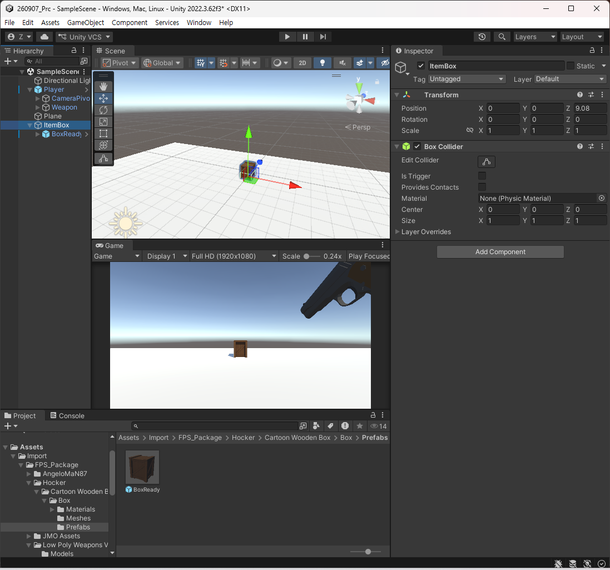
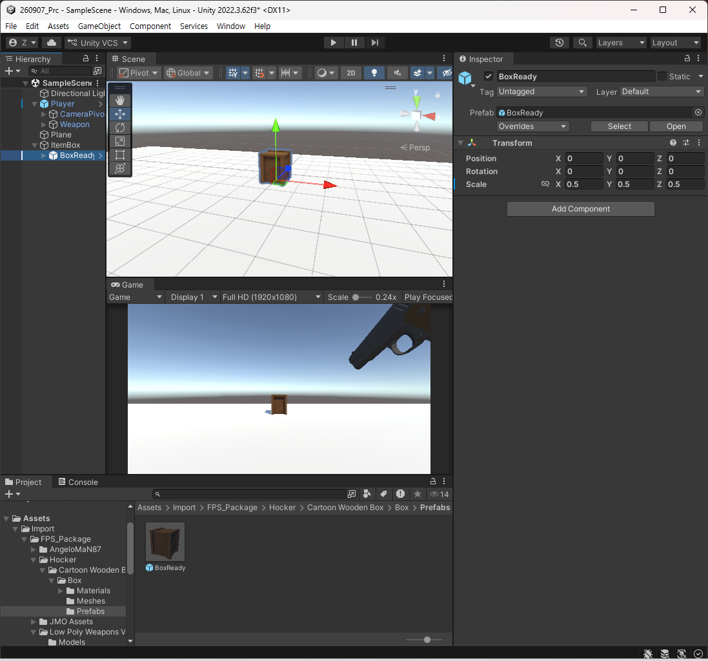
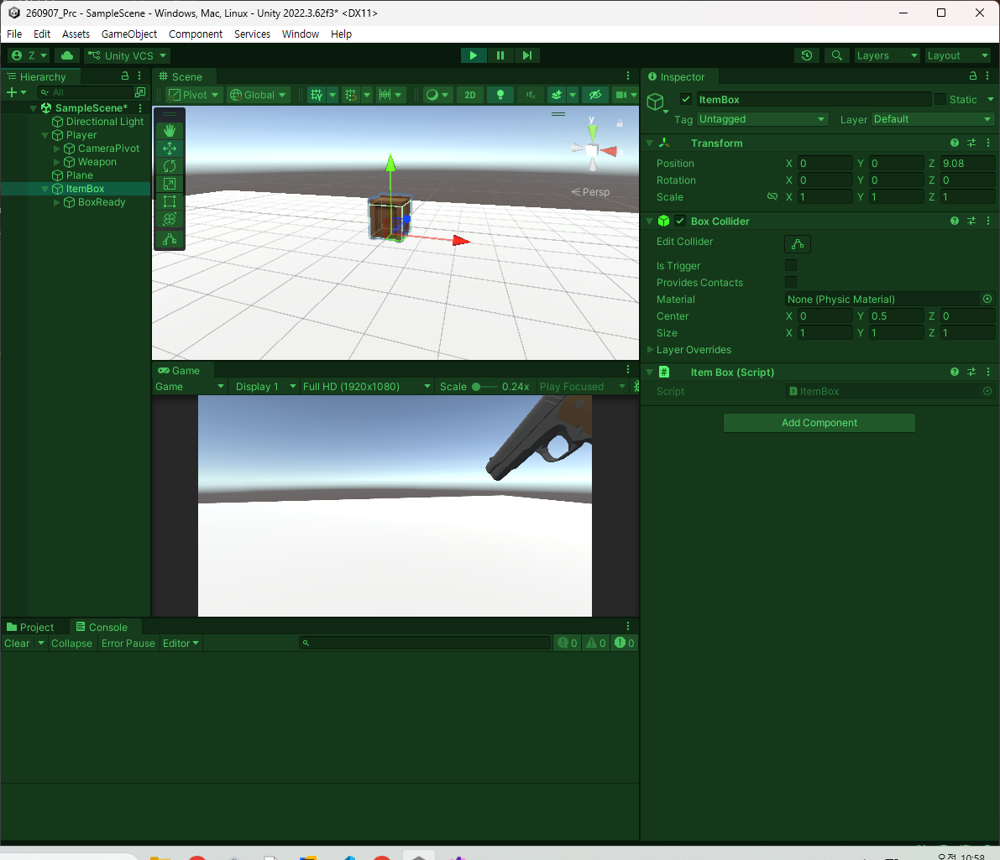
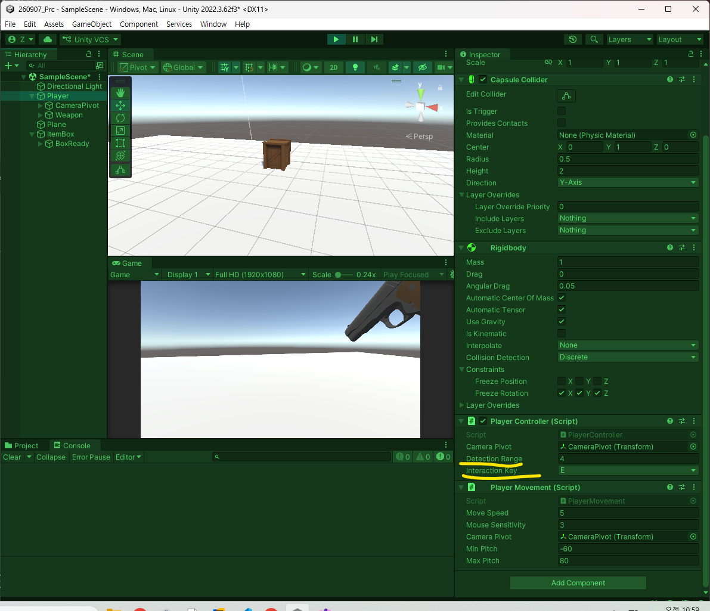
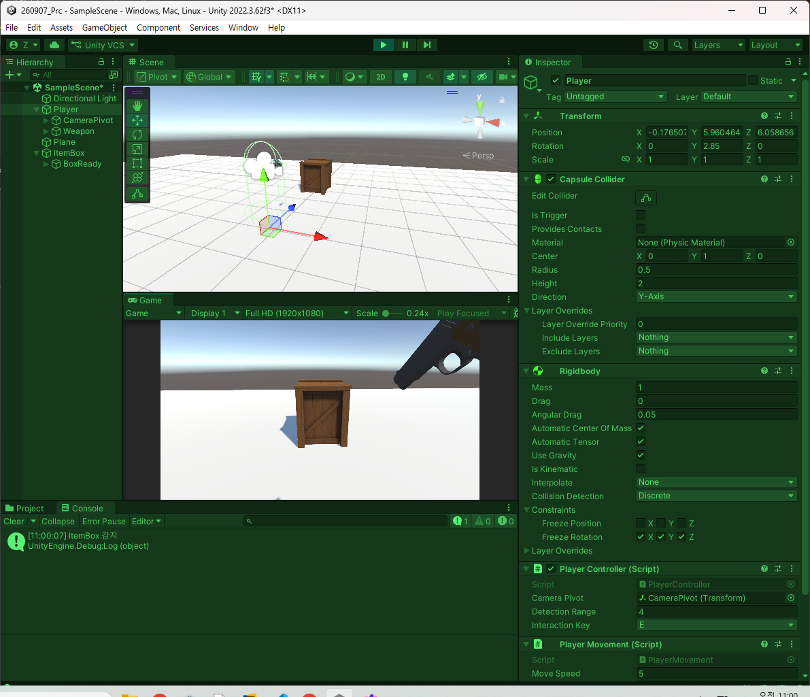
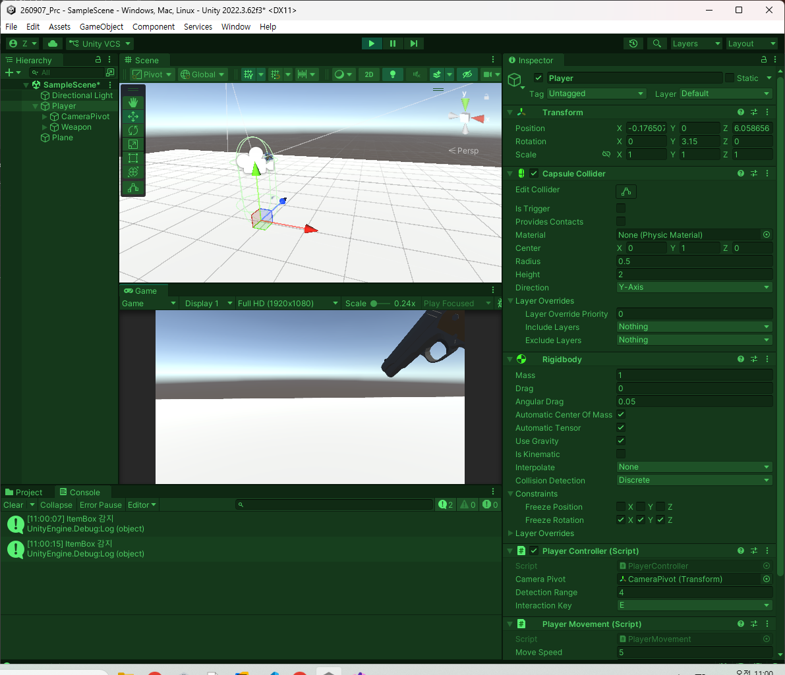
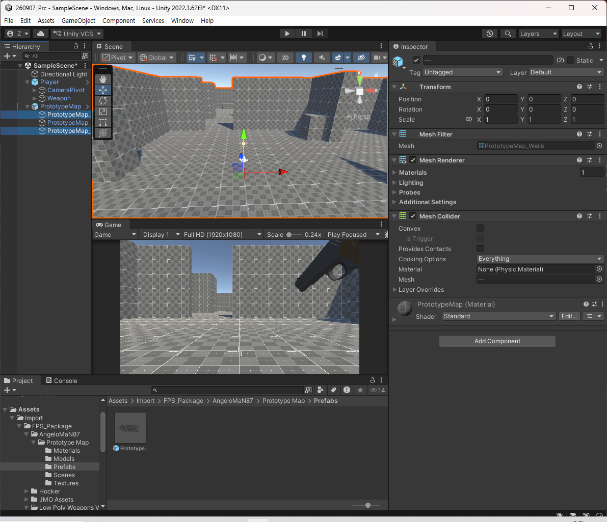
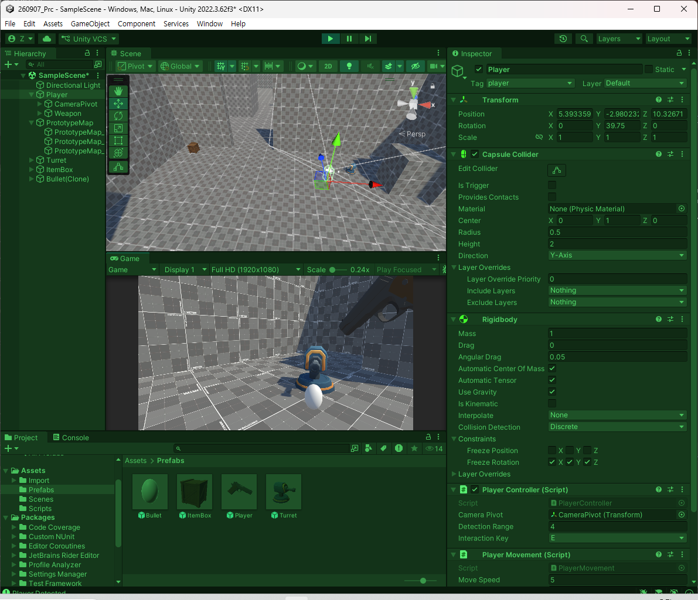

# 260908 Unity(7) FPS 구현(2)
## 1. 재장전
```csharp
using System.Collections;
using System.Collections.Generic;
using Unity.VisualScripting;
using UnityEngine;

public class PlayerWeapon : MonoBehaviour
{
    private Transform _cameraTransform;

    [SerializeField] private KeyCode _fireKey = KeyCode.Mouse0;
    [SerializeField] private float _range;
    [SerializeField] private int _damage;
    [SerializeField] private float _cooldown;

    private float _currentCooldown;
    private bool _isPressedFire => Input.GetKey(_fireKey);
    private bool _isReadyFire => _currentCooldown >= _cooldown;
    private bool _canFire => _isPressedFire && _isReadyFire && !_isEmptyMagazine;

    // --------- 재장전 -----------
    // R키로 30발 재장전
    [SerializeField] private KeyCode _reloadKey = KeyCode.R;
    // 탄알집에 30발 들어갈 수 있다고 가정
    [SerializeField] private int _magazineCount;
    // 30발 소진 시 총 안쏴짐
    private int _currentMagazineCount;
    private bool _isEmptyMagazine => _currentMagazineCount <= 0;
    private bool _isPressedReload => Input.GetKeyDown(_reloadKey);
    // 재장전 탄환은 무제한
    // 리로드 기능 함수
    public void Reload()
    {
        if (!_isPressedReload)
            return;

        _currentMagazineCount = _magazineCount;
        Debug.Log($"{_magazineCount}발 재장전 되었습니다.");
    }
    // -----------------------------------

    // ------------------------------------------
    private void Awake() => CacheComponents();
    private void Start() => Init();
    private void Update() => UpdateCooldown();
    // ------------------------------------------

    public void Fire()
    {
        if (!_canFire) return;

        // 발사 시 현재 탄환 수 감소
        _currentMagazineCount--;
        _currentCooldown = 0f;

        if (!TryGetDamageable(out IDamagable damagable)) return;

        damagable.TakeDamage(_damage);

        // TODO: 실제 구현 완료되면 로그출력 삭제
        Debug.Log($"Player : {damagable.gameObject.name}에게 발사");
        Debug.Log($"Player : {_currentMagazineCount}발 남음.");
    }

    private bool TryGetDamageable(out IDamagable damageable)
    {
        bool result = false;
        damageable = null;

        Ray ray = new Ray(_cameraTransform.position, _cameraTransform.forward);
        RaycastHit hit;

        if (Physics.Raycast(ray, out hit, _range))
        {
            result = hit.transform.TryGetComponent(out damageable);
        }

        return result;
    }

    private void CacheComponents()
    {
        _cameraTransform = Camera.main.transform;
    }

    private void Init()
    {
        _currentCooldown = 0f;
        _currentMagazineCount = _magazineCount;
    }

    private void UpdateCooldown()
    {
        if (_isReadyFire) return;

        _currentCooldown += Time.deltaTime;
    }
}

```

```csharp
using System.Collections;
using System.Collections.Generic;
using UnityEngine;

public class PlayerController : MonoBehaviour
{
    [SerializeField] private Transform _cameraPivot;
    private PlayerMovement _movement;
    private Transform _cameraTransform;

    private PlayerWeapon _weapon;

    private void Awake()
    {
        CacheComponents();
    }

    private void Start()
    {
        LockCursor();
    }

    private void Update()
    {
        _movement.Rotate();
        _weapon.Fire();
        // + 추가됨
        _weapon.Reload();
    }

    private void FixedUpdate()
    {
        _movement.Move();
    }

    private void LateUpdate()
    {
        SetWeaponTransform();
        SetCameraTransform();
    }

    private void CacheComponents()
    {
        _movement = GetComponent<PlayerMovement>();
        _weapon = GetComponentInChildren<PlayerWeapon>();
        _cameraTransform = Camera.main.transform;
    }

    private void SetCameraTransform()
    {
        //_cameraTransform.position = _cameraPivot.position;
        //_cameraTransform.rotation = _cameraPivot.rotation;

        _cameraTransform.SetPositionAndRotation(
            _cameraPivot.position,
            _cameraPivot.rotation
            );
    }

    private void LockCursor()
    {
        Cursor.lockState = CursorLockMode.Locked;
        Cursor.visible = false;
    }

    private void SetWeaponTransform()
    {
        _weapon.transform.SetPositionAndRotation(_cameraPivot.position,
            _cameraPivot.rotation);
    }
}

```


## 2. 상호작용 오브젝트
- 화면 가운데서 주시하는 것을 처리해볼 것이다. 

C# 스크립트를 만들고 진행
```csharp
using System.Collections;
using System.Collections.Generic;
using UnityEngine;

public interface IInteractable
{
    public void Interact();
}

```
인터페이스를 하나 더 만들자.

```csharp
using System.Collections;
using System.Collections.Generic;
using UnityEngine;

public interface IInteractor
{
    
}
```
상호 작용을 당할 때 누군지 알아야 한다. 
```csharp
using System.Collections;
using System.Collections.Generic;
using UnityEngine;

public interface IInteractable
{
    // 누가 시도했는지.
    public void Interact(IInteractor owner);
}
```
반면 상호작용을 시도하는 것이 필요.
```csharp
using System.Collections;
using System.Collections.Generic;
using UnityEngine;

public interface IInteractor
{
    public void TryInteract();
}

```
상호작용을 시도하려는 쪽에서도 게임 오브젝트를 가지고 있게 해보자.

```csharp
using System.Collections;
using System.Collections.Generic;
using UnityEngine;

public interface IInteractor
{
    public GameObject Gameobject { get; }
    public void TryInteract();
}
```
이제는 상호작용 가능한 box를 만들어볼 것이다.



프리팹을 통해 만들었다. 그러면 이 박스에다가 스크립트를 추가할 것이다. 
```csharp
using System.Collections;
using System.Collections.Generic;
using Unity.VisualScripting;
using UnityEngine;

public class ItemBox : MonoBehaviour, IInteractable
{
    public void Interact(IInteractor owner)
    {
        // owner의 능력치 상승
        // 인벤토리로 들어간다.
        // 무기가 생긴다거나
        // 장탄수를 늘리던가

        // 상호작용을 위해 매개변수를 받고 그 상자는 파괴
        Destroy(gameObject);
    }
}

```
이제는 플레이어에서 상호작용이 가능하도록 소스 코드가 추가되어야 한다.

PlayerController에서 Raycast로 감지.
```csharp
using System.Collections;
using System.Collections.Generic;
using UnityEngine;

public class PlayerController : MonoBehaviour, IInteractor
{
    // ---- 중략 ----

    // --------- IInterator -----------
    [SerializeField] private float _detectionRange;
    public void TryInteract()
    {
        Ray ray = new Ray(_cameraTransform.position, _cameraTransform.forward);
        RaycastHit hit;

        if (!Physics.Raycast(ray, out hit, _detectionRange))
            return;

    }

    public void DetectInteractable()
    {

    }
}

```

어떤 것을 처다보고 있는지를 변수로 가지면 좋을 듯.
```csharp
[SerializeField] private float _detectionRange;
private IInteractable _targetInteractable;
private bool _hasDetectInteractable => _targetInteractable != null;
public void TryInteract()
{
    Ray ray = new Ray(_cameraTransform.position, _cameraTransform.forward);
    RaycastHit hit;

    if (!Physics.Raycast(ray, out hit, _detectionRange))
        return;

    _targetInteractable = hit.collider.GetComponent<IInteractable>();
}

public void DetectInteractable()
{

}
```

자주 불릴 것을 따로 두는 편이 좋을듯.

그래서 상호작용에 대한 코드를 전체적으로 작성했을 때 다음과 같다.
```csharp
<PlayerController.cs>
using System.Collections;
using System.Collections.Generic;
using UnityEngine;

public class PlayerController : MonoBehaviour, IInteractor
{
    // ---- 중략 ------

    private void Update()
    {
        _movement.Rotate();
        _weapon.Fire();
        // + 추가됨
        _weapon.Reload();
        // ++ 추가됨
        DetectInteractable();
        TryInteract();
    }

    // --- 중략 -----

    // --------- IInterator -----------
    [SerializeField] private float _detectionRange;
    private IInteractable _targetInteractable;
    private bool _hasDetectInteractable => _targetInteractable != null;
    public GameObject GameObject { get => gameObject; }
    [SerializeField] private KeyCode _interactionKey = KeyCode.E;
    private bool _isPressedInteractionKey => Input.GetKeyDown(_interactionKey);
    private bool _canInteraction => _hasDetectInteractable && _isPressedInteractionKey;

    public void DetectInteractable()
    {
        Ray ray = new Ray(_cameraTransform.position, _cameraTransform.forward);
        RaycastHit hit;

        // Raycast 실패 경우
        if (!Physics.Raycast(ray, out hit, _detectionRange))
        {
            _targetInteractable = null;
            return;
        }

        if (_hasDetectInteractable)
        {
            // 같은 Interactable을 계속 주시하고 있는 경우
            if (hit.collider.gameObject == _targetInteractable.GameObject)
            {
                return;
            }
        }

        _targetInteractable = hit.collider.GetComponent<IInteractable>();

        if (_hasDetectInteractable)
        {
            Debug.Log($"{_targetInteractable.GameObject.name} 감지");
        }
    }
    public void TryInteract()
    {
        if(!_canInteraction)
        { 
            return; 
        }

        _targetInteractable.Interact(this);
        _targetInteractable = null;
    }
    // ----------------------------------------------------------
}

<ItemBox.cs>
using System.Collections;
using System.Collections.Generic;
using Unity.VisualScripting;
using UnityEngine;

public class ItemBox : MonoBehaviour, IInteractable
{
    public GameObject GameObject { get => gameObject; }
    public void Interact(IInteractor owner)
    {
        // owner의 능력치 상승
        // 인벤토리로 들어간다.
        // 무기가 생긴다거나
        // 장탄수를 늘리던가

        // 상호작용을 위해 매개변수를 받고 그 상자는 파괴
        Destroy(gameObject);
    }
}

<IInteractable.cs>
using System.Collections;
using System.Collections.Generic;
using UnityEngine;

public interface IInteractable
{
    public GameObject GameObject { get; }

    // 상호 작용을 당할 때 누군지 알아야 한다.
    public void Interact(IInteractor owner); // 누가 시도했는지.
}

<IInteractor.cs>
using System.Collections;
using System.Collections.Generic;
using UnityEngine;

public interface IInteractor
{
    public GameObject GameObject { get; }
    public void TryInteract();
}

```
스크립트를 넣어주고 


Player에 수치 조정해준 다음 플레이.




만일 '_targetInteractable = null;'를 처리하지 않으면 계속 찾으려고 한다. 따라서 넣어줄 것.

이제 올바르게 바라보고 있는지를 판단하고 싶은데 그것을 구현할 것임. 
```csharp
using System.Collections;
using System.Collections.Generic;
using UnityEngine;

public interface IInteractable
{
    public GameObject GameObject { get; }

    public void Targeting();
    public void Untargeting();

    // 상호 작용을 당할 때 누군지 알아야 한다.
    public void Interact(IInteractor owner); // 누가 시도했는지.
}
```
ItemBox로 이동.
```csharp
using System.Collections;
using System.Collections.Generic;
using Unity.VisualScripting;
using UnityEngine;

public class ItemBox : MonoBehaviour, IInteractable
{
    public GameObject GameObject { get => gameObject; }
    public void Interact(IInteractor owner)
    {
        // owner의 능력치 상승
        // 인벤토리로 들어간다.
        // 무기가 생긴다거나
        // 장탄수를 늘리던가

        // 상호작용을 위해 매개변수를 받고 그 상자는 파괴
        Destroy(gameObject);
    }

    public void Targeting()
    {

    }

    public void Untargeting()
    {

    }
}
```
이제 무엇을 하려고 하는 것인지는 아이템 박스 쪽에 컴포넌트 중에 Outline이 있을 것임. 그것을 해볼 것임.
```csharp
using System.Collections;
using System.Collections.Generic;
using Unity.VisualScripting;
using UnityEngine;

public class ItemBox : MonoBehaviour, IInteractable
{
    public GameObject GameObject { get => gameObject; }
    public void Interact(IInteractor owner)
    {
        // owner의 능력치 상승
        // 인벤토리로 들어간다.
        // 무기가 생긴다거나
        // 장탄수를 늘리던가

        // 상호작용을 위해 매개변수를 받고 그 상자는 파괴
        Destroy(gameObject);
    }

    private Outline _outline;
    private void Awake()
    {
        CacheComponents();
    }
    private void Start()
    {
        Init();
    }

    public void Targeting()
    {
        _outline.enabled = true;
    }

    public void Untargeting()
    {
        _outline.enabled = false;
    }

    private void CacheComponents()
    {
        _outline = gameObject.GetComponent<Outline>();
    }

    private void Init()
    {
        _outline.enabled = false;
    }
}

```
PlayerController로 이동해서 구현한 것 받아서 추가.
```csharp
    public void DetectInteractable()
    {
        Ray ray = new Ray(_cameraTransform.position, _cameraTransform.forward);
        RaycastHit hit;

        // Raycast 실패 경우
        if (!Physics.Raycast(ray, out hit, _detectionRange))
        {
            if(_hasDetectInteractable)
            {
                _targetInteractable.Untargeting();
                _targetInteractable = null;
            }
            return;
        }

        if (_hasDetectInteractable)
        {
            // 같은 Interactable을 계속 주시하고 있는 경우
            if (hit.collider.gameObject == _targetInteractable.GameObject)
            {
                return;
            }
        }

        _targetInteractable.Untargeting();
        _targetInteractable = hit.collider.GetComponent<IInteractable>();

        if (_hasDetectInteractable)
        {
            Debug.Log($"{_targetInteractable.GameObject.name} 감지");
            _targetInteractable.Targeting();
        }
    }
```

```csharp
public void DetectInteractable()
{
    // ---- 중략 ----

    // 이게 null이면 실행하고 아닐때는 안한다는 것.
    _targetInteractable?.Untargeting();
    _targetInteractable = hit.collider.GetComponent<IInteractable>();

    //if (_hasDetectInteractable)
    //{
    //    Debug.Log($"{_targetInteractable.GameObject.name} 감지");
    //    _targetInteractable.Targeting();
    //}

    // 이게 null이면 실행하고 아닐때는 안한다는 것.
    _targetInteractable?.Targeting();
}
```
플레이어만 먹을 수 있는 아이템이면
```csharp
public class ItemBox : MonoBehaviour, IInteractable
{
    public GameObject GameObject { get => gameObject; }
    public void Interact(IInteractor owner)
    {
        // owner의 능력치 상승
        // 인벤토리로 들어간다.
        // 무기가 생긴다거나
        // 장탄수를 늘리던가

        if (!(owner is PlayerController))
            return;

        PlayerController player = (PlayerController)owner;

        // public으로 이동 속도 변화를 줄 수 있는 함수를 주거나
        // 객체로 만들어 붙어있는 동안 변화시켜주고 Destroy나 Disable 때 원래대로 돌려주거나.

        // 상호작용을 위해 매개변수를 받고 그 상자는 파괴
        Destroy(gameObject);
    }
    // ---- 중략 -----
}
```
이런 형식으로 가능하다.

이젠 샘플 맵을 적용해보도록 하자.

갖고와서 Collider 적용


만든 프리팹을 가지고 맵에 적용


이제 이펙트를 적용시킬 것이다. 
먼저 스크립트를 추가한다.
```csharp
using System.Collections;
using System.Collections.Generic;
using UnityEngine;

public class FlameEffect : MonoBehaviour
{
    // 총이 발사되는 동안 유지가 되어야 함. 
    // 멈추는 순간 바로 꺼지면 안된다. 설정한 릴레이 후 자동으로 꺼지게 만들기.
    // gameObject.SetActive(false);

    [SerializeField] private float _deactivateTime;
    private float _time;

    private void OnEnable()
    {
        ResetTime();
    }

    private void Start()
    {
        gameObject.SetActive(false);
    }

    private void Update()
    {
        UpdateTime();
        Deactivate();
    }

    public void Play()
    {
        // 딜레이 초기화
        ResetTime();
    }

    private void ResetTime()
    {
        _time = 0;
    }

    private void UpdateTime()
    {
        _time += Time.deltaTime;
    }

    private void Deactivate()
    {
        if (_time < _deactivateTime)
            return;

        gameObject.SetActive(false);
    }
}
```

```csharp
using System.Collections;
using System.Collections.Generic;
using Unity.VisualScripting;
using UnityEngine;

public class PlayerWeapon : MonoBehaviour
{
    private Transform _cameraTransform;

    [SerializeField] private KeyCode _fireKey = KeyCode.Mouse0;
    [SerializeField] private float _range;
    [SerializeField] private int _damage;
    [SerializeField] private float _cooldown;

    private float _currentCooldown;
    private bool _isPressedFire => Input.GetKey(_fireKey);
    private bool _isReadyFire => _currentCooldown >= _cooldown;
    private bool _canFire => _isPressedFire && _isReadyFire && !_isEmptyMagazine;

    // --------- 재장전 -----------
    // R키로 30발 재장전
    [SerializeField] private KeyCode _reloadKey = KeyCode.R;
    // 탄알집에 30발 들어갈 수 있다고 가정
    [SerializeField] private int _magazineCount;
    // 30발 소진 시 총 안쏴짐
    private int _currentMagazineCount;
    private bool _isEmptyMagazine => _currentMagazineCount <= 0;
    private bool _isPressedReload => Input.GetKeyDown(_reloadKey);
    // 재장전 탄환은 무제한
    // 리로드 기능 함수
    public void Reload()
    {
        if (!_isPressedReload)
            return;

        _currentMagazineCount = _magazineCount;
        Debug.Log($"{_magazineCount}발 재장전 되었습니다.");
    }
    // -----------------------------------

    // ------------------------------------------
    private void Awake() => CacheComponents();
    private void Start() => Init();
    private void Update() => UpdateCooldown();
    // ------------------------------------------

    public void Fire()
    {
        if (!_canFire) return;

        // 발사 시 현재 탄환 수 감소
        _currentMagazineCount--;
        _currentCooldown = 0f;
        FlameEffect();

        if (!TryGetDamageable(out IDamagable damagable)) return;

        damagable.TakeDamage(_damage);

        // TODO: 실제 구현 완료되면 로그출력 삭제
        Debug.Log($"Player : {damagable.gameObject.name}에게 발사");
        Debug.Log($"Player : {_currentMagazineCount}발 남음.");
    }

    private bool TryGetDamageable(out IDamagable damageable)
    {
        bool result = false;
        damageable = null;

        Ray ray = new Ray(_cameraTransform.position, _cameraTransform.forward);
        RaycastHit hit;

        if (Physics.Raycast(ray, out hit, _range))
        {
            result = hit.transform.TryGetComponent(out damageable);
        }

        return result;
    }

    private void CacheComponents()
    {
        _cameraTransform = Camera.main.transform;
    }

    private void Init()
    {
        _currentCooldown = 0f;
        _currentMagazineCount = _magazineCount;
    }

    private void UpdateCooldown()
    {
        if (_isReadyFire) return;

        _currentCooldown += Time.deltaTime;
    }

    // 이펙트
    [SerializeField] private FlameEffect _flameEffect;

    private void FlameEffect()
    {
        _flameEffect.gameObject.SetActive(true);
        _flameEffect.Play();
    }
}
```

발사하는 단계에서 FlameObject를 활성화시켜서 Play를 해주면 Play가 호출될 때마다 누적시간을 초기화하고 계속 쏘고 있는 동안에는 이펙트가 꺼지지 않는다. 

이제 총 쐈을 때, 맞은 지점에도 터지는 이펙트가 필요하다. 

```csharp
    // 탄착군
    [SerializeField] private FlameEffect _shotEffect;

    private void ShotEffect()
    {

    }
```

효과의 앞쪽 방향은 총알의 뒤인데(z) 벡터에서 면에 수직되는 벡터의 개념을 normal 벡터라고 부른다. 기본적으로 raycastHit에서 제공한다. 

부딪히는 것에 대한 포인트 뿐만이 아니라 normal도 얻어올 수 있다. 

이 효과의 Forward를 normal 쪽으로 돌려주는 연산만 하면 될 것.

```csharp
    // 탄착군
    [SerializeField] private FlameEffect _shotEffect;

    // RaycastHit를 받아서 Transform. 
    private void ShotEffect(RaycastHit hit)
    {
        Transform effectTransform = Instantiate(_shotEffect).transform;

        effectTransform.position = hit.point;
        // 원하는 벡터가 들어갈 수 있음.
        effectTransform.forward = hit.normal;
    }
```

적용된 FlameEffect.cs는 다음과 같다.
```csharp
using System.Collections;
using System.Collections.Generic;
using UnityEngine;

public class FlameEffect : MonoBehaviour
{
    // 총이 발사되는 동안 유지가 되어야 함. 
    // 멈추는 순간 바로 꺼지면 안된다. 설정한 릴레이 후 자동으로 꺼지게 만들기.
    // gameObject.SetActive(false);

    [SerializeField] private float _deactivateTime;
    private float _time;

    private void OnEnable()
    {
        ResetTime();
    }

    private void Start()
    {
        gameObject.SetActive(_playStart);
    }

    private void Update()
    {
        UpdateTime();
        Deactivate();
    }

    public void Play()
    {
        // 딜레이 초기화
        ResetTime();
    }

    private void ResetTime()
    {
        _time = 0;
    }

    private void UpdateTime()
    {
        _time += Time.deltaTime;
    }

    private void Deactivate()
    {
        if (_time < _deactivateTime)
            return;

        if(_isDestroy)
            Destroy(gameObject);
        else
            gameObject.SetActive(false);
    }

    // 추가 처리
    [SerializeField] private bool _isDestroy;
    [SerializeField] private bool _playStart;

}

```
Deactivate 함수에서 if 조건 설정에 bool을 제대로 넣었는지에 대해 다시 한 번 확인할 것.

PlayerWeapon.cs에 대한 코드는 다음과 같다.
```csharp
public class PlayerWeapon : MonoBehaviour
{
    private Transform _cameraTransform;

    [SerializeField] private KeyCode _fireKey = KeyCode.Mouse0;
    [SerializeField] private float _range;
    [SerializeField] private int _damage;
    [SerializeField] private float _cooldown;

    private float _currentCooldown;
    private bool _isPressedFire => Input.GetKey(_fireKey);
    private bool _isReadyFire => _currentCooldown >= _cooldown;
    private bool _canFire => _isPressedFire && _isReadyFire && !_isEmptyMagazine;

    // --------- 재장전 -----------
    // R키로 30발 재장전
    [SerializeField] private KeyCode _reloadKey = KeyCode.R;
    // 탄알집에 30발 들어갈 수 있다고 가정
    [SerializeField] private int _magazineCount;
    // 30발 소진 시 총 안쏴짐
    private int _currentMagazineCount;
    private bool _isEmptyMagazine => _currentMagazineCount <= 0;
    private bool _isPressedReload => Input.GetKeyDown(_reloadKey);
    // 재장전 탄환은 무제한
    // 리로드 기능 함수
    public void Reload()
    {
        if (!_isPressedReload)
            return;

        _currentMagazineCount = _magazineCount;
        Debug.Log($"{_magazineCount}발 재장전 되었습니다.");
    }
    // -----------------------------------

    // ------------------------------------------
    private void Awake() => CacheComponents();
    private void Start() => Init();
    private void Update() => UpdateCooldown();
    // ------------------------------------------

    public void Fire()
    {
        if (!_canFire) return;

        // 발사 시 현재 탄환 수 감소
        _currentMagazineCount--;
        _currentCooldown = 0f;
        FlameEffect();

        if (!TryGetDamageable(out IDamagable damagable)) return;

        damagable.TakeDamage(_damage);

        // TODO: 실제 구현 완료되면 로그출력 삭제
        Debug.Log($"Player : {damagable.gameObject.name}에게 발사");
        Debug.Log($"Player : {_currentMagazineCount}발 남음.");
    }

    // Raycast가 어디인가 맞았을 때 판단 가능.
    private bool TryGetDamageable(out IDamagable damageable)
    {
        bool result = false;
        damageable = null;

        Ray ray = new Ray(_cameraTransform.position, _cameraTransform.forward);
        RaycastHit hit;

        if (Physics.Raycast(ray, out hit, _range))
        {
            ShotEffect(hit);
            result = hit.transform.TryGetComponent(out damageable);
        }

        return result;
    }

    private void CacheComponents()
    {
        _cameraTransform = Camera.main.transform;
    }

    private void Init()
    {
        _currentCooldown = 0f;
        _currentMagazineCount = _magazineCount;
    }

    private void UpdateCooldown()
    {
        if (_isReadyFire) return;

        _currentCooldown += Time.deltaTime;
    }

    // 이펙트
    [SerializeField] private FlameEffect _flameEffect;

    private void FlameEffect()
    {
        _flameEffect.gameObject.SetActive(true);
        _flameEffect.Play();
    }

    // 탄착군
    [SerializeField] private FlameEffect _shotEffect;

    // RaycastHit를 받아서 Transform. 
    private void ShotEffect(RaycastHit hit)
    {
        Transform effectTransform = Instantiate(_shotEffect).transform;

        effectTransform.position = hit.point;
        // 원하는 벡터가 들어갈 수 있음.
        effectTransform.forward = hit.normal;
    }
}
```
RaycastHit의 정보가 담기는 TryGetDamageable()에 적용시켜야 하는 점, 제대로 적용이 되고 있는지에 대해 확인할 것.

이제 이것을 기반으로 하여 배울 것들을 추가할 예정이다. 예정된 항목은 다음과 같다.
 - 레이어마스크 : 특정 Layer만 걸리는 애들을 걸리게 한다.
 - UI 구성
 - 싱글톤 패턴으로 관리자 클래스
 - 오브젝트 풀가지고 생성 파괴를 정리
 - 델리게이트로 UI를 갱신하는 로직
 - 코루틴으로 시간체크하는 것을 타이머 굴러가게 하거나
 - 애니메이션으로 깡통인 플레이어 캐릭터를 입혀서 적용
 - 뛰어오는 애니메이션을 적용하거나 하는 등

이번엔 자체적으로 해볼 것들은 다음과 같음.
- 스팀팩 구현
  - 필드 내 상호작용 가능한 아이템으로 구현하고 20초동안 이동속도 증가, 
  - 가능하다면 총의 연사속도나 플레이어 체력 도입하여 체력을 깎는다 효과를 적용
  - 20초가 지나면 풀리면서 기존 상태로 복귀
- 수류탄 구현 
  - 3키를 꾹 눌러 던지는 힘 충전(max 이상 넘지 않도록)
  - 떼면 누적된 힘으로 수류탄 투척, 던진 후 3초가 경과하면 폭발, 
  - Physics.OverlapSphere를 사용해 설정된 반경 내에 존재하는 데미지를 입을 수 있는 오브젝트들에게 모두 데미지 부여
  - 수류탄 개수는 3개로 제한. 
- 프로토타입 몬스터 구현
  - 지정된 범위 내에 플레이어가 존재하고 시야 내에 들어오는 경우 플레이어 추적
  - 플레이어와 거리가 설정값 이하가 된 경우, 쿨타임 설정값을 기준으로 연속 공격 
  - 에셋 적용해도 되지만 단순 큐브, Sphere를 사용해 임시 구현 가능.