# 260909 Unity(8) Layermask
## 1. Layermask
### 1.1. 개요
- 여태까지는 상당히 많은 양의 조건식을 달거나 tag를 달아주거나 했다. 
- Layer는 분류 체계이다. 
- 계층상 나눠서 특정 Layer끼리는 충돌이 안일어나도록 막거나 특정 Layer만 특정할 수 있다. 
- 기존에는 tag를 썼고 직관적이라 편했다. 
- Layer는 입문자 입장에서는 진입장벽이 존재한다. 
- 하지만 상황이 tag로만 하면 불편해질 수 있다. 

### 1.2. 설명
Turret을 예를 들면 다음과 같다. 

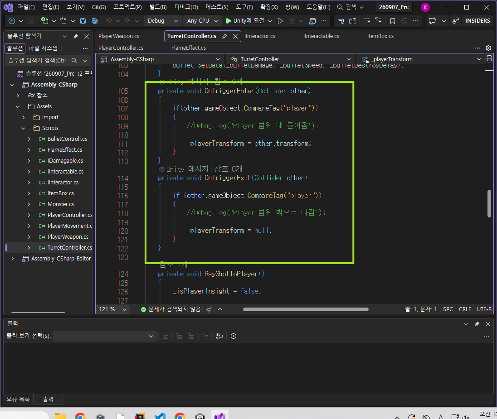

**이렇게 되면 문자열 기반이라 조건이 추가하면 할수록 코드가 길어지고 오타의 확률이 높아진다**. 

- 그래서 Layer를 써볼 것이다.

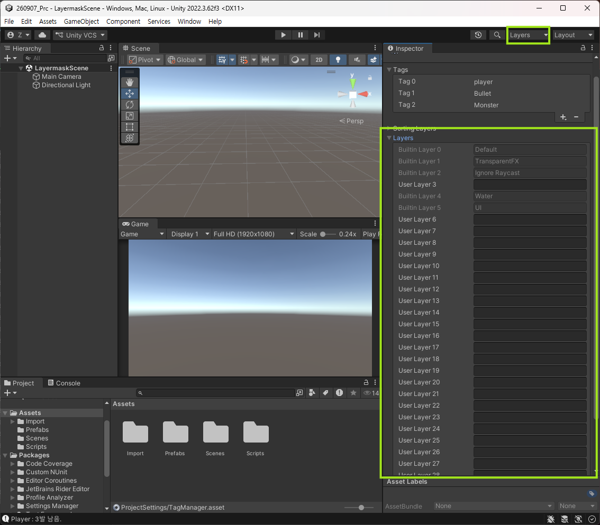

- bit에 대한 논리게이트 연산과 bit shifting을 다뤄야 한다. 
- 성능상으로나 한 번에 여러 분류를 선택해서 원하는 것을 한 번에 다룰 수 있다는 것이 장점이다. 따라서 작업 자체가 효율적이다.
  
Plane을 깔고 도형을 추가한다. rigidbody 적용.

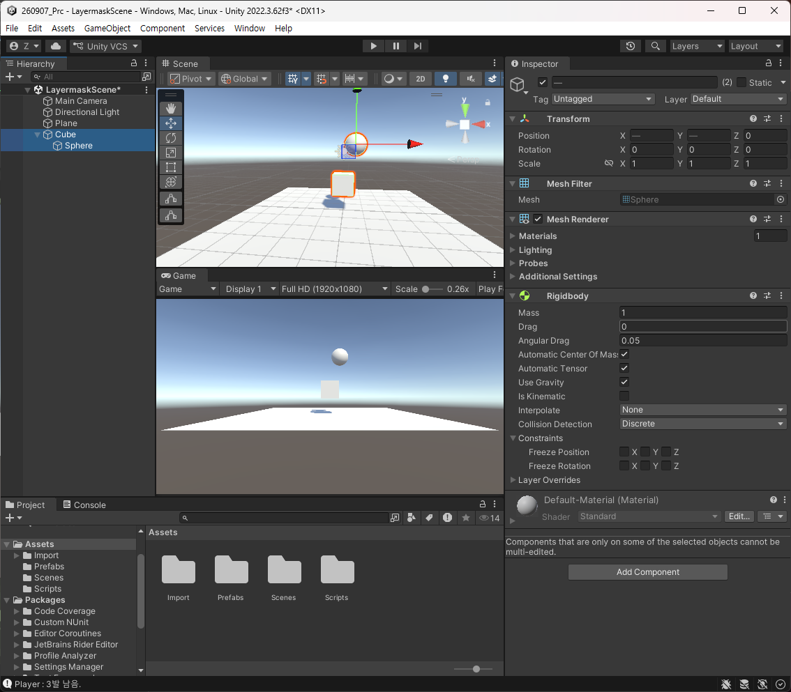

일단 Layer를 추가해서 Player, Enemy, Ground를 추가하고 Project Setting에 들어가서

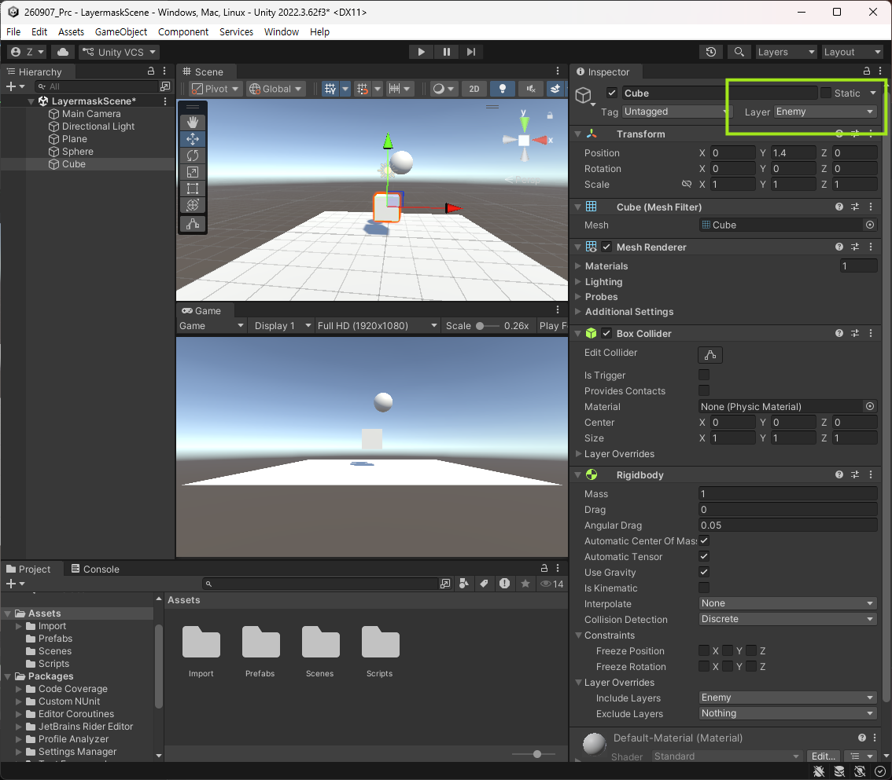
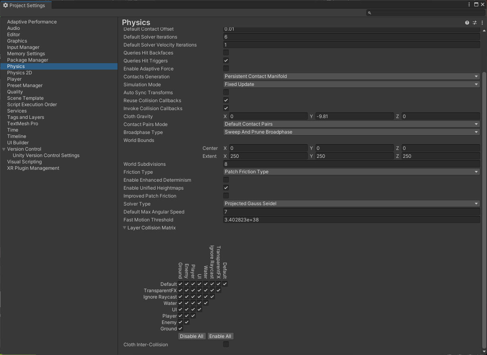
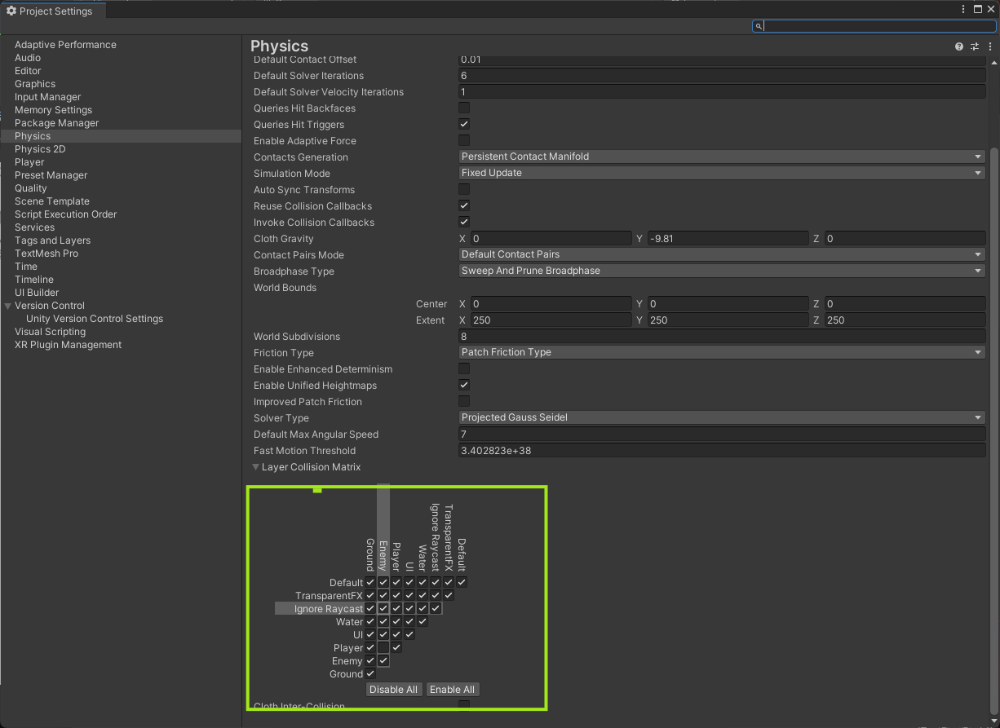

를 하면 서로가 충돌하지 않는다. 

- Tag의 경우 권장 사항이 아니다. 실수를 할 수 있는 여지가 너무 많아 차라리 하나의 묶음 단위에서 게임 오브젝트를 분류하자는 것이 Layer인 셈. 
- 그러니까 Layer는 계층 자체를 나누는 셈. 

### 1.3. 사용
- 스크립트에 Layermask를 선언하여 인스펙터에서 지정이 가능하다. 
- 특정 자리가 0인지 1인지에 대해 여부를 체크하기 때문에 비트 연산을 알아야 한다는 것. 
- **원하는 자리에 1이 있는지 없는지를 체크를 한다고 생각할 것**.
- 논리 연산자를 통해 layermask를 잘 다룰 수 있다. 
- 물론 Tag처럼 문자로 쓸 수는 있지만

```csharp
using System.Collections;
using System.Collections.Generic;
using UnityEngine;

public class LayerTest : MonoBehaviour
{
}
```

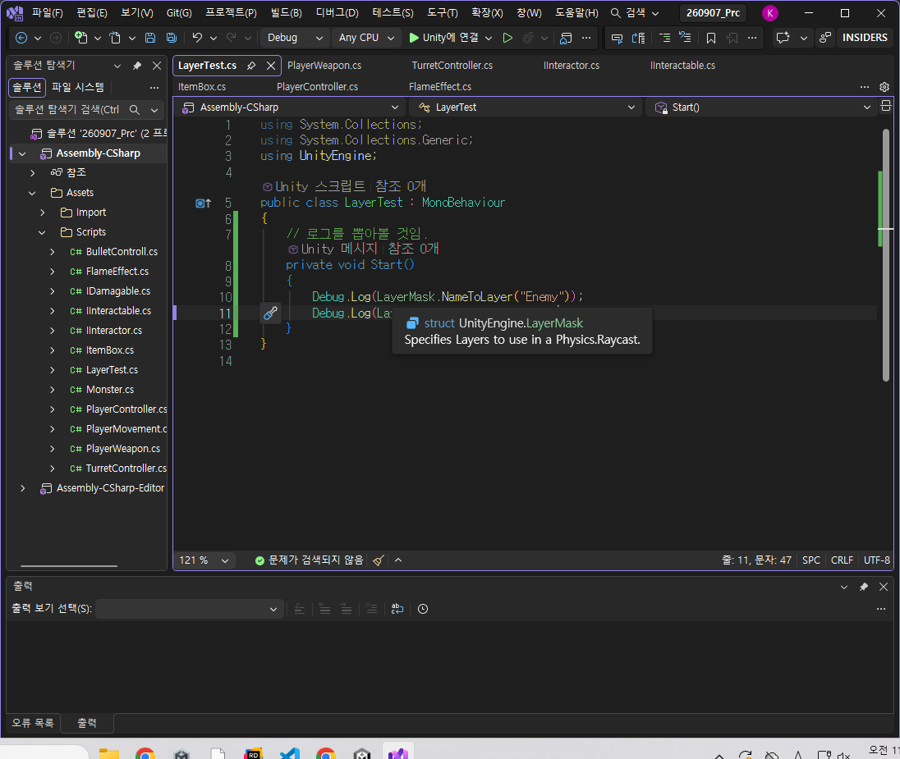

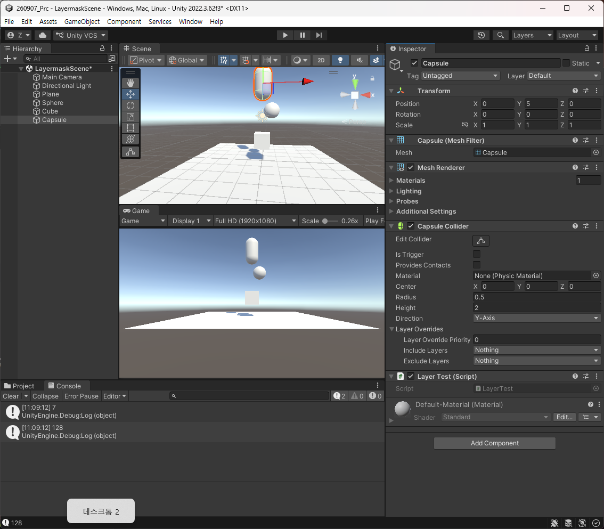

로그를 해석하면 7번째에 Enemy가 있다는 것이고 bit에서는 7번째 칸이 1이라서 128이라는 의미.

- NameToLayer는 몇번째 칸이고 GetMask는 2진법으로 나오는 자리이다.
- Layer는 원하는 것을 검출해서 쓴다는 개념이다. 
- 그래서 Raycast에서 쓰는 것을 생각해보도록 할 것이다. 
- LayerMask는 구조체로 구현되어 있고 이것을 갖다가 연산도 많이 하는 경우가 있다. 
- 예를 들어 둘을 중복으로 선택해서 중복으로 더하고 싶으면 or 연산(|)이 들어간다. 그래서 중복 선택이 가능한 형태로 변한다. 
- 만일 & 연산일 경우, 둘 다 True여야만 한다. 그러면 둘 다 선택이 안된 상태로 0만 있을 것이다. 
- 이런 연산이 많은 이유가 더한 다음에 중복된 그룹들을 판별할 때 | 연산으로 더해서 쓰고 & 연산일 때는 자신이 속한 Layer인지를 판별, 즉 찾을 때 쓴다.  
- 그래서 클래스 객체보다는 조금 더 메모리 친화적으로 쓸 수 있다(값 타입이므로).

```csharp
using System.Collections;
using System.Collections.Generic;
using UnityEngine;

public class LayerTest : MonoBehaviour
{
    public LayerMask TargetLayer;
    [SerializeField] private float _rayDistance;

    public void Update()
    {
        // 이 오브젝트의 위치에서 정면으로 발사되는 Ray 생성. 
        Ray ray = new Ray(gameObject.transform.position, gameObject.transform.forward);
        // Raycast를 사용
        RaycastHit hit;

        // Raycast를 사용하여 감지된 gameObject의 이름 출력
        // Raycast의 거리는 인스펙터에서 조절할 수 있도록 한다.
        if (Physics.Raycast(ray, out hit, _rayDistance))
        {
            Debug.Log($"{hit.transform.name} 감지");
        }
    }
}
```

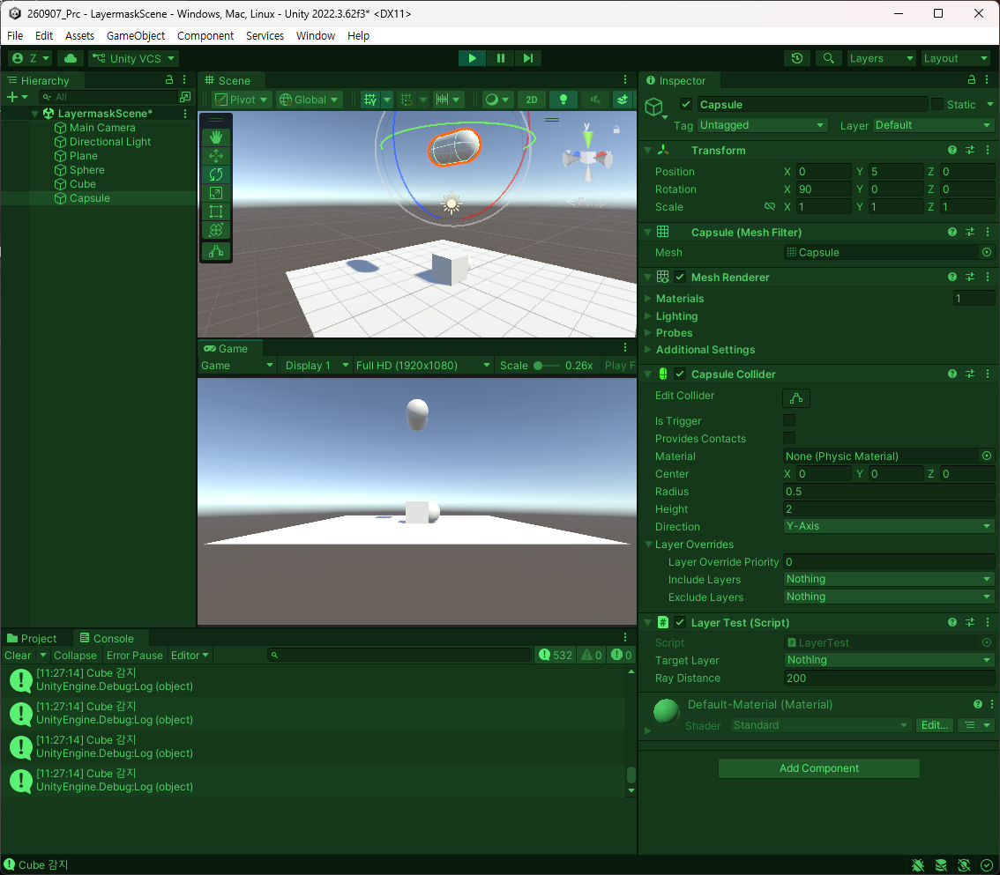

내가 찾고자 하는 것만 찾게끔 만들 수 있다. 

```csharp
using System.Collections;
using System.Collections.Generic;
using UnityEngine;

public class LayerTest : MonoBehaviour
{
    public LayerMask TargetLayer;
    [SerializeField] private float _rayDistance;

    public void Update()
    {
        // 이 오브젝트의 위치에서 정면으로 발사되는 Ray 생성. 
        Ray ray = new Ray(transform.position, transform.forward);
        // Raycast를 사용
        RaycastHit hit;

        // Raycast를 사용하여 감지된 gameObject의 이름 출력
        // Raycast의 거리는 인스펙터에서 조절할 수 있도록 한다.
        if (Physics.Raycast(ray, out hit, _rayDistance, TargetLayer))
        {
            Debug.Log($"{hit.transform.name} 감지");
        }
    }
}
```

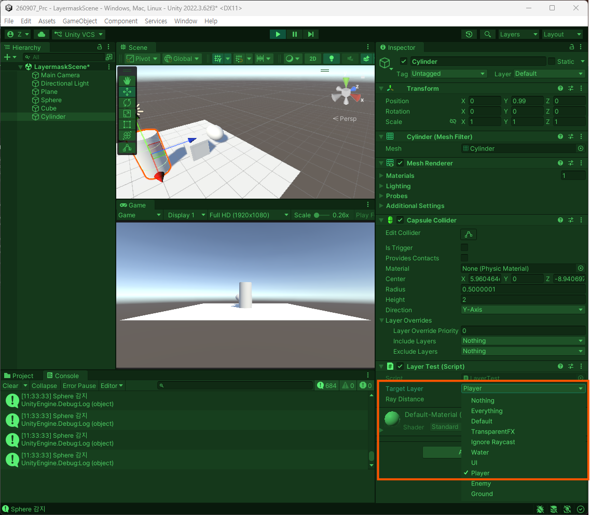
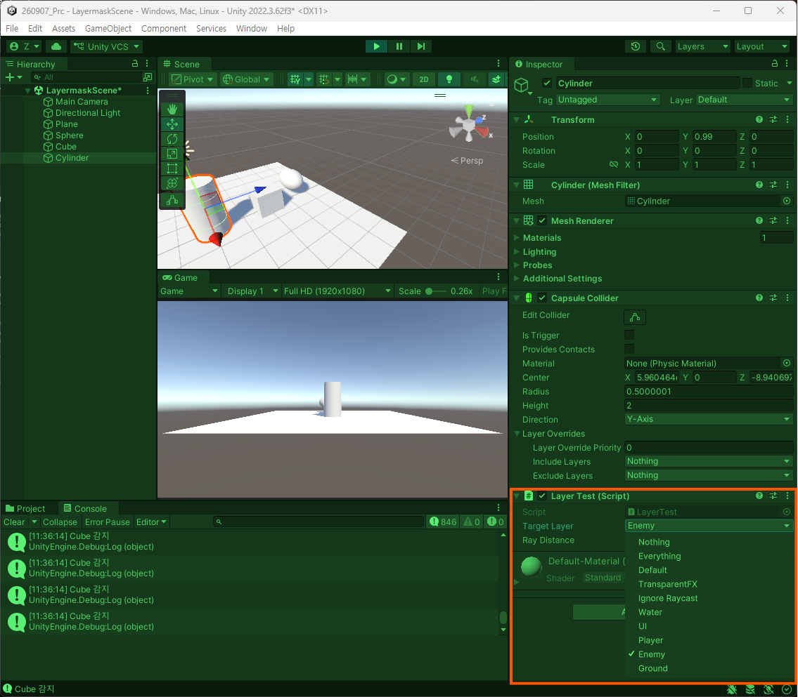

그래서 기존 TurretController에서의 까닥거리는 버그를 수정할 수 있을 것이다. 

당연히 충돌에서도 쓸 수 있다. 

콜라이더에 접근해서 Player layer를 보게된다면 8번째 칸이고 256이라는 것은 8번째 칸이 1이므로 발생한다. 

이를 비교해줘야 하는 것인데 이것이 같아지려면 데이터 자체는 현재 (앞은 모두 0)0111, (앞은 모두 0)1000 0000인데 이 데이터를 1이라고 밀어줘야 한다. 그래서 이 데이터를 1로 바꿔주면 원하는 Layer인지 판별할 수 있는 것이다.

그것을 해볼 것.

```csharp
public class LayerTest : MonoBehaviour
{
    public LayerMask TargetLayer;
    [SerializeField] private float _rayDistance;

    private void OnTriggerEnter(Collider other)
    {
        // 자릿수
        int layer = (1 << other.gameObject.layer);
        if(layer == TargetLayer.value)
        {
            Debug.Log("찾음");
        }
    }
```

하지만 Tag랑 사용법이 딱히 달라진 것은 없는 것 같다. 32bit 비트 마스크에서 Target과 Ground의 Layer이 겹친 상황. Trigger에 감지된 것은 플레이어다. 

```csharp
public class LayerTest : MonoBehaviour
{
    public LayerMask TargetLayer;
    [SerializeField] private float _rayDistance;

    // 뭔가 연산을 했을 때 0이 아닐 때 -> And 결과가 != 0; 
    private void OnTriggerEnter(Collider other)
    {
        // 자릿수
        int layer = (1 << other.gameObject.layer);
        if ((TargetLayer.value & layer) != 0) 
        {
            Debug.Log("찾음");
        }
    }
}
```
이렇게하면 감지 영역에서 읽힌다. 

응용을 하여 기능도 가능.
```csharp
    // 기능 선언
    private bool ContainsLayer(LayerMask mask, Collider layer)
    {
        return 0 != (mask.value & (1 << layer.gameObject.layer));
    }
```

이것을 LayerMask 자체를 비교해주는 기능을 자체적으로 제공해주면 되었으면 한다. 

```csharp
private void OnTriggerEnter(Collider other)
{
    if (TargetLayer.Contains(other))  
    {
        Debug.Log("찾음");
    }
}
```
지금은 전혀 안된다.

이렇게 하려면 확장 기능으로 추가해야 한다.

자주 쓰이는 로직을 확장 메서드를 통해서 제공될 수 있도록 한다.

쓰면 편하다는 것이지 반드시란 것은 없다.

코드를 직관적으로 쓸 때 만들법함. 

일단 구축
```csharp
using System.Collections;
using System.Collections.Generic;
using UnityEngine;

public static class LayerMaskExtension
{
    public static bool Contains(this LayerMask mask, int layer)
    {
        return (mask.value & (1 << layer)) != 0;
    }

    public static bool Contains(this LayerMask mask, GameObject gameObj)
    {
        return (mask.value & (1 << gameObj.layer)) != 0;
    }

    public static bool Contains(this LayerMask mask, Component comp)
    {
        return (mask.value & (1<<comp.gameObject.layer)) != 0;
    }

    public static LayerMask Add(this LayerMask mask, int layer)
    {

    }

    public static LayerMask Remove(this LayerMask mask, int layer)
    {
    }
}
```

각 함수명에 합당한 연산자를 적용시켜준다면 다음과 같을 것. 그리고 실사용을 같이 보면 

```csharp
// or 연산자를 사용
public static LayerMask Add(this LayerMask mask, int layer)
{
    return (mask.value | (1 << layer));
}

<MaskTest.cs>

    private void Start()
    {
        TargetLayer = TargetLayer.Add(9);
    }
```

그렇다면 뺼 때는 어떻게 할 것인가 생각해보면 

원래 빼려는 이진수들을 다 뒤집고 &를 하게 된다면 원하는 결과를 얻는다. 

그것을 반영했을 때 다음과 같이 서술된다.

```csharp

    // or 연산자를 사용
    public static LayerMask Add(this LayerMask mask, int layer)
    {
        return (mask.value | (1 << layer));
    }

    public static LayerMask Remove(this LayerMask mask, int layer)
    {
        return (mask.value & ~(1 << layer));
    }
```

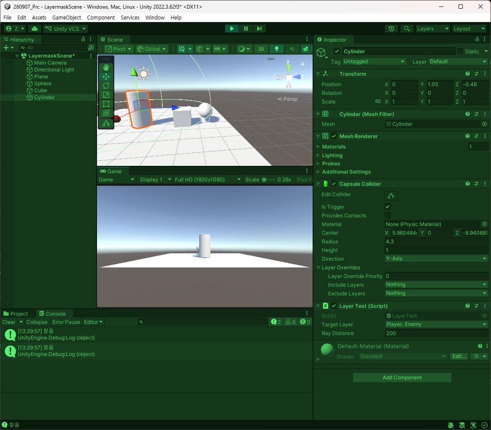

만일 이해가 가지 않으면 일일히 써가면서 확인하는 것이 가장 좋다. 

```csharp
using System.Collections;
using System.Collections.Generic;
using UnityEngine;

public static class LayerMaskExtension
{
    public static bool Contains(this LayerMask mask, int layer)
    {
        return (mask.value & (1 << layer)) != 0;
    }

    public static bool Contains(this LayerMask mask, GameObject gameObj)
    {
        return (mask.value & (1 << gameObj.layer)) != 0;
    }

    public static bool Contains(this LayerMask mask, Component comp)
    {
        return (mask.value & (1<<comp.gameObject.layer)) != 0;
    }

    // or 연산자를 사용
    public static LayerMask Add(this LayerMask mask, int layer)
    {
        return (mask.value | (1 << layer));
    }

    public static LayerMask Add(this LayerMask mask, GameObject gameObj)
    {
        return (mask.value | (1 << gameObj.layer));
    }

    public static LayerMask Add(this LayerMask mask, Component comp)
    {
        return (mask.value | (1 << comp.gameObject.layer));
    }

    public static LayerMask Remove(this LayerMask mask, int layer)
    {
        return (mask.value & ~(1 << layer));
    }
    public static LayerMask Remove(this LayerMask mask, GameObject gameObj)
    {
        return (mask.value & ~(1 << gameObj.layer));
    }
    public static LayerMask Remove(this LayerMask mask, Component comp)
    {
        return (mask.value & ~(1 << comp.gameObject.layer));
    }
}

```
기능 확장.

모두 선택하고 싶을 경우도 만들도록 해보자.
```csharp
using System.Collections;
using System.Collections.Generic;
using UnityEngine;

public static class LayerMaskExtension
{
    public static bool Contains(this LayerMask mask, int layer)
    {
        return (mask.value & (1 << layer)) != 0;
    }

    public static bool Contains(this LayerMask mask, GameObject gameObj)
    {
        return (mask.value & (1 << gameObj.layer)) != 0;
    }

    public static bool Contains(this LayerMask mask, Component comp)
    {
        return (mask.value & (1<<comp.gameObject.layer)) != 0;
    }

    // or 연산자를 사용
    public static LayerMask Add(this LayerMask mask, int layer)
    {
        return (mask.value | (1 << layer));
    }

    public static LayerMask Add(this LayerMask mask, GameObject gameObj)
    {
        return (mask.value | (1 << gameObj.layer));
    }

    public static LayerMask Add(this LayerMask mask, Component comp)
    {
        return (mask.value | (1 << comp.gameObject.layer));
    }

    public static LayerMask Remove(this LayerMask mask, int layer)
    {
        return (mask.value & ~(1 << layer));
    }
    public static LayerMask Remove(this LayerMask mask, GameObject gameObj)
    {
        return (mask.value & ~(1 << gameObj.layer));
    }
    public static LayerMask Remove(this LayerMask mask, Component comp)
    {
        return (mask.value & ~(1 << comp.gameObject.layer));
    }

    public static LayerMask Everything(this LayerMask mask)
    {
        return ~0;
    }

    public static LayerMask Nothing(this LayerMask mask)
    {
        return 0;
    }
}
```

- 키워드 : 메서드 체이닝
  - 그러니까 클래스 내부에서 함수를 만들 때, 클래스 이름을 자료형으로 두고 return을 자기 자신인 this로 받고난 다음, Instantiate를 선언하고  .을 찍어 선택적으로 세팅하여 Activate 함수로써 마무리.
