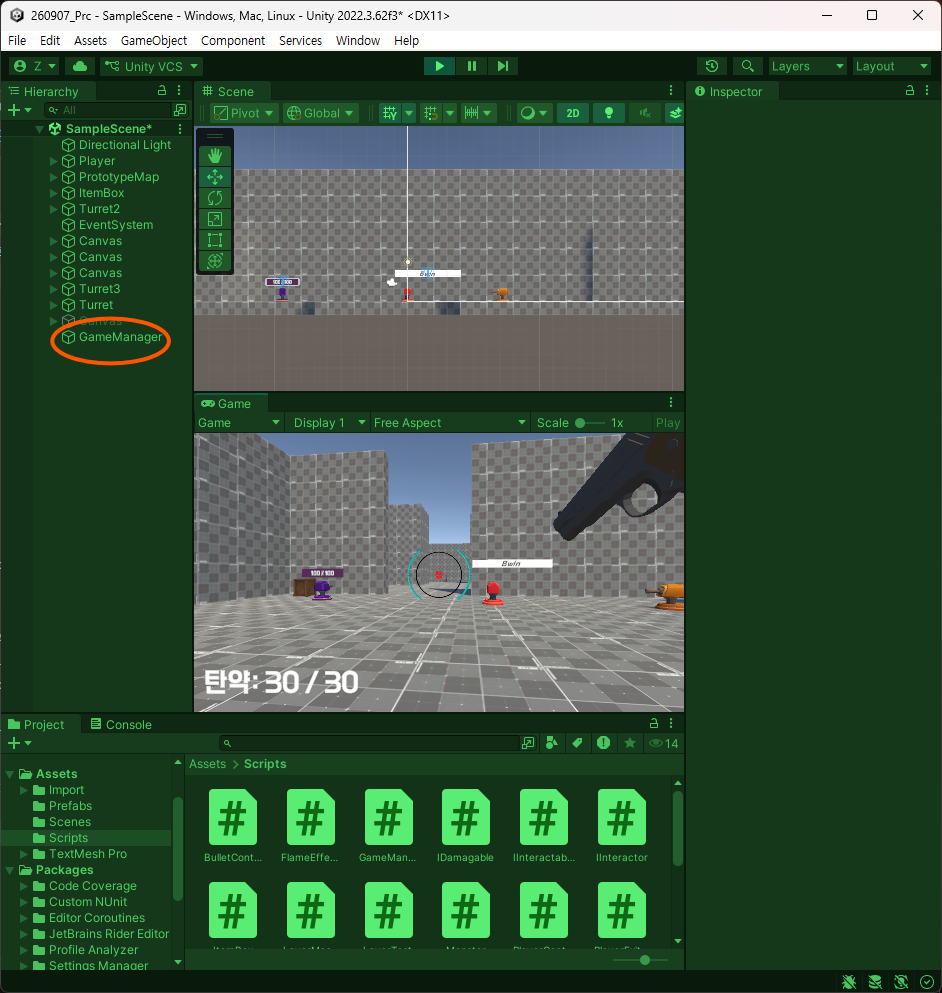
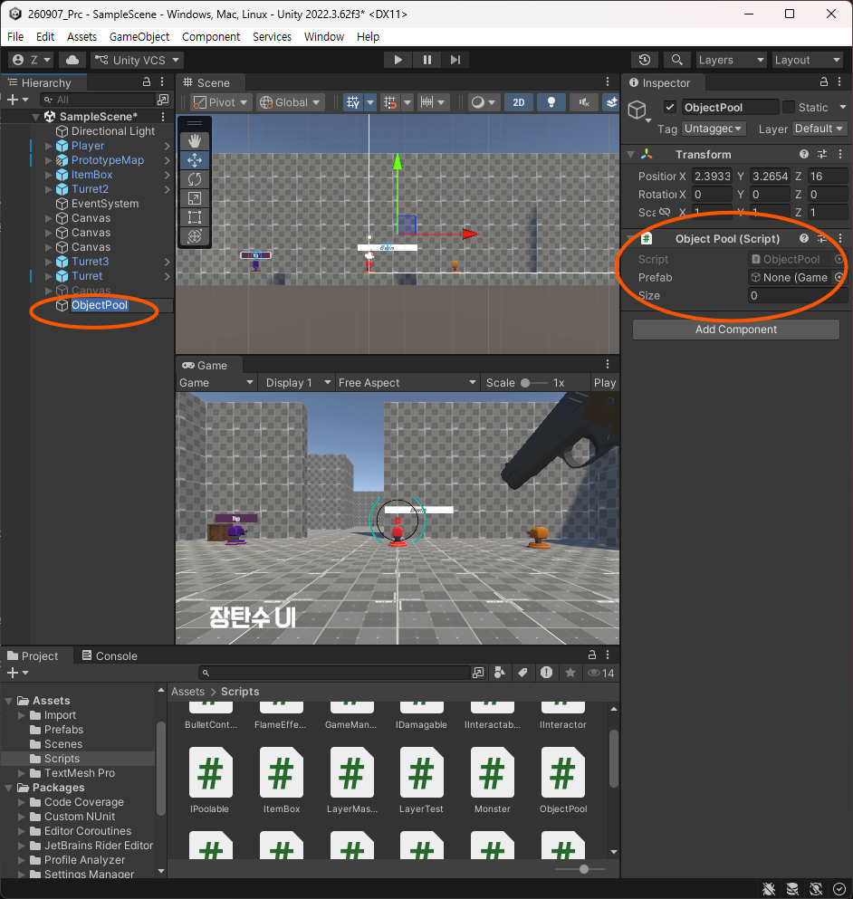
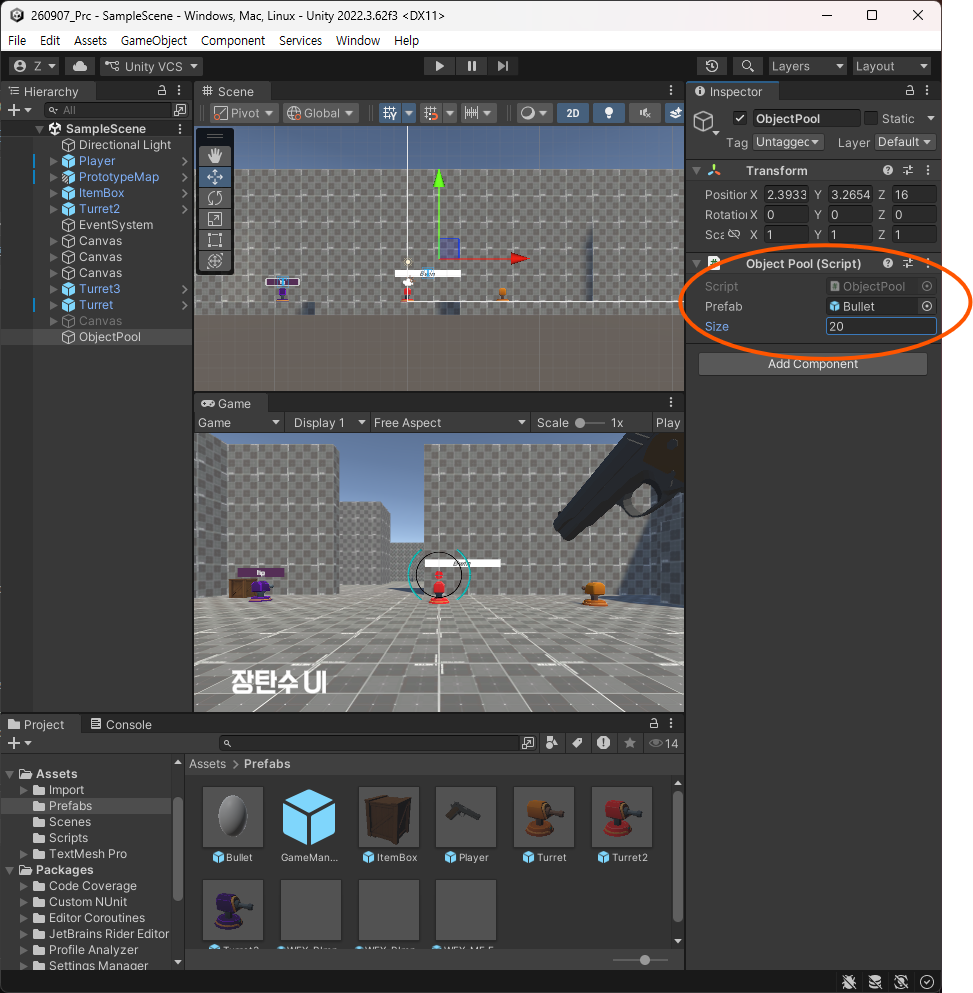

# 260911 Unity(10) Static, 싱글톤, 오브젝트 풀
## 1. Static
### 1.1. 개요
- C# 프로그래밍을 처음 접했을 때 다음과 같은 경우가 있었음.
```csharp
class Program
{
    static void Main(string[] arg)
    {
        Console.WriteLine("hello world!");
    }
}
```
- 이 프로그램 내에서 함수 선언 시, private이건 public이던 static을 붙였고 추가적 클래스에는 붙이지 않았었다.
- 그래서 static은 흘러가는 식으로 주입이 된 상태이다. 

### 1.2. 설명
- 이게 사실은 [링크](https://learn.microsoft.com/ko-kr/dotnet/csharp/language-reference/keywords/static)를 참조하면서 봤을 때 
  - 클래스들이 동일한 데이터들을 공유했다
  - static이 붙었을 때, 클래스 변수에 대한 참조가 아니라 클래스 자체로 접근하여 기능 호출이 가능했다. 
- 그게 가능했던 이유가 static이라는 것이 정적 데이터이고 움직임이 적다.
- static으로 선언한 순간 정적으로 쓰겠다는 의미가 된다. 
- 즉, 정해져있으니까 시스템 전역적으로 사용할 수 있는 것으로 된다.
- 클래스 인스턴스마다 개별적인 데이터가 아닌 클래스 전체에서 하나를 가진다.
- 인스턴스에 접근하는 것이 아닌 클래스 이름을 통해 접근해야 하며 조건마다 차이는 있으나 static으로 선언된 함수나 변수는 static끼리만 사용 가능하다.
- 일반 변수는 객체마다 별개의 데이터를 가지고 static은 말그대로 클래스 전체에서 공유하는 데이터이다. 
- **확장 메서드의 경우가 대표적으로 static 클래스**의 예시이다.

## 2. 싱글턴
### 2.1. 디자인 패턴
- 목적상 싱글턴에서 static을 쓸 수 밖에 없다.
- 더불어서 디자인 패턴이 언급할만한 키워드이다.
- 프로그래밍이 분야마다 형식이나 결의 차이는 있지만 객체지향을 어떻게 관리하며 어떤 식으로 생성하며 구조를 잡는지에 대해 프로그래머들이 고민했을 것.
- 경험이 쌓이다 보니까 이것에 대해 특정 상황을 잘 극복할만한 이론화 해놓은 것, 설계 기법이 디자인 패턴인 셈. ([링크](https://refactoring.guru/ko/design-patterns))
- 그래서 **메인 관리자가 유일하나 객체들이 쉽게 접근이 가능하도록 해야 한다가 싱글턴 패턴**이다. 

### 2.2. 설명
- 게임 매니저가 있고 중요 처리들(시작, 정지, 데이터)을 관리하는 객체가 있다. 
- 문제는 게임 매니저를 알아야 상태가 어떤지 몇인지를 참조를 받아 알 수 있어야 한다. 
- Find를 하거나 인스펙터에 참조를 거는 것이 아니면 알 수 없다. 
- 비단 플레이어말고도 다를 게임 인스턴스들이 알아야 하므로 중요하다.
- 그런 경우에 시스템 전역적으로 쉽게 접근 가능하면서도 시스템에서 하나만 걸어버리는 패턴이다. 
- 편의성이 그렇다보니 **단점은 잘못 쓰면  객체지향을 무시하는 경향이 발생할 수 있다. 책임이 몰릴 수 있다는 것**.
- **디자인 패턴을 쓰기 위해서 상황을 만들면 안됄 것.**
- **인스턴스가 하나만 있도록 할 것이고 전역 접근을 지원해야 한다.**
- 그래서 게임 매니저의 경우 게임 전반적 상태를 관리해야 하기 때문에 하나만 있어야 한다. 
- 게임 내에서 씬 전환 시에도 유지되어야 하는 것이 많다. 
- 그럴 때 쓸 수 있는 것이 DontDestroyOnLoad가 있었다.
- 여기에 한 발 더 나아가서 쉽게 접근 시키도록 하여 static으로 되는 것.
- 모든 상황에 맞는 패턴은 없기 때문에 디자인 패턴을 다루는 것에 주의를 해야 한다.
- **디자인 패턴에 대해서는 그림을 그리고 이해해야 하며 어떻게 짜야 할지에 대해 직접 해보는 것이 중요.**
- 싱글톤을 안쓰기 위해 의존성 주입이라는 개념이 출범한다. 하지만 이해가 좀 어려울 수 있다. 
- 유니티도 의존성 주입을 위해 zenject라는 패키지로도 제공한다([링크](https://velog.io/@ttangu5510/Unity-Zenject)).
- 하지만 **디자인 패턴이던 zenject든간에 모르는 상태에서 일단 프로젝트를 진행해보고 난 다음에 천천히 도입을 해서 사용해봐야 이해가 가능할 것.**

### 2.3. 사용
- 기본적인 코드는 다음과 같다. 
```csharp
using System.Collections;
using System.Collections.Generic;
using UnityEngine;

public class GameManager : MonoBehaviour
{
    public bool IsGameRunning { get; private set; }

    public void Run()
    {
        LockCursor();
        Time.timeScale = 1;
        IsGameRunning = true;
    }

    public void Pause()
    {
        UnlockCursor();
        Time.timeScale = 0;
        IsGameRunning = false;
    }

    private void LockCursor()
    {
        Cursor.lockState = CursorLockMode.Locked;
        Cursor.visible = false;
    }

    private void UnlockCursor()
    {
        Cursor.lockState = CursorLockMode.None;
        Cursor.visible = true;
    }
}
```
- 직접 참조를 걸거나 find를 하지 않는 이상 모른다.
- 기본 골자에 static을 통한 변수를 선언할 것. 
```csharp
using System.Collections;
using System.Collections.Generic;
using UnityEngine;

public class GameManager : MonoBehaviour
{
    public bool IsGameRunning { get; private set; }
    public static GameManager Instance;

    //----//
}
```
- 이를 사용하여 전역적 접근이 가능하기에 
```csharp
GameManager.Instance.Pause();
```
- 이런 것이 가능한 것.
- SetSingleton()이라고 함수를 이용해 자기 자신을 넣어주도록 한다.
```csharp
public class GameManager : MonoBehaviour
{
    public bool IsGameRunning { get; private set; }
    public static GameManager Instance;

    private void Awake() => SetSingleton();
    private void Start() => Run();

    public void Run()
    {
        LockCursor();
        Time.timeScale = 1;
        IsGameRunning = true;
    }

    private void SetSingleton()
    {
        Instance = this;
    }
// -------//
```
- 만든 GameManager에 대한 빈 게임 인스턴스를 생성하여 넣어준 다음 시행을 하면 정상적으로 멈추고 재개됨을 확인할 수 있다. 



- 굳이 게임 오브젝트 참조를 안해도 편하게 가져올 수 있다.
- 하지만 편해진 것을 잘못 사용하는 순간 객체지향이 무너진다. 
- **허나 의존은 하지 말 것**.
- 자칫하면 게임 매니저의 코드 한 줄이 추가되는 순간 전체적인 인스턴스의 코드가 다 바뀌어야 할 수도 있다.
- 아무튼 이것이 가능해지니 게임 돌아가는 것과 정지하는 것에 대해 게임 내 시간이 흘러가게 할 것인지 말 것인지, 마우스 포인터 가리기 보이기를 설정하는 것등에 대해 설정해두고 플레이어를 게임에서 아예 정지를 시키는 것도 추가해봄직 하다.
```csharp
<PlayerController.cs>

private void Update()
{
    if (!GameManager.Instance.IsGameRunning)
        return;

    _movement.Rotate();
    _weapon.Fire();
    // + 추가됨
    _weapon.Reload();
    // ++ 추가됨
    DetectInteractable();
    TryInteract();
    // +++ 추가됨
    PauseGame();

    // ++++ 추가됨.
    if (Input.GetKeyDown(KeyCode.P))
        GameManager.Instance.Pause();
    if (Input.GetKeyDown(KeyCode.O))
        GameManager.Instance.Run();
}
```

### 2.4. 싱글턴 핵심
- 전역적인 접근을 해야 한다.
- 게임 내에 단 하나만 존재해야 한다.
- 씬 전환에도 유지가 되어야 한다.

### 2.5. 체크
- 하나만 있도록 어떻게 체크할지? 
- 인스턴스가 뭐가 들어있다면 이미 게임 매니저가 있다는 뜻이고 그 때는 Destroy를 해야 한다. 
```csharp
private void SetSingleton()
{
    Instance = this;

    if (Instance != null && Instance != this)
    { 
        Destroy(gameObject); 
    }
}
```

여기에 씬이 전환해도 유지가 되어야 한다.

```csharp
private void SetSingleton()
{

    if (Instance != null && Instance != this)
    { 
        Destroy(gameObject); 
    }
    else
    {
        Instance = this;
    }

    DontDestroyOnLoad(gameObject);
}
```

### 2.6. 추가
- SingletonBehavior라는 C# 스크립트를 만들고 싱글톤으로 적용하고 싶은 객체들을 이를 상속받도록 만들어 볼 것이다.
- 상속받게 만들 것이나 무엇을 반환해야 하는 것인지 모를 수 있다.
- 그럴 때 제네릭을 사용한다.
```csharp
using System.Collections;
using System.Collections.Generic;
using UnityEngine;

public abstract class SingletonBehavior<T> : MonoBehaviour
{
    public T Instance;
}
```
- 뭔들 반환하게 되게 되었다.
```csharp
using System.Collections;
using System.Collections.Generic;
using UnityEngine;

public abstract class SingletonBehavior<T> : MonoBehaviour
{
    public static T Instance;

    protected void SetSingleton()
    {
        if (Instance != null && Instance != this)
        {
            Destroy(gameObject);
        }
        else
        {
            Instance = this;
            DontDestroyOnLoad(gameObject);
        }
    }
}
```
- 유니티에서 만약에 SetSingleton에서 Awake로부터 호출을 하는데 Player에 Awake가 실행될까 GameManager가 가장 먼저 실행되는지는 유니티 마음대로이다.
- SetSingleton이 안되어 있을 수 밖에 없다.
- 애초에 인스턴스를 얻을 당시에 초기화가 안되었다면 하고나서 옮겨주자고 하는 접근이 가능하게끔 해줘야 한다.
- 그럼 이 인스턴스를 property로 만들어야 한다.
```csharp
using System.Collections;
using System.Collections.Generic;
using Unity.VisualScripting;
using UnityEngine;

public abstract class SingletonBehavior<T> : MonoBehaviour
{
    private static T _instance;

    public static T Instance
    {
        get
        {
            // 아무것도 Instance에서 없을 때 초기화가 필요.
            if (_instance == null) 
            {
                // 원하는 타입이 나올 때까지 찾기.
                _instance = FindObjectOfType<T>();
                DontDestroyOnLoad(_instance.gameObject);
            }

            return _instance;
        }
    }

    protected void SetSingleton()
    {
        if (Instance != null && Instance != this)
        {
            Destroy(gameObject);
        }
        else
        {
            Instance = this;
            DontDestroyOnLoad(gameObject);
        }
    }
}
```
- 하지만 에러가 발생.
- T에서는 뭐가 들어오는지 모른다. 
- 유니티에서 일어나는 것이지 기본 C#이 일어나는 것이 아니다.
- 무엇이 들어오는지 제약을 걸어줄 필요가 있다는 것.
```csharp
public abstract class SingletonBehavior<T> : MonoBehaviour where T : MonoBehaviour
```
- 그러니까 T는 반드시 Monobehaviour를 상속받아야 한다.
- 이 클래스 내부에서 접근이 필요하지는 않는다. 
- private 필드로 접근하여 
```csharp
using System.Collections;
using System.Collections.Generic;
using Unity.VisualScripting;
using UnityEngine;

public abstract class SingletonBehavior<T> : MonoBehaviour where T : MonoBehaviour
{
    private static T _instance;

    public static T Instance
    {
        get
        {
            // 아무것도 Instance에서 없을 때 초기화가 필요.
            if (_instance == null) 
            {
                // 원하는 타입이 나올 때까지 찾기.
                _instance = FindObjectOfType<T>();
                DontDestroyOnLoad(_instance.gameObject);
            }

            return _instance;
        }
    }

    protected void SetSingleton()
    {
        if (_instance != null && _instance != this)
        {
            Destroy(gameObject);
        }
        else
        {
            _instance = (T)this;
            DontDestroyOnLoad(gameObject);
        }
    }
}
```
그래서 이렇게 

```csharp
using System.Collections;
using System.Collections.Generic;
using Unity.VisualScripting;
using UnityEngine;

public abstract class SingletonBehavior<T> : MonoBehaviour where T : MonoBehaviour
{
    private static T _instance;

    public static T Instance
    {
        get
        {
            // 아무것도 Instance에서 없을 때 초기화가 필요.
            if (_instance == null) 
            {
                // 원하는 타입이 나올 때까지 찾기.
                _instance = FindObjectOfType<T>();
                DontDestroyOnLoad(_instance.gameObject);
            }

            return _instance;
        }
    }

    protected void SetSingleton()
    {
        if (_instance != null && _instance != this)
        {
            Destroy(gameObject);
        }
        else
        {
            _instance = GetComponent<T>();
            DontDestroyOnLoad(gameObject);
        }
    }
}
```

Monobehaviour를 상속받으면 자신을 하도록 하면
```csharp
using System.Collections;
using System.Collections.Generic;
using UnityEngine;

public class GameManager : SingletonBehavior<GameManager>
{
    public bool IsGameRunning { get; private set; }
    public static GameManager Instance;

    private void Awake() => SetSingleton();

    public void Run()
    {
        LockCursor();
        Time.timeScale = 1;
        IsGameRunning = true;
    }

    public void Pause()
    {
        UnlockCursor();
        Time.timeScale = 0;
        IsGameRunning = false;
    }

    private void LockCursor()
    {
        Cursor.lockState = CursorLockMode.Locked;
        Cursor.visible = false;
    }

    private void UnlockCursor()
    {
        Cursor.lockState = CursorLockMode.None;
        Cursor.visible = true;
    }
}
```
- 게임 내에서 자주 사용하여 필요하다면 상속을 받아 쓰면 된다.
- 모든 디자인 패턴들은 사용에 주의를 해야 한다.
- 그러니까 과시욕에 의해 사용은 금물

## 3. 오브젝트 풀
### 3.1. 개요
- 오브젝트 풀의 핵심적인 목표는 
- 만들고 없애는 것은 메모리 관점에서 상당히 비효율적이다.
- 자연스럽게 가비지 컬렉터와 엮이게 된다.
- 메모리는 한정적인 자원이다. 
- 프로그램이 실행된다는 것은 RAM에 미리 올려둔다는 것이다. 
- 기능들은 사용과 변수 하나하나가 RAM에 들어가있다는 것.
- 메모리나 cs 지식들은 뒤에서 공부를 해야 한다는 것.
- 기본적으로는 객체 하나하나 생성과 파괴는 메모리 어딘가에 계속 올라간다. 
- 그런데 객체가 파괴되었다고 하더라도 메모리 어딘가에 남아있고 내부적으로 GC가 돌아간다면 한순간 멈출 수도 있다. 
- 그래서 GC가 덜 돌아가도록 조치가 필요하다는 이야기.
- 필요 이상의 로직이 들어가게 된다면 최적화가 좋지 않게 되고 프레임 드랍이 발생한다.
- 그래서 자주 사용할 것들에 대해서 Load를 해두고 재사용이 이런 사건의 방지법 중 하나다.
- 유니티와 C# 가비지 컬렉터는 돌아가는 것이 다르다.
- C#에서는 빈 공간이 남으면 재배치가 돌아간다. 
- 유니티는 아직까지 지원이 되고 있진 않다.
- 게임 오브젝트 하나의 크기는 크다.
- 그렇다보니 생성 자체를 너무 비효율적으로 많이 쓰는 것을 자제
- 미리 로드하고 쓴다고 접근.
- 자신이 설명 가능한 것들을 사용하고 아닌 것들에 대해선 공부를 할 것.

### 3.2. 사용
- 실질적인 오브젝트를 한 번 이용을 해볼 것이다.

- 스크립트 2개 생성.
```csharp
<ObjectPool.cs>
using System.Collections;
using System.Collections.Generic;
using UnityEngine;

public class ObjectPool
{ 
}

<IPoolable.cs>
using System.Collections;
using System.Collections.Generic;
using UnityEngine;

public interface IPoolable
{
}
```

여기서 IPoolable부터
```csharp
using System.Collections;
using System.Collections.Generic;
using UnityEngine;

public interface IPoolable
{
    public ObjectPool Pool { get; }
    public void ReturnToPool();
}
```

구현한 클래스 보관해야 한다.

```csharp
using System.Collections;
using System.Collections.Generic;
using UnityEngine;

public class ObjectPool
{
    private IPoolable[] _pool;

}
```
메모리는 말했지만 한정적인 자원이고 가늠하기 힘든 상황이면 size를 항상 바꿔줄 필요가 있다.

```csharp
using System.Collections;
using System.Collections.Generic;
using UnityEngine;

public class ObjectPool
{
    private IPoolable[] _pool;

    //public void Resize()
    //{
    //    _pool = new IPoolable[newSize];
    //    // 기존 데이터 넣기
    //}
}
```
하지만 지금은 고려 사항은 아님. 
```csharp
using System.Collections;
using System.Collections.Generic;
using UnityEngine;

public class ObjectPool
{
    private IPoolable[] _pool;

    //public void Resize()
    //{
    //    _pool = new IPoolable[newSize];
    //    // 기존 데이터 넣기
    //}

    public float Size { get; private set; } // 크기
    public int Count { get; private set; } // 실질적으로 들어가있는 수

    public ObjectPool(int size, GameObject prefab)
    {

    }
}
```
계속 진행.
```csharp
using System.Collections;
using System.Collections.Generic;
using UnityEngine;

public class ObjectPool
{
    private IPoolable[] _pool;

    //public void Resize()
    //{
    //    _pool = new IPoolable[newSize];
    //    // 기존 데이터 넣기
    //}

    public float Size { get; private set; } // 크기
    public int Count { get; private set; } // 실질적으로 들어가있는 수

    public ObjectPool(int size, GameObject prefab)
    {
        _pool = new IPoolable[size];
        Size = size;
    }
}
```

그냥 monobehaviour 이용하도록 하자.

```csharp
using System.Collections;
using System.Collections.Generic;
using UnityEngine;

public class ObjectPool : MonoBehaviour
{
    [SerializeField] private GameObject _prefab;

    [field: SerializeField] public int Size { get; private set; } // 크기
    private IPoolable[] _pool;
    public int Count { get; private set; } // 실질적으로 들어가있는 수

    private void Awake()
    {
        _pool = new IPoolable[Size];
        
        for (int i = 0; i < _pool.Length; i++)
        {
            IPoolable poolable = Instantiate(_prefab).GetComponent<IPoolable>();
        }
    }
}
```

```csharp
using System.Collections;
using System.Collections.Generic;
using UnityEngine;

public class ObjectPool : MonoBehaviour
{
    [SerializeField] private GameObject _prefab;

    //public void Resize()
    //{
    //    _pool = new IPoolable[newSize];
    //    // 기존 데이터 넣기
    //}

    [field: SerializeField] public int Size { get; private set; } // 크기
    private IPoolable[] _pool;
    public int Count { get; private set; } // 실질적으로 들어가있는 수

    private void Awake()
    {
        _pool = new IPoolable[Size];
        
        for (int i = 0; i < _pool.Length; i++)
        {
            IPoolable poolable = Instantiate(_prefab, transform.position, transform.rotation).GetComponent<IPoolable>();
        }
    }
}
```

생성되자마자 비활성화 처리를 해줘야 한다.

```csharp
using System.Collections;
using System.Collections.Generic;
using UnityEngine;

public class ObjectPool : MonoBehaviour
{
    [SerializeField] private GameObject _prefab;

    //public void Resize()
    //{
    //    _pool = new IPoolable[newSize];
    //    // 기존 데이터 넣기
    //}

    [field: SerializeField] public int Size { get; private set; } // 크기
    private IPoolable[] _pool;
    public int Count { get; private set; } // 실질적으로 들어가있는 수

    private void Awake()
    {
        _pool = new IPoolable[Size];
        
        for (int i = 0; i < _pool.Length; i++)
        {
            GameObject gameObj = Instantiate(_prefab);
            _pool[i] = gameObj.GetComponent<IPoolable>();
            gameObj.SetActive(false);
        }
    }
}
```
사용 준비 끝.

함수로 뺴두자.

```csharp
using System.Collections;
using System.Collections.Generic;
using UnityEngine;

public class ObjectPool : MonoBehaviour
{
    [SerializeField] private GameObject _prefab;

    //public void Resize()
    //{
    //    _pool = new IPoolable[newSize];
    //    // 기존 데이터 넣기
    //}

    [field: SerializeField] public int Size { get; private set; } // 크기
    private IPoolable[] _pool;
    public int Count { get; private set; } // 실질적으로 들어가있는 수

    private void Awake() => Init();

    // 외부에서 사용 편하도록 하기
    public void Take()
    {

    }

    // 배열에 꽉 차게끔 준비가 되었는데 
    private void Init()
    {
        _pool = new IPoolable[Size];

        for (int i = 0; i < _pool.Length; i++)
        {
            GameObject gameObj = Instantiate(_prefab);
            _pool[i] = gameObj.GetComponent<IPoolable>();
            gameObj.SetActive(false);
        }

        Count = Size;
    }
}
```

```csharp
// 외부에서 사용 편하도록 하기
// 반환형을 void에서 IPoolable로 변경
public IPoolable Take()
{
    return _pool[Count - 1]; // 이러면 위험성 존재.
}
```

얻어가는거까지 완성.

```csharp
using System.Collections;
using System.Collections.Generic;
using UnityEngine;

public class ObjectPool : MonoBehaviour
{
    [SerializeField] private GameObject _prefab;

    //public void Resize()
    //{
    //    _pool = new IPoolable[newSize];
    //    // 기존 데이터 넣기
    //}

    [field: SerializeField] public int Size { get; private set; } // 크기
    private IPoolable[] _pool;
    public int Count { get; private set; } // 실질적으로 들어가있는 수
    public bool IsEmpty => Count == 0; // 코드 가독성 용도.

    private void Awake() => Init();

    // 외부에서 사용 편하도록 하기
    // 반환형을 void에서 IPoolable로 변경
    public IPoolable Take()
    {
        //if(Count == 0)
        //    return null;
        if(IsEmpty)
            return null;

        Count--;
        IPoolable poolable = _pool[Count];

        return poolable;

        // 이것만 있으면 위험성 존재. 따라서 위 코드들로 진행.
        // return _pool[Count - 1]; 
    }

    // 배열에 꽉 차게끔 준비가 되었는데 
    private void Init()
    {
        _pool = new IPoolable[Size];

        for (int i = 0; i < _pool.Length; i++)
        {
            GameObject gameObj = Instantiate(_prefab);
            _pool[i] = gameObj.GetComponent<IPoolable>();
            gameObj.SetActive(false);
        }

        Count = Size;
    }
}
```



실행이 되었을 때 필연적으로 bullet들이 생성이 되긴 하지만 문제는 꺼내서 쓴다는 것은 어딘가에 존재하고 비활성화된 것을 갖다가 쓰는 것인데 위치도 초기화해주고 방향도 지정해야 하므로 이런 로직들이 동반되어야 한다.

그럼 풀을 사용하는 Turret쪽에서 설정해줘야 한다.

위치 변경이 동작이 동반되는 transform을 인터페이스에서 제공해주는 것으로 하자.

```csharp
using System.Collections;
using System.Collections.Generic;
using UnityEngine;

public interface IPoolable
{
    public ObjectPool Pool { get; }
    public Transform transform { get; }

    public void ReturnToPool();
}
```
이것을 TurretController에 적용을 하면

```csharp
    private void SpawnBullet()
    {
        // 1. 얻어오기 
        IPoolable bullet = _pool.Take();

        // 2. Transform.pos, rot 설정
        bullet.transform.position = _muzzlePoint.position;
        bullet.transform.rotation = _muzzlePoint.rotation;

        // 3. 활성화
        bullet.transform.gameObject.SetActive(true);

        //SetData - 연산이 적은 방식
        (bullet as BulletControll).SetData(_bulletDamage, _bulletSpeed, _bulletDestroyDelay);

        if (!TryGetDamageable(out IDamagable damagable))
            return;

        damagable.TakeDamage(_bulletDamage);
    }
```
배열에서 빼가면 공석이 되므로 

```csharp
public IPoolable Take()
{
    //if(Count == 0)
    //    return null;
    if(IsEmpty)
        return null;

    Count--;
    IPoolable poolable = _pool[Count];
    _pool[Count] = null;

    return poolable;

    // 이것만 있으면 위험성 존재. 따라서 위 코드들로 진행.
    // return _pool[Count - 1]; 
}
```

실수. bulletController.cs에다가 할 것.

```csharp
<TurretController4.cs>
    [SerializeField] private ObjectPool _bulletPool; 

    private void SpawnBullet()
    {
        // 1. 얻어오기 
        IPoolable bullet = _bulletPool.Take();

        // 2. Transform.pos, rot 설정
        bullet.tr.position = _muzzlePoint.position;
        bullet.tr.rotation = _muzzlePoint.rotation;

        // 3. 활성화
        bullet.tr.gameObject.SetActive(true);

        //SetData - 연산이 적은 방식
        (bullet as BulletControll).SetData(_bulletDamage, _bulletSpeed, _bulletDestroyDelay);

        if (!TryGetDamageable(out IDamagable damagable))
            return;

        damagable.TakeDamage(_bulletDamage);
    }

<IPoolable.cs>
using System.Collections;
using System.Collections.Generic;
using UnityEngine;

public interface IPoolable
{
    public ObjectPool Pool { get; }
    public Transform tr { get => tr; }

    public void ReturnToPool();
}


<BulletController.cs>
[SerializeField] private ObjectPool _bulletPool; 
public ObjectPool Pool { get; }
public Transform Transform { get; }

private void SpawnBullet()
{
    // 1. 얻어오기 
    IPoolable bullet = _bulletPool.Take();

    // 2. Transform.pos, rot 설정
    bullet.Transform.position = _muzzlePoint.position;
    bullet.Transform.rotation = _muzzlePoint.rotation;

    // 3. 활성화
    bullet.Transform.gameObject.SetActive(true);

    //BulletControll bullet = Instantiate(
    //    _bulletPrefab,
    //    _muzzlePoint.position,
    //    _muzzlePoint.rotation
    //    );

    //SetData - 연산이 적은 방식
    (bullet as BulletControll).SetData(_bulletDamage, _bulletSpeed, _bulletDestroyDelay);

    if (!TryGetDamageable(out IDamagable damagable))
        return;

    damagable.TakeDamage(_bulletDamage);
}

public void ReturnToPool()
{

}
```

현재 총알 로직이 경과시간 이후에 본인을 터뜨리도록 하는데 이것을 returntopool로 가야 한다.
