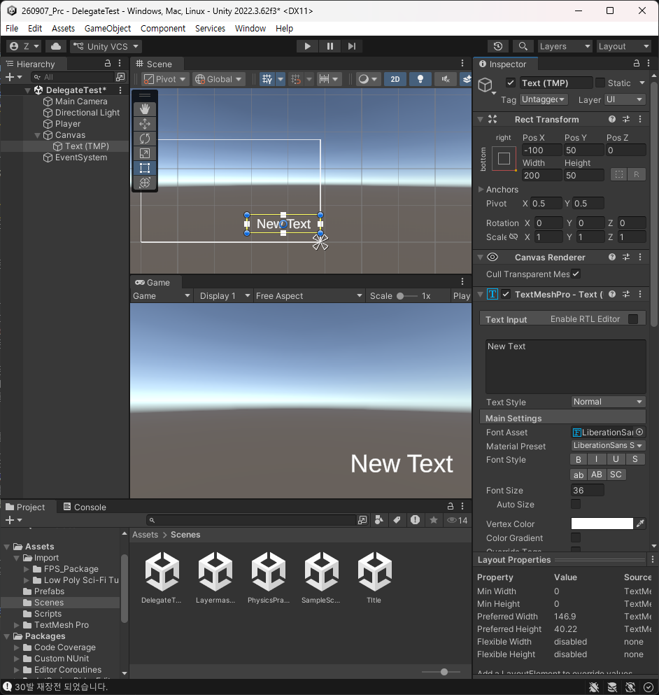
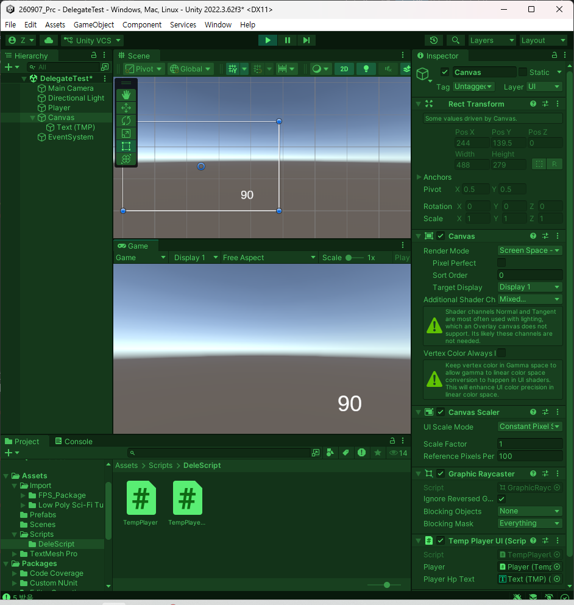

# 260914 Unity(11) Delegate, 이벤트, Unity Action, Unity Events
## 1. Delegate
### 1.1. 기존 로직 흐름
- UI 같은 경우 탄창에서였는데 UI를 다룰 때 필연적으로 애초에 갱신해서 올리던가 데이터가 변할 때 호출을 해야 했었다. 
- 기능적으로는 되고 있지만 플레이어와 UI 객체가 있을 때, 둘 중 하나가 다른 하나에 대해 알고 있었어야 했다.
- 그래서 데이터가 바뀌면 UI가 갱신되었다. 
- 이렇게 되면 로직이 추가되면 UI를 추가해줘야 한다.
- 즉, 플레이어가 알고 있어야 하는 객체들이 많아진다.
- 구현이 되면 상관은 없겠지만 뭔가 많이 추가가 되어 있다가 잘못해서 플레이어에서 수정사항이 생기면 UI들에 영향이 갈 수 있다. 
- **호출하는 로직이 바뀐다는 것이다**.
- 그래서 유지보수성이 좋은 구조냐고 생각했을 때 이는 좋지 않은 구조이다.
- 그러면 반대로 UI가 플레이어를 알고 있는 쪽이라고 한다면 Update마다 플레이어 데이터를 체크하고 갱신하는 구조가 건실한 구조로 보일 수도 있다.
- 플레이어 체력을 매 프레임마다 고치는 비효율 구조가 될 수 있다. 
- 이전 프레임의 데이터를 변수 하나로 갱신하고 있다면 결론적으로 업데이트마다 로직을 비교하는 것이 돌아갈 수 밖에 없다.
- UI를 갱신하는 함수가 존재할탠데 델리게이트를 통해서 설계 기법이 넓어질 수 있게 된다.
- 플레이어에 이벤트를 부여해서 UI가 갱신하는 기능을 이벤트에 걸어놓고 플레이어는 이벤트를 발화시켜서 등록된 UI 기능들이 실행되도록 할 것이다. 
- 그래서 플레이어 체력이 달라질 때만 갱신하도록 할 것이다.
- 결론부터 이야기하면 델리게이트는 이름이 붙지 않는 함수를 만들 때 쓰는 것인데 **델리게이트는 함수를 담아둘 수 있는 타입을 만들 수 있다.**
- 여태까진 데이터만을 담았으나 이제 변수에 함수를 담고, 변수를 발화시키면 등록된 함수가 실행되도록 만들 수 있다.
- 즉, 기능 자체를 담아놓을 수 있는 키워드이다.

### 1.2. 개요
- 프로그래밍적으로는 사건이라고 생각하는 것이 좋다.
- **델리게이트는 현재 조건에서 함수를 담아놓을 수 있는 타입을 정의하고 이벤트의 경우는 델리게이트로 만들어놓은 것을 사건으로써 발화시키는 개념이다.** 
- 현재까지는 담아놓는 것이 형태가 있었지만 이제는 기능 자체가 담길 수 있도록 만들 수 있다.
- UI들에서 갱신하는 것들을 플레이어에 미리 등록하고 플레이어는 어떤 UI가 붙은지 모른다.
- **메서드를 담을 수 있도록 지원하는 키워드.**
```
public delegate void ScoreChangeHandler(int score);
```
- 현재 형태에서는 다를 것이 없다. 
- 하지만 delegate가 붙었을 때 마치 타입처럼 쓰인다.
- 이것은 반환형이 없고 매개 변수를 받을 수 있는 형태가 된다는 것.
- 델리게이트를 빼면 함수선언과 비슷하지만 delegate가 붙는 순간 함수명은 타입이 되는 것이다.
- 이것은 반환형이 없고 int형 매개 변수가 담아놓을 수 있는 형태인데 이것을 변수로 만든 형태를 보인다.
- 함수를 변수에 담는다라는 말이다.
- 참조타입 특성처럼 **델리게이트는 특정 데이터를 가리키는 것이 아닌 함수를 가리킨다.**
- 허나 함수 하나만을 담는 것이 아닌 여러 함수를 담아둘 수 있고 순차적으로 실행한다.
- 명칭상 '델리게이트 체인'이라고 한다.

### 1.3. 사용 
새로운 씬에서 진행.


스크립트 2개 생성.

```csharp
using System.Collections;
using System.Collections.Generic;
using Unity.VisualScripting.Antlr3.Runtime.Tree;
using UnityEngine;

public class TempPlayer : MonoBehaviour
{
    public int playerHp { get; private set; }

    private void Update()
    {
        if(Input.GetKeyDown(KeyCode.Alpha1))
        {
            TakeDamage(5);
        }
        if (Input.GetKeyDown(KeyCode.Alpha2))
        {
            Heal(10);
        }
    }

    public void TakeDamage(int damage)
    {
        playerHp -= damage;
        Debug.Log($"{damage} 받음");
    }

    public void Heal(int heal)
    {
        playerHp += heal;
        Debug.Log($"{heal}만큼 회복");
    }
}

```

```csharp
using System.Collections;
using System.Collections.Generic;
using UnityEngine;
using TMPro;

public class TempPlayerUI : MonoBehaviour
{
    [SerializeField] private TextMeshProUGUI _playerHpText;

    public void RefreshHealthUI()
    {

    }
}

```

UI에 대해 알고 있다가 

```csharp
    using System.Collections;
    using System.Collections.Generic;
    using UnityEngine;
    using TMPro;

    public class TempPlayerUI : MonoBehaviour
    {
        [SerializeField] private TextMeshProUGUI _playerHpText;

        public void RefreshHealthUI(int health)
        {
            _playerHpText.text = health.ToString();
        }
    }
```

```csharp
using System.Collections;
using System.Collections.Generic;
using Unity.VisualScripting.Antlr3.Runtime.Tree;
using UnityEngine;

public class TempPlayer : MonoBehaviour
{
    public int playerHp { get; private set; }
    public TempPlayerUI UI;

    private void Update()
    {
        if(Input.GetKeyDown(KeyCode.Alpha1))
        {
            TakeDamage(5);
        }
        if (Input.GetKeyDown(KeyCode.Alpha2))
        {
            Heal(10);
        }
    }

    public void TakeDamage(int damage)
    {
        playerHp -= damage;
        Debug.Log($"{damage} 받음");
        UI.RefreshHealthUI(playerHp);
    }

    public void Heal(int heal)
    {
        playerHp += heal;
        Debug.Log($"{heal}만큼 회복");
        UI.RefreshHealthUI(playerHp);
    }
}
```

하지만 권장하고 싶은 구조의 형태는 아니다.

바꿔서 실행. UI쪽에서 

```csharp
    using System.Collections;
    using System.Collections.Generic;
    using UnityEngine;
    using TMPro;

    public class TempPlayerUI : MonoBehaviour
    {
        public TempPlayer Player;
        [SerializeField] private TextMeshProUGUI _playerHpText;

        private void Update()
        {
            RefreshHealthUI(Player.playerHp);
        }

        public void RefreshHealthUI(int health)
        {
            _playerHpText.text = health.ToString();
        }
    }

```

```csharp
using System.Collections;
using System.Collections.Generic;
using UnityEngine;
using TMPro;


public class TempPlayerUI : MonoBehaviour
{
    public TempPlayer Player;
    [SerializeField] private TextMeshProUGUI _playerHpText;

    private void Update()
    {
        RefreshHealthUI(Player.playerHp);
    }

    public void RefreshHealthUI(int health)
    {
        Debug.Log("UI 갱신");
        _playerHpText.text = health.ToString();
    }
}

--------------------------
using System.Collections;
using System.Collections.Generic;
using Unity.VisualScripting.Antlr3.Runtime.Tree;
using UnityEngine;

public class TempPlayer : MonoBehaviour
{
    public int playerHp { get; private set; }
    //public TempPlayerUI UI;

    private void Update()
    {
        if(Input.GetKeyDown(KeyCode.Alpha1))
        {
            TakeDamage(5);
        }
        if (Input.GetKeyDown(KeyCode.Alpha2))
        {
            Heal(10);
        }
    }

    public void TakeDamage(int damage)
    {
        playerHp -= damage;
        Debug.Log($"{damage} 받음");
        //UI.RefreshHealthUI(playerHp);
    }

    public void Heal(int heal)
    {
        playerHp += heal;
        Debug.Log($"{heal}만큼 회복");
        //UI.RefreshHealthUI(playerHp);
    }
}

```

이러면 성능적으로든 문제점이 있다. 계속 Update에서 걸기 때문. 전자는 구조적 문제가 된다.

그렇다면 어떻게 해야 하는지 애매해진다.

이 기능을 플레이어에게 미리 등록을 시켜줄 것이다.

```csharp
using System.Collections;
using System.Collections.Generic;
using Unity.VisualScripting.Antlr3.Runtime.Tree;
using UnityEngine;

public class TempPlayer : MonoBehaviour
{
    public delegate void IntChange(int value);

    // ----- //
}

```

현재 IntChange는 반환형이 없고 int 매개 변수를 1개 받는 함수를 담아둘 수 있는 타입이다라고 정의를 한 것이다.

이젠 이렇게 진행하도록 하자.

```csharp
using System.Collections;
using System.Collections.Generic;
using Unity.VisualScripting.Antlr3.Runtime.Tree;
using UnityEngine;

public class TempPlayer : MonoBehaviour
{
    public delegate void IntChange(int value);

    public int playerHp { get; private set; }
    //public TempPlayerUI UI;
    // 체력이 바뀌었을 때란 직관적인 이름을 암묵적으로 사용한다.
    public IntChange OnHealthChanged;
    // -------------//
}
```

이제 UI 쪽에서 접근을 달리 해보자.

```csharp
using System.Collections;
using System.Collections.Generic;
using UnityEngine;
using TMPro;


public class TempPlayerUI : MonoBehaviour
{
    public TempPlayer Player;
    [SerializeField] private TextMeshProUGUI _playerHpText;

    //private void Update()
    //{
    //    RefreshHealthUI(Player.playerHp);
    //}

    // 활성화 될 때.
    private void OnEnable()
    {
        Player.OnHealthChanged = RefreshHealthUI;
    }

    public void RefreshHealthUI(int health)
    {
        Debug.Log("UI 갱신");
        _playerHpText.text = health.ToString();
    }
}

```

이렇게 예약을 걸어둔다.

IntChande는 반환형이 없고 int 매개 변수 하나를 받는 타입이다.

자료형을 int 등의 것으로 담아두면 바로 에러 발생.

매개변수가 추가되도 에러 발생.

그래서 delegate를 붙여서 선언하는 것은 쓰고 싶은 타입을 커스텀하는데 그 대상이 함수라는 것이다.

```csharp
using System.Collections;
using System.Collections.Generic;
using Unity.VisualScripting.Antlr3.Runtime.Tree;
using UnityEngine;

public class TempPlayer : MonoBehaviour
{
    public delegate void IntChange(int value);

    //public int playerHp { get; private set; }
    private int _health;
    public int playerHp 
    {
        get => _health; 
        
        private set
        {
            _health = value;
            OnHealthChanged(playerHp);
        }
    }
    //public TempPlayerUI UI;
    // 체력이 바뀌었을 때란 직관적인 이름을 암묵적으로 사용한다.
    public IntChange OnHealthChanged;

    private void Update()
    {
        if(Input.GetKeyDown(KeyCode.Alpha1))
        {
            TakeDamage(5);
        }
        if (Input.GetKeyDown(KeyCode.Alpha2))
        {
            Heal(10);
        }
    }

    public void TakeDamage(int damage)
    {
        playerHp -= damage;
        Debug.Log($"{damage} 받음");
        //UI.RefreshHealthUI(playerHp);
    }

    public void Heal(int heal)
    {
        playerHp += heal;
        Debug.Log($"{heal}만큼 회복");
        //UI.RefreshHealthUI(playerHp);
    }
}

```

이렇게 쓸 수 있지만 가급적 이런 느낌으로 사용하지 말 것. 

 null이 들어있을 수 있는데 저렇게 쓰면 null check가 되지 않는다.

```csharp
using System.Collections;
using System.Collections.Generic;
using Unity.VisualScripting.Antlr3.Runtime.Tree;
using UnityEngine;

public class TempPlayer : MonoBehaviour
{
    public delegate void IntChange(int value);

    //public int playerHp { get; private set; }
    private int _health;
    public int playerHp 
    {
        get => _health; 
        
        private set
        {
            _health = value;
            OnHealthChanged?.Invoke(playerHp);
        }
    }
    //public TempPlayerUI UI;
    // 체력이 바뀌었을 때란 직관적인 이름을 암묵적으로 사용한다.
    public IntChange OnHealthChanged;

    private void Update()
    {
        if(Input.GetKeyDown(KeyCode.Alpha1))
        {
            TakeDamage(5);
        }
        if (Input.GetKeyDown(KeyCode.Alpha2))
        {
            Heal(10);
        }
    }

    public void TakeDamage(int damage)
    {
        playerHp -= damage;
        Debug.Log($"{damage} 받음");
        //UI.RefreshHealthUI(playerHp);
    }

    public void Heal(int heal)
    {
        playerHp += heal;
        Debug.Log($"{heal}만큼 회복");
        //UI.RefreshHealthUI(playerHp);
    }
}

```

이 방식이 조금 더 안전한 방식이다. 



하지만 추가적 문제가 발생할 수 있는 부분이 이 코드이다. 

```csharp
    private void OnEnable()
    {
        Player.OnHealthChanged = RefreshHealthUI;
    }
```

delegate 체인으로 Player.OnHealthChanged += RefreshHealthUI; 사용했다고 한다면 UI갱신이 여러번 일어나게 된다.

OnEnable에서 특정 이벤트와 기능을 담아두는 것이 흔할탠데 간단히 

```csharp
using System.Collections;
using System.Collections.Generic;
using Unity.VisualScripting.Antlr3.Runtime.Tree;
using UnityEngine;

public class TempPlayer : MonoBehaviour
{
    public delegate void IntChange(int value);

    //public int playerHp { get; private set; }
    private int _health;
    public int playerHp 
    {
        get => _health; 
        
        private set
        {
            _health = value;
            OnHealthChanged?.Invoke(playerHp);
        }
    }
    //public TempPlayerUI UI;
    // 체력이 바뀌었을 때란 직관적인 이름을 암묵적으로 사용한다.
    public IntChange OnHealthChanged;

    private void Update()
    {
        if(Input.GetKeyDown(KeyCode.Alpha1))
        {
            TakeDamage(5);
        }
        if (Input.GetKeyDown(KeyCode.Alpha2))
        {
            Heal(10);
        }
    }

    public void TakeDamage(int damage)
    {
        playerHp -= damage;
        Debug.Log($"{damage} 받음");
        //UI.RefreshHealthUI(playerHp);
    }

    public void Heal(int heal)
    {
        playerHp += heal;
        Debug.Log($"{heal}만큼 회복");
        //UI.RefreshHealthUI(playerHp);
    }
}

```

```csharp
using System.Collections;
using System.Collections.Generic;
using UnityEngine;
using TMPro;


public class TempPlayerUI : MonoBehaviour
{
    public TempPlayer Player;
    [SerializeField] private TextMeshProUGUI _playerHpText;

    //private void Update()
    //{
    //    RefreshHealthUI(Player.playerHp);
    //}

    // 활성화 될 때.
    private void OnEnable()
    {
        Player.OnHealthChanged += RefreshHealthUI;
    }

    private void OnDisable()
    {
        Player.OnHealthChanged -= RefreshHealthUI;
    }

    public void RefreshHealthUI(int health)
    {
        Debug.Log("UI 갱신");
        _playerHpText.text = health.ToString();
    }
}

```

활성화 될때마다 걸어주는 것이 비효율인데 위와 같은 패턴으로 사용한다.

델리게이트 체인을 걸어서 이러한 형식으로 자주 사용하게 된다.

이 상태에서 잘 돌아가는 것 같음. UI를 껐다가 켜도.

여전히 안전하게 사용하고 있다고 보긴 어렵다. 문법적으로 가능한 행위를 적용했을 때

```csharp
using System.Collections;
using System.Collections.Generic;
using UnityEngine;
using TMPro;


public class TempPlayerUI : MonoBehaviour
{
    public TempPlayer Player;
    [SerializeField] private TextMeshProUGUI _playerHpText;

    //private void Update()
    //{
    //    RefreshHealthUI(Player.playerHp);
    //}

    // 활성화 될 때.
    private void OnEnable()
    {
        Player.OnHealthChanged += RefreshHealthUI;
    }

    private void Update()
    {
        Player.OnHealthChanged?.Invoke(Player.playerHp);
    }

    private void OnDisable()
    {
        Player.OnHealthChanged -= RefreshHealthUI;
    }

    public void RefreshHealthUI(int health)
    {
        Debug.Log("UI 갱신");
        _playerHpText.text = health.ToString();
    }
}

```

그런데 저것을 public으로 열어두고 쓰면 만행에 가깝다고 한다. 기능은 걸어줄 수 있지만 델리게이트 실행은 플레이어에서만 가능하도록 하는 키워드가 필요하다.


## 2. 이벤트
### 2.1. 사용
바로 적용해보자.

```csharp
using System.Collections;
using System.Collections.Generic;
using Unity.VisualScripting.Antlr3.Runtime.Tree;
using UnityEngine;

public class TempPlayer : MonoBehaviour
{
    public delegate void IntChange(int value);

    //public int playerHp { get; private set; }
    private int _health;
    public int playerHp 
    {
        get => _health; 
        
        private set
        {
            _health = value;
            OnHealthChanged?.Invoke(playerHp);
        }
    }
    //public TempPlayerUI UI;
    // 체력이 바뀌었을 때란 직관적인 이름을 암묵적으로 사용한다.
    public event IntChange OnHealthChanged;

    private void Update()
    {
        if(Input.GetKeyDown(KeyCode.Alpha1))
        {
            TakeDamage(5);
        }
        if (Input.GetKeyDown(KeyCode.Alpha2))
        {
            Heal(10);
        }
    }

    public void TakeDamage(int damage)
    {
        playerHp -= damage;
        Debug.Log($"{damage} 받음");
        //UI.RefreshHealthUI(playerHp);
    }

    public void Heal(int heal)
    {
        playerHp += heal;
        Debug.Log($"{heal}만큼 회복");
        //UI.RefreshHealthUI(playerHp);
    }
}

```

외부에 누군지도 모를 것들은 실행이 되면 안된다.

private으로 하면 함수로 등록할 수도 없게 되므로 외부 공개로 함수를 걸어주면서 델리게이트 실행 자체를 플레이어에서만 하도록 제약을 걸어주는 것이 event이다.

걸어주는 것은 가능하지만 외부 실행은 에러가 된다. 문법적 위험을 막아주는 키워드가 된다.

그래서 핵심 골자는 델리게이트이다.

```csharp

```

```csharp

```

```csharp

```

```csharp

```

```csharp

```

```csharp

```

```csharp

```

```csharp

```

```csharp

```