# 260915 Unity(12) 코루틴
## 1. 코루틴(Coroutine)
### 1.1. 기존 진행 사항
- 문법이나 유니티 엔진을 하면서 어떤 기능들에 포커싱이 되었었다.
- 코루틴의 경우는 문법적으로 집중할 필요가 존재
- 내부적으로 돌아가는 것이 우선이 아님.
- 업데이트 내에서 업데이트의 제약을 많이 받음.

### 1.2. 개요
- 유니티에서 설정할만한 것은 많이 있지는 않는다. 
- 어떤 문법으로 써야 할지, 어떤 단어들을 적어야 하는지에 대해 집중하는 것이 좋을 것.

### 1.3. 기존 로직

터렛을 한 번 살펴보도록 하자.
```csharp
private void Update()
{
    RayShotToPlayer();
    Rotate();
    Fire();
    UpdateCurrentCooldown();
}
```
딜레이 계산도 업데이트에서 쿨다운이라는 변수를 통해 deltaTime을 더해주는 구조였다.

그래서 업데이트를 주석처리해버리면 아무 기능이 실행되지 않는다.

업데이트에서 한 틱당 시간 체크, Raycast를 쏘거나 회전 등의 것들을 모두 잃게 된다는 것.

이번에 배우는 것은 쿨다운 계산에 편히 적용이 가능하다. 

- 결과론적으로는 이번 키워드는 대기 명령을 할 수 있다.
- 하지만 코루틴은 진입 장벽이다. 
- 코루틴을 거치면 많은 코드양이 줄어들 수 있게 된다. 
- 쿨다운 부분에 대한 것을 코루틴으로 처리가 가능하다. 
- 즉발로 이루어진 재장전을 설정된 시간에 의거해 코루틴으로 설정 가능하다. 
- 원하는 타이밍에 되도록 하기 편한 로직이다. 
- 순차적으로 하는 것과 else if가 추가되는 지금에서 이것을 바꿔서 구현한다는 것은 배운 내용으로는 힘들다.
- 델타 타임은 직관적인 방법이지만 다른 방법을 알 필요가 있다.
- 업데이트에 쌓이면 어느 한 군데를 수정해도 다른 모든 것들을 수정해야 할 경우가 발생.
- 그래서 시간 기반을 독립적으로 돌아가게끔 구조적으로 조정할 필요가 있단 이야기.
- 코루틴을 볼 때는 로직 하나씩만 봐야지 덩어리로 봐선 안된다.

### 1.4. 개념
샘플 소스 코드는 다음과 같이 있다고 하자. 
```csharp
private void Start()
{
    Debug.Log("Start---"); //1

    Foo();

    Debug.Log("-----Start")//2
}

private void Foo()
{
    Debug.Log("Foo---"); //3


    Debug.Log("-----Foo")//4
}
```
새로운 씬에서 빈 오브젝트에 이것을 붙여줬을 때 1-3-4-2 순서로 발생한다.

만약에 Foo라는 함수가 LoadDataSheet이라고 하여 외부 데이터를 불러와서 적용시키는 것이라고 생각해보자.

Start에서 시작하여 1번이 되는데 데이터 요청을 했는데 도착하기도 전에 2번이 되서는 안된다. 대기하는 시간이 필요하다.

Thread.Sleep을 통해 멈추려면 멈출 수 있겠지만 게임에서 로그인 과정에서 어딘가 접속 요청을 하여 게임이 멈추는 현상은 없다. 

사실상 실제로 과정 자체를 정지시키는 Thread.Sleep은 써서는 안되는 방법이 된다.

그래서 
```
// 데이터 로드 완료될 때까지 대기
    // 완료되면 다음 로직 수행
```
이런 상황이어야 한다. 

무언가 여기에서 대기를 걸어줘야 하는 상황인데 현재의 상황에서 쓸 수 있는 것은 없다. 

그래서 이것에 가장 합당한 방법이 비동기적 처리 방식이다. 

현재까지는 순차적 처리였던 반면에 비동기같은 경우에는 처리하는 경우 대기 명령이 있을 때, 그 함수는 명령받은 기점에서 정지를 하고 다른 것을 한다음, 다른 조건이 만족되면 다시 이어서 할 수 있게끔 하는 키워드이다. 

유니티는 이 비동기적 처리가 비슷하게 돌아갈 수 있도록 해주는 것이 코루틴이라는 키워드이다. 

함정은 비동기처럼 보이게 만들려고 하지만 동기적이다. 단일 스레드에서 돌아가는 동기적 방식이다. 

### 1.5. 기본적 사용

추가적인 Scene을 만들고 스크립트도 만든다. 

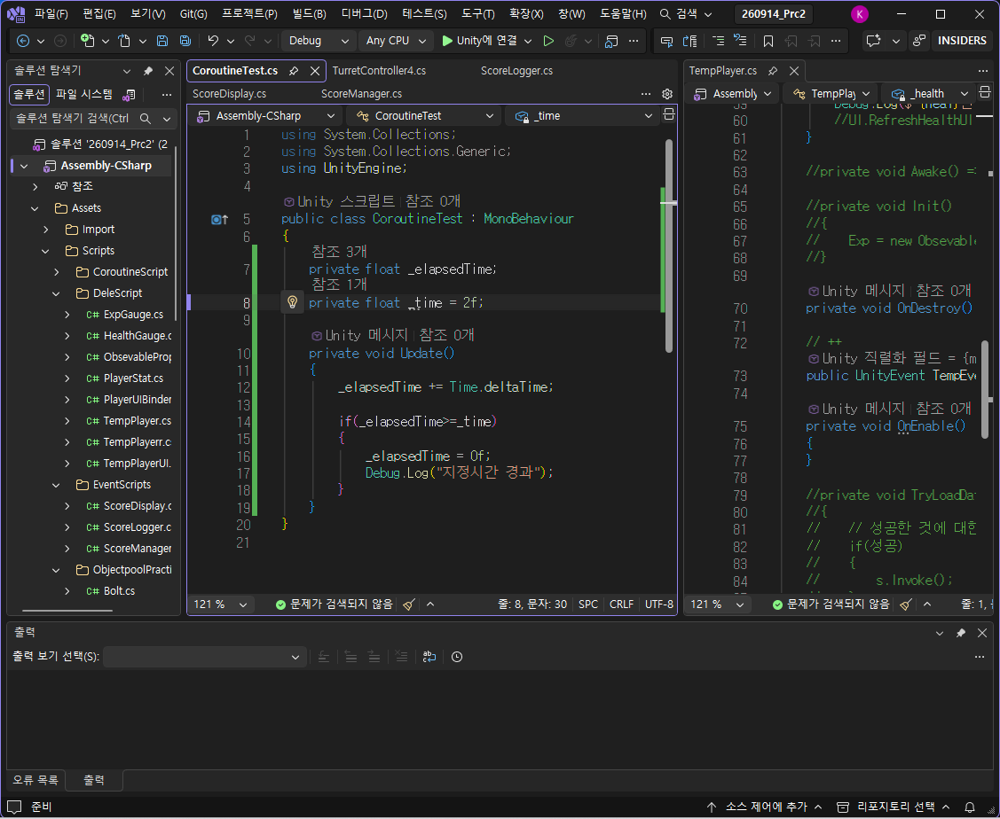

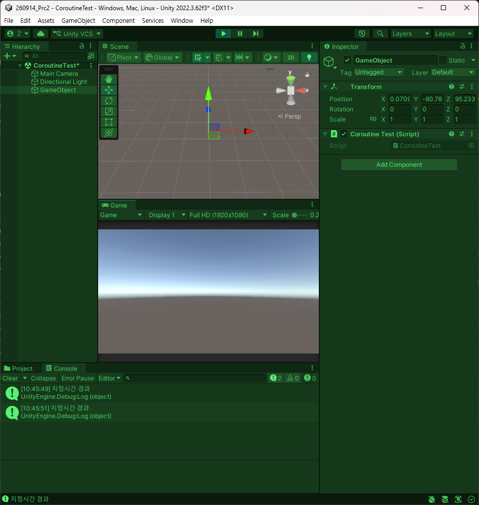

이렇게 진행이 되었었던 반면 코루틴을 적용했을 때

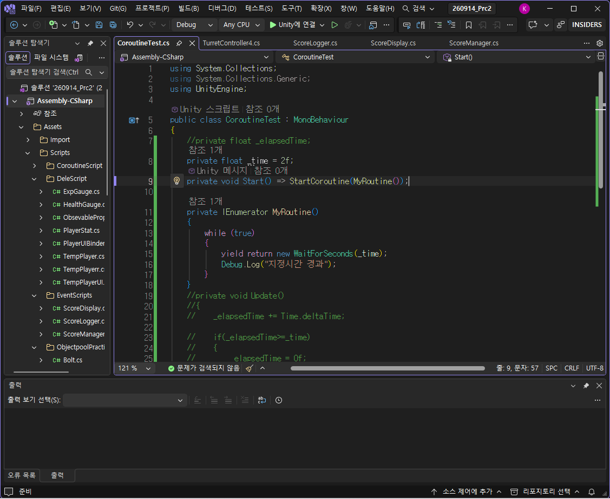

실제 실행을 하면 


동일하게 동작을 한다.

실제로 Yield return의 조건이 만족할 때까지 기다린다. 

이것을 수정하여 

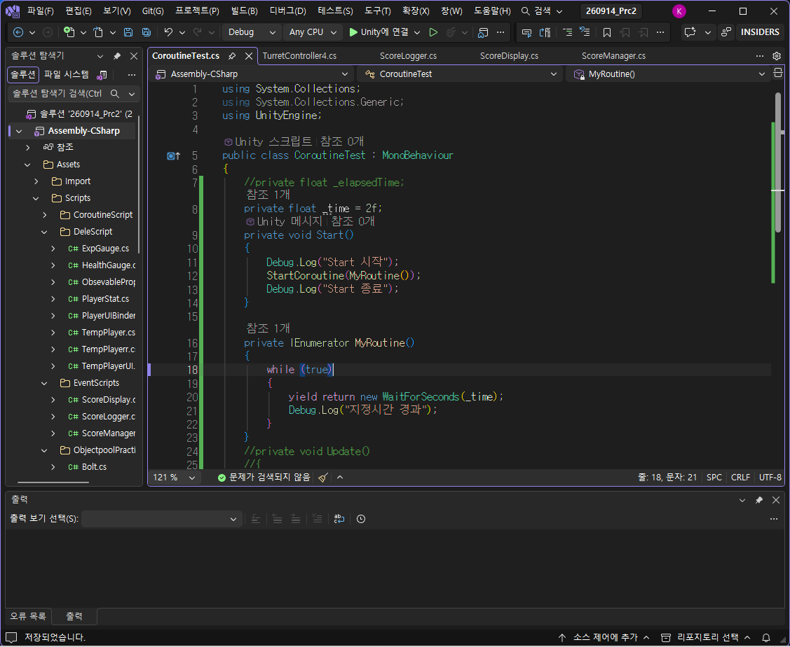


와 같이 해두면 

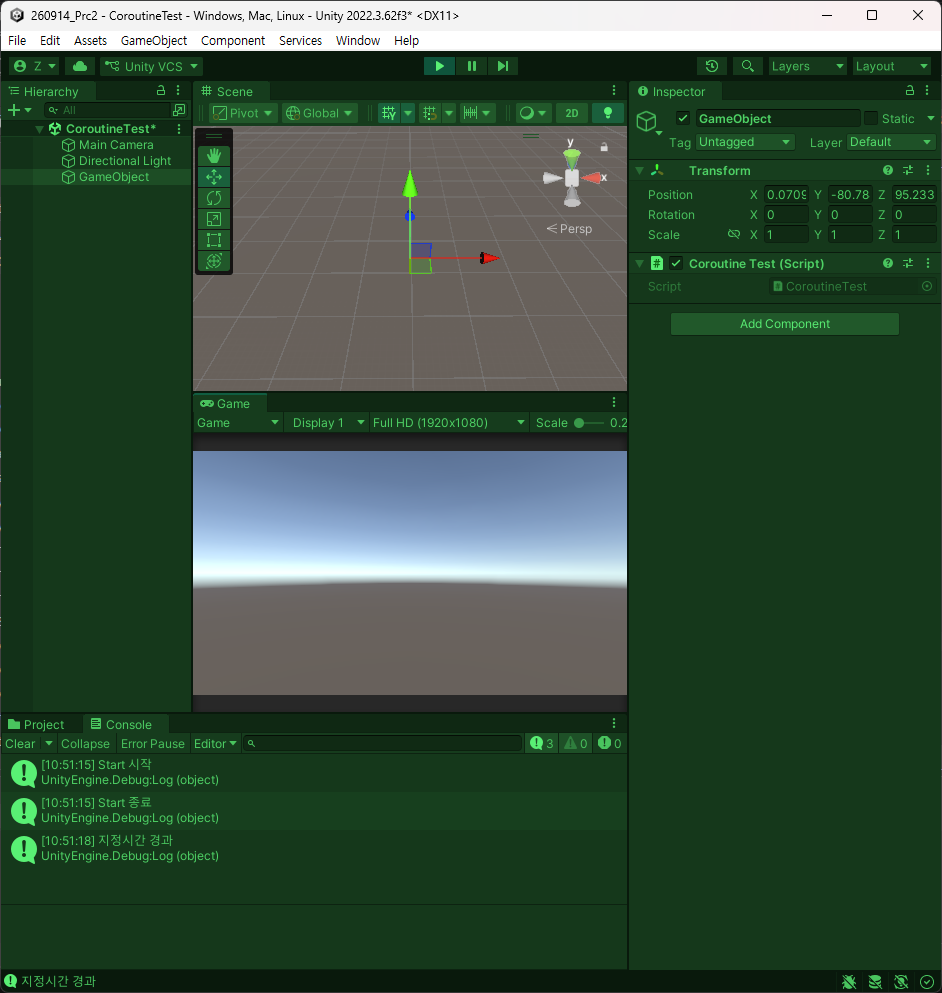

아까 1-3-4-2 형식이 아니라 1-2-3-4처럼 된다는 것. 그러니까 다른 일을 하며 기다리고 하는 것을 볼 수 있음. 

이제는 Update에 강하게 결합된 형태가 아니라 실행만 해주면 알아서 굴러가게끔 할 수 있다. 마치 Lifecycle을 사용하지 않은 것처럼.

프레임마다 연산은 어차피 일어나는데 감지를 하고 이동을 하거나 회전시켜주는 것은 해야 하는데 시간 누적마저도 객체 오브젝트 기능을 업데이트해서 수행할 수 있도록 했는데 반복적 기능들을 Start에서 한 번만 하도록 해줄 수 있다. 

특정 기능을 수행할 때, 시간을 계속 체크가 아닌 나열 형식, 예를 들면 버프 같은 것들이 이에 대해 가능할 것이다. 

### 1.6. 문법적 관점
- 함수의 반환형은 'IEnumerator'로 된다. 
- 이에 대한 것은 foreach를 설명하는 Iterator에서 지나가듯 이야기를 했었다. 
- 그래서 기본적으로 IEnumorator가 왜 붙는지 내부적으로 파고들면 너무 심연인 것이다. 
- 일단은 **IEnumorator로 반환형을 사용**한다고 알고 있을 것.
- 그런데 뭘 반환하는 것인지에 대해 설명을 한다면 **반환할 때는 'yield return xxx'이고 이것의 의미는 'xxx가 충족되는 상황까지 함수를 일시정지하고 대기를 할 것'이라는 의미**이다. 
- 사용할 때, StartCoroutine의 매개변수로써 넣어줘야 한다.
```csharp
using System.Collections;
using System.Collections.Generic;
using UnityEngine;

public class CoroutineTest : MonoBehaviour
{
    private void Start()
    {
        Debug.Log("Start 시작");
        StartCoroutine(MyRoutine());
        Debug.Log("Start 종료");
    }

    private IEnumerator MyRoutine()
    {
        yield return null;
    }
}
```
- 메서드 자체를 직접 호출이 아니라 StartCoroutine(); 안의 매개변수로써 넘겨줘야 한다는 의미. MyRoutine();의 형식으로 가지 않는다. 
- 추가적으로 멈출 때는 StopCoroutine();이라는 함수를 사용하면 된다. 

### 1.7. 사용
- 다음은 Update에 한 번 써보자

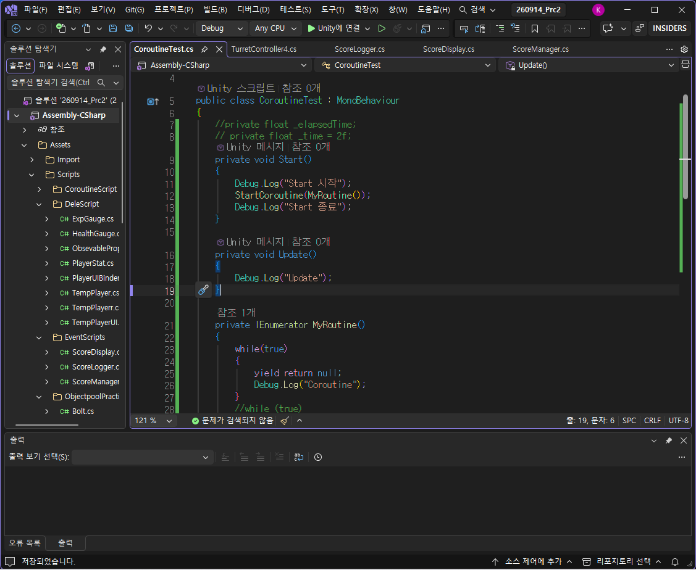

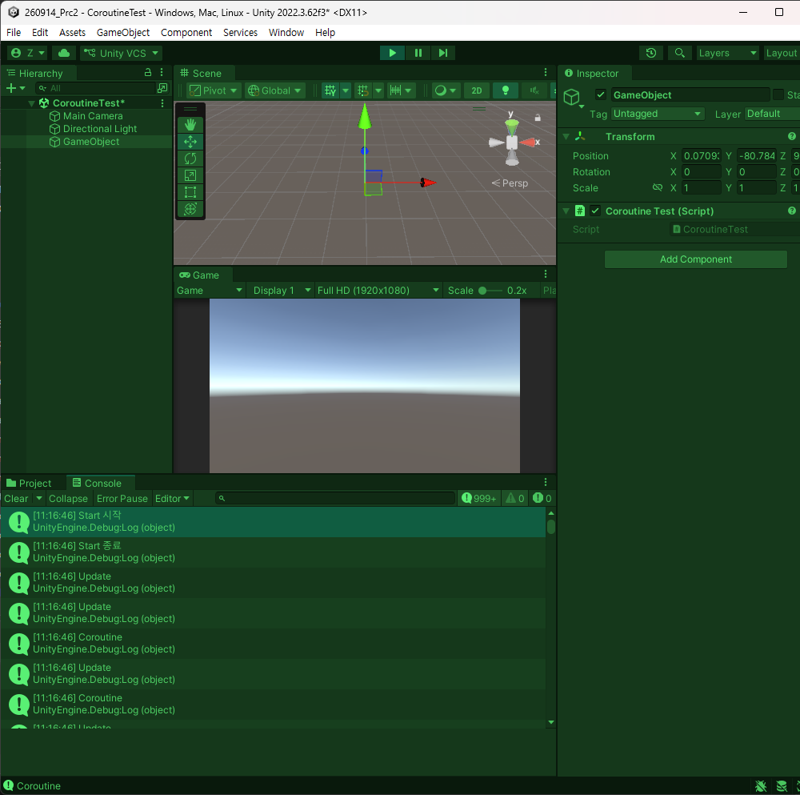

현재 상황은 이렇다. 라이프사이클들을 보면 Update가 수행된 다음에 LateUpdate가 수행이 될 것이고 Update와 LateUpdate 사이에서 yield null이 보인다. 

그래서 yield null이라는 의미는 업데이트가 되기 전에 yield null이 될 때까지 기다리란 의미가 된다. 

```csharp
using System.Collections;
using System.Collections.Generic;
using UnityEngine;

public class CoroutineTest : MonoBehaviour
{
    //private float _elapsedTime;
    // private float _time = 2f;
    private void Start()
    {
        Debug.Log("Start 시작");
        StartCoroutine(MyRoutine());
        Debug.Log("Start 종료");
    }

    private void Update()
    {
        Debug.Log("Update");
    }

    private void LateUpdate()
    {
        Debug.Log("--LateUpdate--");
    }

    private IEnumerator MyRoutine()
    {
        while(true)
        {
            yield return null;
            Debug.Log("Coroutine");
        }
    }
}
```

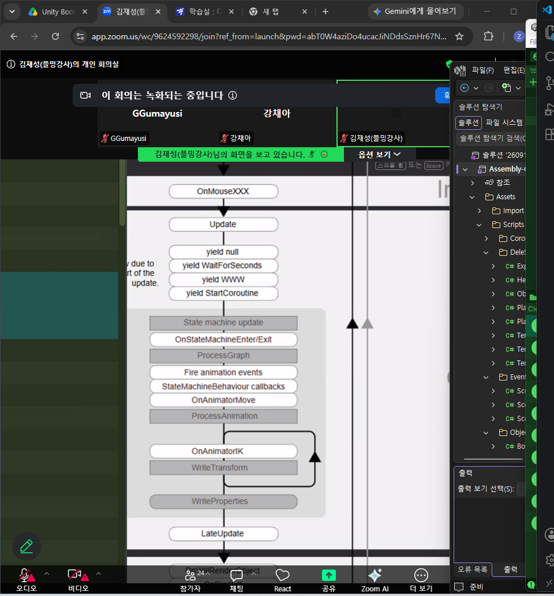

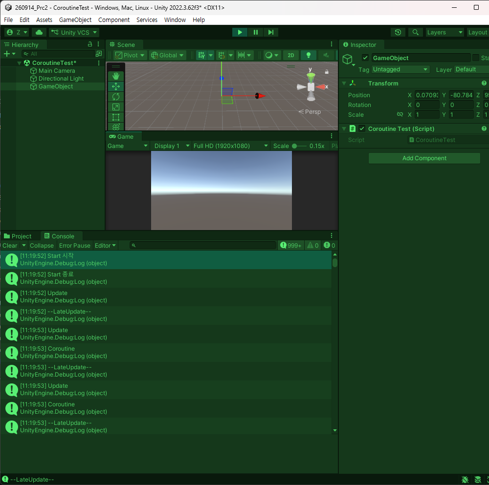

이렇게 했을 경우 프레임 단위로 실행이 되는 것을 볼 수 있다. 

하지만 코루틴을 사용할 때 yield return null을 많이 사용하지도 않는다. 

코루틴조차 라이프사이클 내에서 돈다. 

유니티에서 웹에서 요청보내는 것을 기다릴 때 WWW를 사용.

여기서 Waitforsecond을 다시 보면 

```csharp
private IEnumerator MyRoutine()
{
    while(true)
    {
        yield return new WaitForSeconds(0.1f);
        Debug.Log("Coroutine");
    }
}
```

와 같이 수정을 하고 실행을 하게 되면 

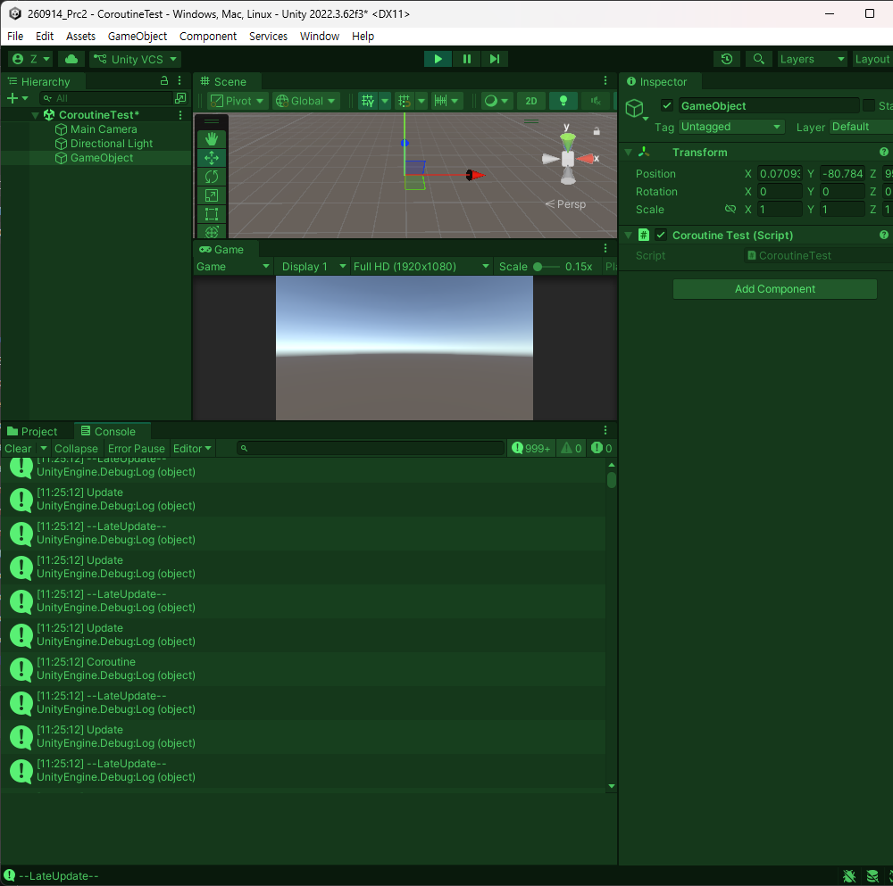

0.1초를 걸어둔 상태에서 프레임 단위에서는 긴 시간인데 0.1초가 경과한 시점에서 프레임 안에서 놀고 있음을 시사할 수 있다. 

로직을 다른 방식으로 적어보자.

```csharp
using System.Collections;
using System.Collections.Generic;
using UnityEngine;

public class CoroutineTest : MonoBehaviour
{
    private void Start()
    {
        Debug.Log("Start 시작");
        StartCoroutine(MyRoutine());
        Debug.Log("Start 종료");
    }

    private IEnumerator MyRoutine()
    {
        Debug.Log("Coroutine 1");
        yield return new WaitForSeconds(1f);
        Debug.Log("Coroutine 2");
        yield return new WaitForSeconds(1f);
        Debug.Log("Coroutine 3");
        yield return new WaitForSeconds(1f);
        Debug.Log("Coroutine 4");
        yield return new WaitForSeconds(1f);

        Debug.Log("Coroutine 5");
    }
}
```

현재의 형식에서는 Coroutine 1이 먼저 뜬다.

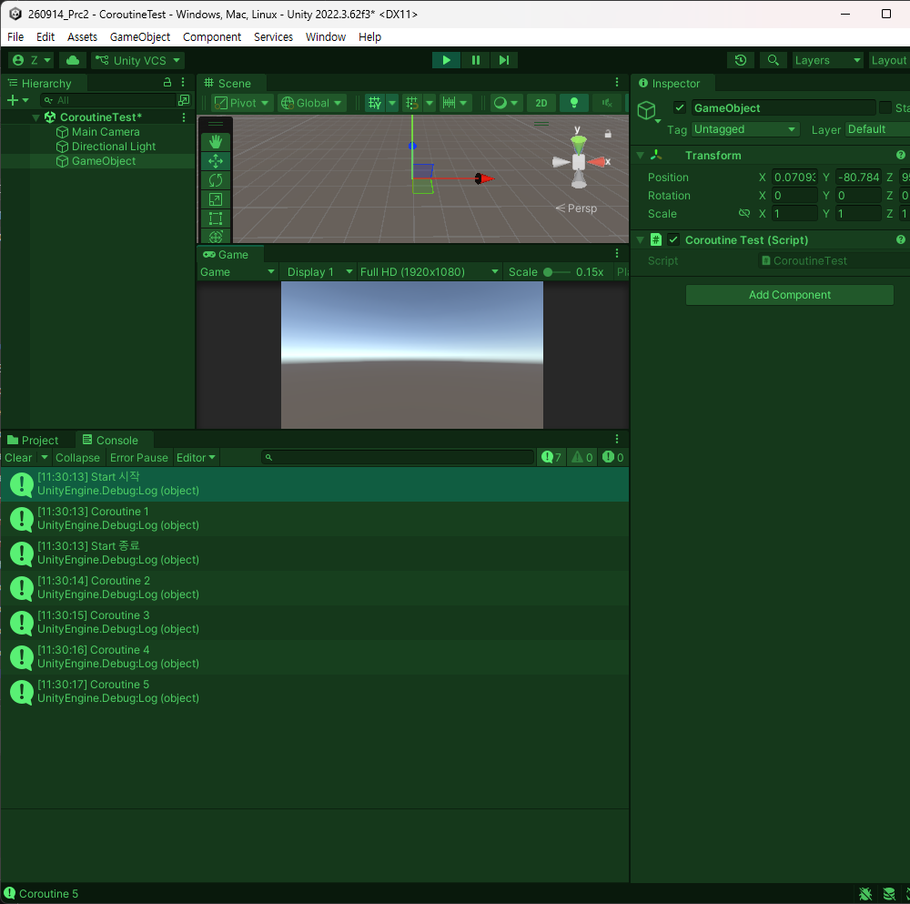

yield return을 만나면서 1초 정지가 되고 Start 종료가 그 다음 뜨고 난 다음에 나머지가 뜨는 형태가 된다.

yield return은 일시정지이고 일정 시간동안 기다려주는 이벤트의 느낌이라고 생각하면 된다. 

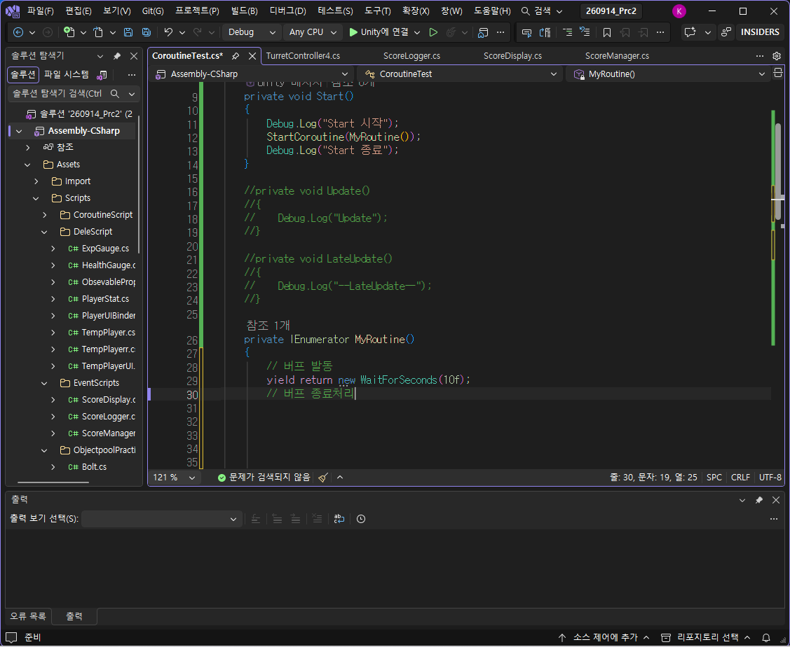

원하는 상황까지의 대기가 가능하고 특정 시간대마다 실행되어야 하는 것들을 둘 수 있다.

Raycast를 매 프레임마다 쏘는 것은 좋은 방식은 아니다. 그래서 원하는 시간마다 delay를 줄 수 있다. 그래서 0.1초간격마다 쏘도록 할 수도 있다는 것. 

그래서 주기적으로 하는 것을 딜레이를 걸어 사용할 수 있다. 델타 타임을 문법적으로 쉽게 표현할 수 있다. 

비단 특정 시간만 기다려야 하는 것도 아니고 yield StartCoroutine으로 코루틴을 기다리는 것도 가능하다. 이것 때문에 진입 장벽이 높아짐.

이것 때문에 로직이 꼬인다. 그래서 현 단계에선 이렇게까지 쓰는 것은 가급적 하지 말 것. 

호출 순서가 많아지고 복잡해질수록 결과를 예측하기 힘들다. 

yield WaitForFixedUpdate의 경우 물리처리 이후에 재가동하겠다는 것이다. 즉, 물리처리와 같은 루틴들을 관리할 때 사용하는 것인데 이것 역시도 FixedUpdate를 그냥 쓰는 것이 좋을수도 있다. 

LateUpdate 이후에 Gizmo 그리는 단계를 넘어서 yield WaitForEndOfFrame이 있는데 프레임의 단계가 끝날 때 주는 제약도 있다. 

선택지는 다양하다. yield return 다음을 붙일 때, [라이프사이클 표](https://docs.unity3d.com/kr/2019.4/Manual/ExecutionOrder.html)를 보면 나온다. 


## 2. 추가사항
### 2.1. yield break
- 코루틴도 함수고 반환형 여부를 떠나 return을 만나면 종료를 하는데 코루틴도 그러한 방식으로 종료를 해야 한다.
- 함수 내부에서 판단이 가능해야 하는데 StopCoroutine이 아닌 **yield break;**를 사용한다. 
- 이게 코루틴 내부에서는 함수의 break 역할을 한다.
- 효과적인 관리는 한 단계가 추가되는 것이긴 하다.
- 지금은 yield return 이후의 붙는 키워드를 잘 생각해봐야 한다. 

### 2.2. 문제
- new는 새로 데이터를 할당하는 행위인데 while문으로 1초마다 루틴을 수행하는데 반복에서 문제가 난다.
- 많은 게임 오브젝트가 이것을 통해 돌렸다는 것이고 new를 계속 할당하는 점이고 클래스를 계속 생성하게 된다. 
- 참조 타입이 어떤 식으로 굴러가는지 생각하면 클래스 객체를 1초마다 생성하고 여러 인스턴스가 사용하며 가비지가 누적이 된다.
- 이는 프로그래밍에서 피해야 하는 방향이다.
- 그래서 쓸 방법이 필요하다.

### 2.3. 재활용

클래스 필드로 하나 생성해보자

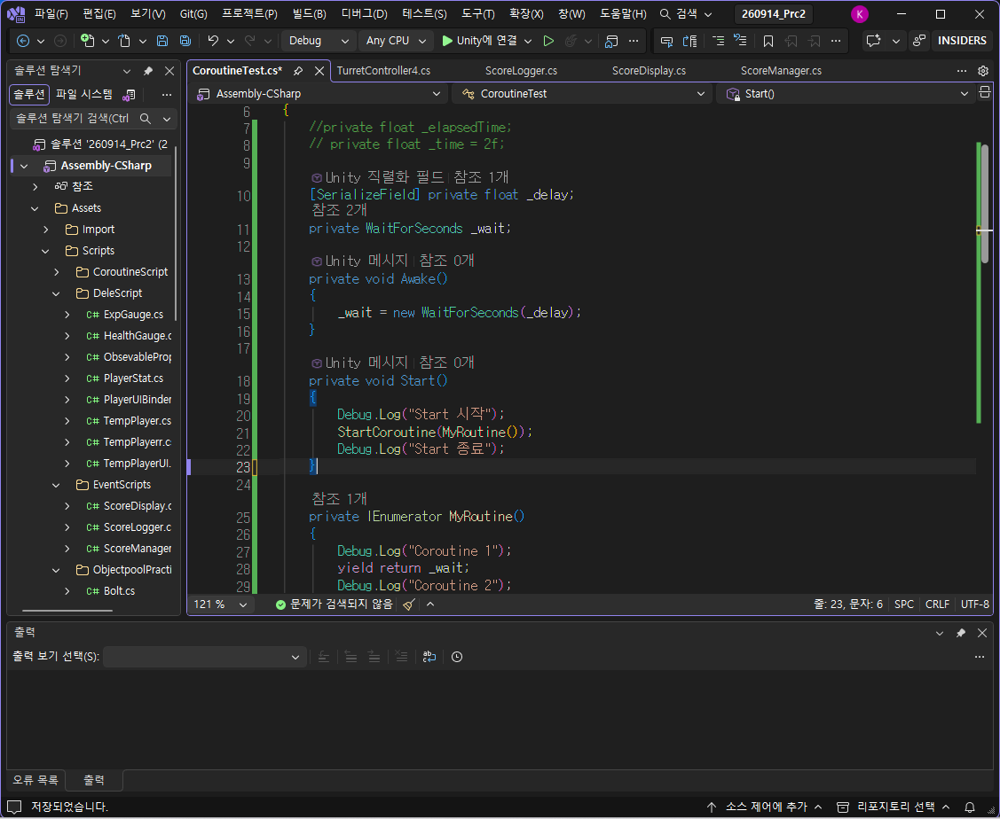

객체를 캐싱하여 재활용하는 방식을 적용하면 좀 더 효율적으로 가능해질 것이다. 

반복적으로 사용될 것이라면 Awake에 미리 만들어두고 그것을 사용하는 것이 맞다는 것. 

내부적인 값이 float인 WaitForSeconds인데 개별 클래스에서 가지는 것이 아닌 yield Instruction을 효과적으로 관리할 수 있게 된다. 지금은 언급만 할 정도.

while이 아닌 몇 분 단위일 경우 캐싱까지도 갈 필요 없다. 따라서 단시간에 여러번 반복될 것인가에 대한 여부를 생각해보라는 것.


### 2.4. 기타 사항
- WaitForSeconds에서는 게임 정지 시 TimeScale을 0으로 만든 것인데 WaitForSeconds까지도 정지시킨다.
- WaitUntil이 있는데 특정 조건이 충족될때까지인데 WaitForSeconds와 다르게 델리게이트를 가진 형태이다. 
```csharp
private IEnumerator MyRoutine()
{
    yield return new WaitUntil();
    Debug.Log("Coroutine");
}
```
- 추가적 참조 타입이 있다는 뜻
- 이것은 괄호안에 들어온 조건이 참이 될 때까지 기다린다는 의미이다. 

```csharp
yield return new WaitUntil(isBool);
```

- 이렇게는 못쓴다. bool 타입의 델리게이트를 써야 한다.
- 프로그래밍에서는 익명 함수라는 것이 존재한다. 
- 델리게이트를 선언하고 난 다음에 반환형을 설정하고 매개변수를 설정한 함수만을 받았었다. 
- 델리게이트는 함수 이름이 안 붙어있는채로 delegate (매개변수) 만이 붙은 것을 익명 함수라고 한다.
- 익명 함수를 쓰는 것이 기본적인 형태 뿐만이 아니라 람다식이라고 하여 매개변수를 받아 연산을 return하는 형태가 있다. 
: (a, b) => a + b;
- 그러면 델리게이트를 직접 넣는 것이 아닌 람다식으로 처리를 하는데 
```csharp
private IEnumerator MyRoutine()
{
    yield return new WaitUntil(() => isBool);
    Debug.Log("Coroutine");
}
```
- Function은 반환값이 있었고 Action은 없었다. 
- Func이라고 되어 있으면 반환값이 있다는 이야기이고 매개 변수는 없는 상황이라 ()만 있는 것이고 =>가 있고 반환하는 것이 있다. 
- 그럼 여기에 Update에 특정 키에 대한 것이 변하도록 switching을 시켜보자. 

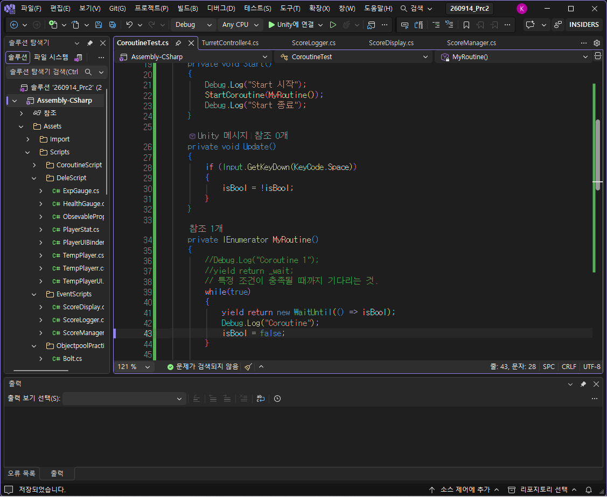

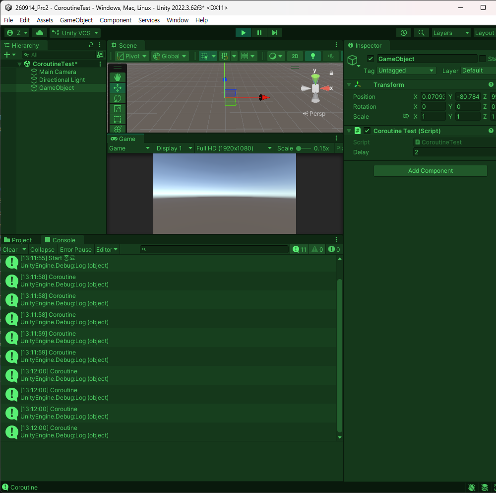

이렇게 Space를 눌러 Console 확인

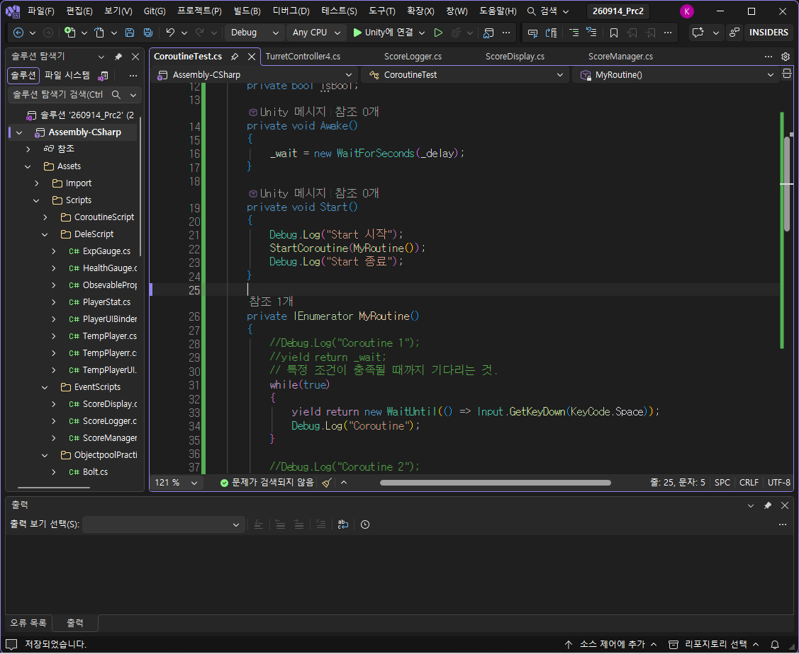

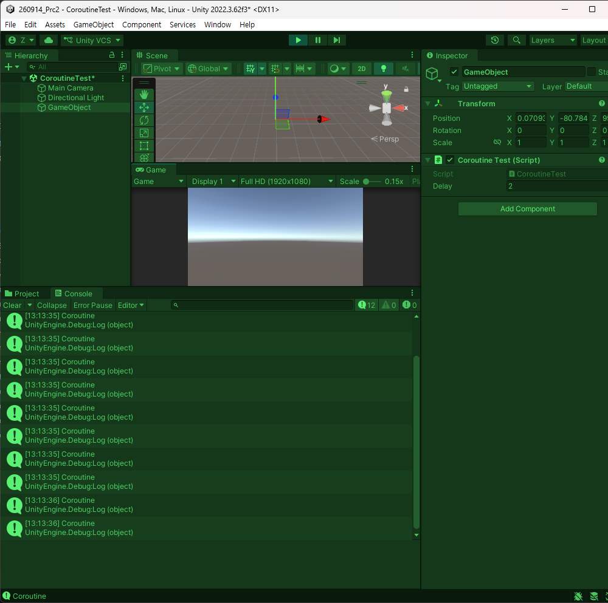

업데이트 없이 바로 꽂을수도 있기는 한데 이렇게는 쓰지 말 것. 

WaitWhile도 존재하는데 이것은 조건이 false가 될 때까지인데 이것보단 WaitUntil을 좀 더 쓴다. 

이렇게 코루틴 가지고만으로도 게임을 돌릴 수 있다. 

### 2.5. 오남용 및 방지
- 게임 내부에서 기능들 중 자주 쓰는 것들을 단시간에 코루틴만 남용한다면 
- StartCoroutine의 반환형을 생각해보면 코루틴인데 코루틴은 클래스이다. 
- 그래서 메모리가 새로 할당되는 구조이다. 코루틴 객체가 생성되어서 함수와 함께 뽑아져 나온다. 
- 한 프레임에서 수백 수천번이 일어나면 게임이 계속 장시간 돌리면 GC가 돌아갈 상황이 있게 되고 이에 대한 자가진단은 필요할 것. 
- 명시적으로는 StopCoroutine을 쓰지만 효과적으로 쓰는 방법이 있다. 
- 이것을 감지하게 변수로 할당하고 그 여부에 따라 코루틴을 시행하고 애초에 없다면 이 Stop을 하지 않게끔 한다면?
```csharp
public class CoroutineTest : MonoBehaviour
{
    //private float _elapsedTime;
    // private float _time = 2f;

    [SerializeField] private float _delay;
    private WaitForSeconds _wait;
    private Coroutine _routine;
    private bool isBool;

    private void Awake()
    {
        _wait = new WaitForSeconds(_delay);
    }

    private void Start()
    {
        Debug.Log("Start 시작");
        //StartCoroutine(MyRoutine());
        //StartCoroutine(MyRoutine());
        Debug.Log("Start 종료");
    }

    private void Update()
    {
        if (Input.GetKeyDown(KeyCode.Alpha1))
            Run();

        if (Input.GetKeyDown(KeyCode.Alpha2))
            Stop();
    }

    private void Run()
    {
        if (_routine != null)
            return;

        StartCoroutine(MyRoutine());
    }

    private void Stop()
    {
        if (_routine == null)
            return;

        StopCoroutine(_routine);
    }

    private IEnumerator MyRoutine()
    {
        yield return _wait;
        Debug.Log("Coroutine");
    }
}
```

이랬을 때 참조가 없어지는 것이 아니므로 null까지 해줘야 한다.

```csharp
private void Run()
    {
        if (_routine != null)
            return;

        StartCoroutine(MyRoutine());

        _routine = null;
    }
```

내부에서 반복문을 쓴다면 이런식으로의 break를 생각해볼 것.

### 2.6. 정리
- IEnumerator
- yield return 이후에 무엇이 나오는지
- 프레임마다 혹은 특정 조건마다 반복되는 라이프사이클
- StartCoroutine(), StopCoroutine().
- yield Instruction이나 변수를 통해 new가 단시간에 자주 할당되는 것은 캐싱해서 쓰자.